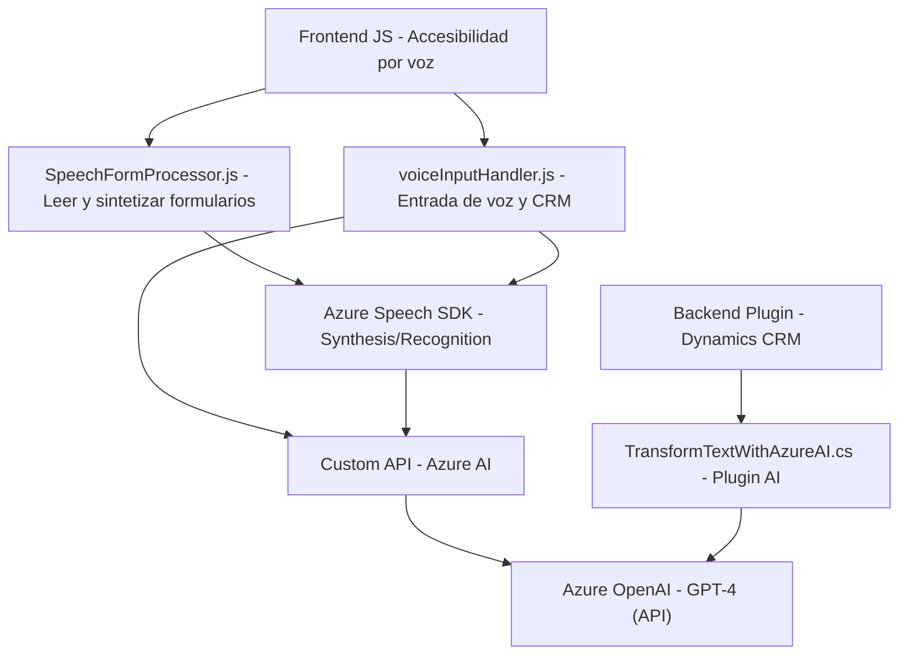

### Breve resumen técnico:
Este repositorio incluye componentes clave diseñados para integrarse con sistemas CRM como Microsoft Dynamics. Facilita tanto la entrada de voz para interacción con formularios como la transformación avanzada de texto utilizando Azure AI y OpenAI. Organiza la funcionalidad en módulos independientes y un plugin específico para ejecutar lógica en una capa backend. Los componentes están preparados para accesibilidad y manejo de lenguaje natural.

---

### Descripción de arquitectura:
La arquitectura plantea una solución distribuida con las siguientes capas:
1. **Frontend**: Implementado en JavaScript, interactúa con los usuarios mediante síntesis y reconocimiento de voz (Azure Speech SDK). Gestión dinámica de formularios en el sistema CRM.
2. **Backend**: Utiliza un plugin de Dynamics CRM (`TransformTextWithAzureAI.cs`) que invoca servicios Azure AI/OpenAI para ejecutar lógica avanzada de transformación de texto. La arquitectura aquí sigue el patrón de plugin y external integration.
3. **Servicios externos**: Se conecta directamente con Azure Speech SDK para funcionalidades de voz y con Azure OpenAI para transformar y procesar texto.

Esta arquitectura mezcla el patrón de capa **n-tier** en el frontend/backend y un **plugin architecture** en el ecosistema CRM. Asimismo, utiliza servicios externos, acercándose al concepto de **microservicios** en ciertas operaciones.

---

### Tecnologías usadas:
1. **Frontend (JavaScript)**:
   - Azure Speech SDK.
   - Funcionalidades del sistema CRM (formContext, Xrm.WebApi).
   - Promesas/async-await para programación reacitiva.

2. **Backend (C#)**:
   - Microsoft Dynamics SDK.
   - HttpClient para solicitudes REST.
   - JSON Libraries (System.Text.Json / Newtonsoft.Json).
   - Azure AI → Modelo GPT-4o.

3. **Patrones usados**:
   - Delegación de responsabilidades y lazy-loading para el SDK.
   - Integración de servicios externos (API).
   - Event-driven programming en ciertas operaciones de voz.
   - Modelo dinámico de datos en formularios CRM.
   - Plugin-based architecture para lógica backend.

---

### Diagrama Mermaid válido para GitHub Markdown:

---

### Conclusión final:
Este repositorio despliega una solución que conecta un sistema CRM como Dynamics con tecnologías avanzadas de accesibilidad y procesamiento de texto en el ámbito de inteligencia artificial. La arquitectura es híbrida, combinando una capa frontend basada en eventos y modularidad con extensión backend mediante plugins nativos del sistema CRM. Usa patrones modernos como lazy-loading, integración API y asincronía. Este diseño favorece escalabilidad y flexibilidad al interactuar con servicios externos como Azure Speech SDK y OpenAI.