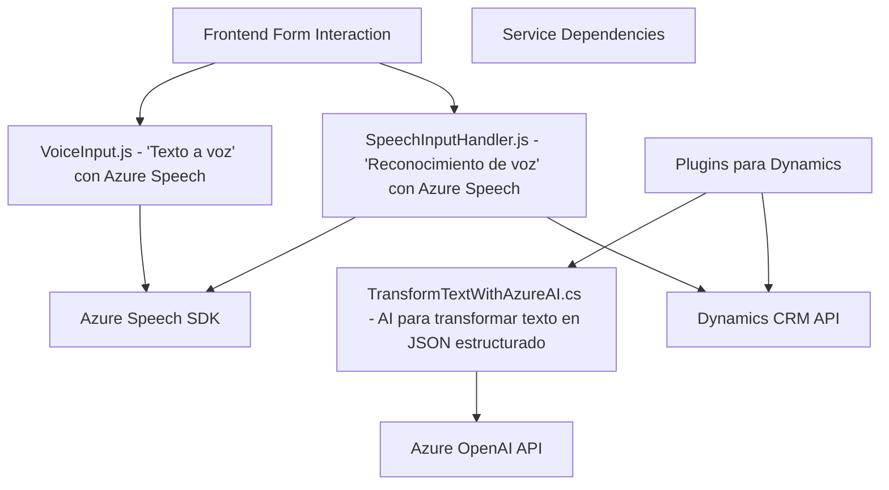

### Breve resumen técnico
El repositorio parece albergar una solución centrada en el uso de reconocimiento/entrada de voz y síntesis de texto a voz integrada con formularios dinámicos (Dynamics CRM), servicio Azure OpenAI, y el SDK de Azure Speech. Estas funcionalidades están distribuidas en archivos que utilizan APIs externas (Azure y Dynamics 365) para operaciones relacionadas con la interacción en tiempo real y el procesamiento de datos basados en voz.

---

### Descripción de arquitectura
La solución combina varias capas de funcionalidad:
1. **Frontend**:
   - Responsabilidades:
     - Procesamiento y sintetización de datos del formulario (texto a voz).
     - Reconocimiento de voz activa para interactuar con formularios y APIs personalizadas.
   - Arquitectura: Organizada en una **estructura modular** basada en funciones reutilizables que interactúan directamente con el SDK de Azure y los elementos visibles del formulario.
   - Implementada como una capa que gestiona la interacción con el cliente y los elementos visuales del formulario.
   
2. **Plugin Backend**:
   - Responsabilidades:
     - Procesamiento profundo de texto de entrada mediante conectividad directa con el servicio **Azure OpenAI**.
     - Integración a través de Dynamics CRM como un **plugin** que extiende las funcionalidades estándar del sistema.
   - Arquitectura: Implementa el **Plugin Pattern**, actúa como capa de servicio intermedia entre el sistema CRM y Azure OpenAI.

3. **Servicios Externos**:
   - Azure Speech SDK: Sintetización y procesamiento de voz.
   - Azure OpenAI: Transformación avanzada de texto.
   - Dynamics CRM APIs: Gestión contextual de datos del formulario y servicios adicionales personalizables.

La arquitectura general es un **modelo híbrido en capas**, donde cada componente cumple un rol específico con separaciones de responsabilidad claras. Aunque parcialmente modular, la solución también tiene dependencias directas en servicios externos para IA, voz y consumo de datos, lo que requiere configuraciones distintas en los entornos de ejecución.

---

### Tecnologías usadas
1. **Frontend**:
   - **JavaScript (ES6)**:
     - Control de eventos asíncronos (promesas, callbacks).
   - **Azure Speech SDK**:
     - Integración con el navegador para reconocimiento y síntesis de voz.
   - **Dynamics CRM APIs**:
     - `Xrm.WebApi.online.execute` para consumir servicios de datos.
2. **Backend Plugin**:
   - **C#**:
     - Implementación de lógica dinámica y procesamiento de datos mediante el framework .NET.
   - **Azure OpenAI API**:
     - Procesamiento de texto avanzado.
   - **Newtonsoft JSON**:
     - Manipulación y serialización JSON en C#.
   - **Dynamics SDK**:
     - Extensión personalizada del sistema CRM usando `IPlugin`.
3. **Servicios externos**:
   - Servicios de **Azure**:
     - Speech SDK (audio), OpenAI (texto y reglas específicas).

---

### Diagrama Mermaid válido para GitHub

---

### Conclusión final
La solución descrita en el repositorio representa un **integración de sistemas orientados a IA y reconocimiento de voz** en un ecosistema Dynamics CRM. Su frontend interactúa directamente con los servicios de Azure y Dynamics para facilitar interacciones dinámicas y, al mismo tiempo, la capa backend complementa estas capacidades al enriquecer las solicitudes con procesamiento avanzado de texto mediante Azure OpenAI. La arquitectura modular facilita el mantenimiento y la extensibilidad, pero la inclusión de configuraciones hardcoded como claves/URLs de servicios requiere refactorización para mejorar la seguridad y escalabilidad.