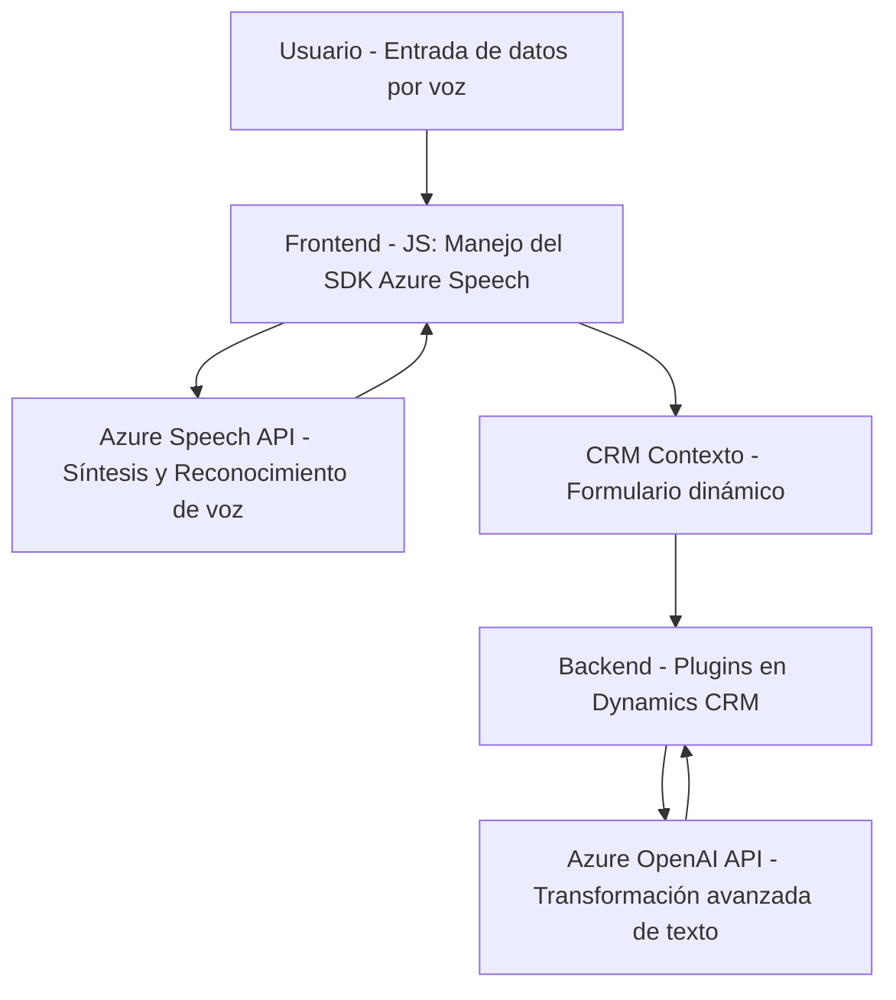

## Breve resumen técnico

El repositorio analiza fragmentos de un sistema compuesto por **funcionalidades de reconocimiento de voz**, **síntesis de voz**, y un **plugin para Microsoft Dynamics CRM** conectado a servicios de **Azure Speech API** y **Azure OpenAI API**. Los módulos parecen orientarse hacia la integración de inteligencia artificial con flujos CRM para transformar y procesar datos a través de interfaces dinámicas.

---

## Descripción de arquitectura

La solución opera como una arquitectura híbrida compuesta:
1. **Frontend:** Scripts JavaScript que manejan interacción con el SDK Azure Speech (UI/UX de voz).
2. **Backend/Plugins:** Ejecutan lógica en Dynamics CRM, implementando plugins personalizados (C#).
3. **Servicios externos:** SDK y APIs de **Azure Speech** y **Azure OpenAI**, actuando como microservicios de IA para síntesis de voz y procesamiento de texto.

Patrones identificados:
- **Capa de presentación y captura:** Scripts JS procesan entrada de voz en el navegador o cliente CRM.
- **Capa de procesamiento:** Lógica en plugins y servicios externos procesa datos y transcripciones.
- **Capa de integración:** Conexión directa con Azure, Dynamics CRM y APIs para entrada/salida de datos.

---

## Tecnologías usadas
1. **JavaScript:**
   - Utilización del SDK de Azure Speech para reconocimiento y síntesis.
   - Manipulación de datos y DOM en formularios web/CRM.
2. **C#:**
   - Desarrollo de plugins en Dynamics CRM usando el SDK de Microsoft.Xrm.
   - Integración con servicios HTTP y JSON mediante `HttpClient` y `Newtonsoft.Json`.
3. **Servicios externos:**
   - **Azure Speech SDK:** Reconocimiento/síntesis de voz.
   - **Azure OpenAI API:** Procesamiento avanzado de texto con normas personalizadas.
4. **Microsoft Dynamics CRM Framework:**
   - Plugins orientados a eventos que se integran con el entorno CRM (`IPlugin`).

---

## Diagrama Mermaid válido para GitHub

---

## Conclusión final

El sistema integra inteligencia artificial y funcionalidad avanzada para mejorar la interacción con formularios en CRM, utilizando tecnología de entrada/salida de voz y transformación textual como servicios externos. La arquitectura híbrida combina lógica en el cliente (JavaScript), en el servidor (plugins CRM) y servicios de nube (APIs de Azure), con enfoque desacoplado y modular.