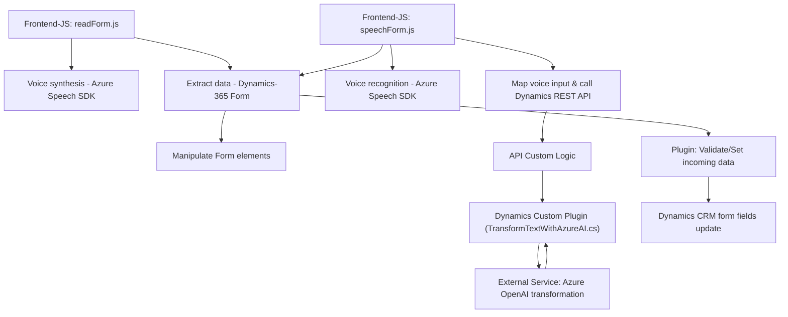

### Breve resumen técnico:

Este repositorio contiene una solución cuyo enfoque principal está en la integración del servicio **Azure Speech SDK** y **Azure OpenAI** con un entorno de Microsoft **Dynamics CRM**. Se utiliza un conjunto de archivos para implementar la funcionalidad de entrada de datos y generación de síntesis de voz sobre formularios del CRM, además de la transformación de texto mediante inteligencia artificial (AI). La solución utiliza un enfoque modular, donde cada archivo está diseñado para realizar funciones específicas, siendo la lógica de procesamiento dividida entre el cliente (JavaScript) y el servidor (.NET).

---

### Descripción de arquitectura:

La arquitectura general es **Cliente-Servidor** con una integración hacia servicios externos (Azure Cognitive Services y Azure OpenAI). La estructura del sistema se puede dividir en dos componentes principales:
1. **Frontend (JS)**: Responsables de la interacción del usuario, manipulación de formularios de Dynamics CRM y ejecución de funciones para síntesis de voz o reconocimiento de entrada por voz.
2. **Server-side Plugin (.NET)**: Define un plugin de Dynamics CRM que comunica el sistema con el servicio de Azure OpenAI para transformar valores textuales según normas predefinidas, retornando un JSON estructurado.

Los patrones principales en uso son:
1. **Modularidad**: Cada archivo tiene funciones específicas organizadas en pequeños bloques de lógica bien definidos.
2. **Service-Oriented Architecture (SOA)**: Integración con servicios externos (Azure Speech SDK, Azure OpenAI) para lograr las funcionalidades avanzadas.
3. **Plugin Architecture**: Uso de la interfaz `IPlugin` para acoplar la funcionalidad al entorno de Dynamics CRM como un complemento.
4. **Encapsulación**: Funciones auxiliares para separar responsabilidades como cargar SDKs externamente, realizar asignaciones de valores a campos, o comunicarse con APIs.

---

### Tecnologías usadas:

1. **Frontend (JavaScript):**
   - **Azure Speech SDK:** Para síntesis de voz y reconocimiento de entrada por voz.
   - **Dynamics 365 SDK (Xrm API):** Para manipulación de formularios y registros en Dynamics CRM.
   - **Web APIs:** Integración con servicios RESTful como el de Azure OpenAI.

2. **Backend (.NET Plugin):**
   - **Microsoft Dynamics CRM SDK (IPlugin, IPluginExecutionContext):** Para integrar el procesamiento en el servidor de Dynamics CRM.
   - **Azure OpenAI API:** Un servicio de inteligencia artificial para transformar texto.
   - **Namespace .NET:** Herramientas y clases del SDK .NET para operaciones de red (HTTPClient), serialización/deserialización (Json), y manejo de datos.

3. **External Dependencies:**
   - `Microsoft.Xrm.Sdk.Query`: Para realizar consultas en Dynamics CRM.
   - `Newtonsoft.Json.Linq`: Biblioteca para manejar objetos JSON en .NET.
   - Azure-specific services for Cognitive APIs and AI APIs.

---

### Diagrama Mermaid:

---

### Conclusión final:

La solución presentada se caracteriza por una integración híbrida entre sistemas cliente y servidor. El código en el frontend utiliza JavaScript para interactuar directamente con Dynamics 365 registros y formularios, añadiendo la funcionalidad de reconocimiento de entrada por voz y síntesis de texto mediante **Azure Speech SDK**. En el back-end, el plugin realiza comunicación directa con **Azure OpenAI** para transformar texto con reglas específicas. 

El sistema global tiene componentes bien definidos, pero podría beneficiarse de una mejor modularización y una estructura más jerárquica. Además, la falta de gestión de errores en ciertos puntos críticas, especialmente en la interacción con servicios externos, puede comprometer su robustez al enfrentar condiciones inesperadas. Potencialmente, la solución podría evolucionar hacia una arquitectura más desacoplada como la **hexagonal** o incluso **microservicios** para aumentar su escalabilidad y facilitar su mantenimiento.