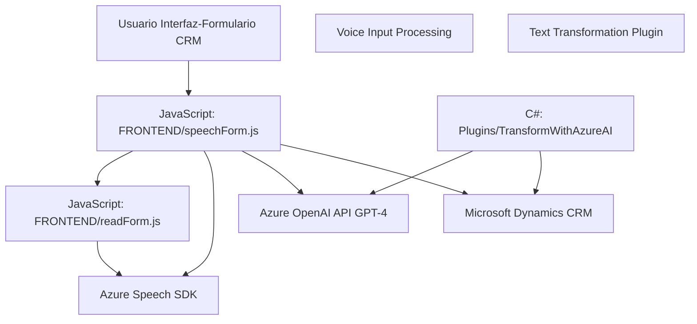

### Breve Resumen Técnico
El repositorio incluye varias implementaciones orientadas a la integración entre Microsoft Dynamics CRM y servicios externos como Azure AI y Azure Speech SDK. Hay una combinación de desarrollo frontend en JavaScript y backend en C# que permite automatizar y extender funcionalidades basadas en reconocimiento de voz, síntesis de audio, y procesamiento de texto con IA.

---

### Descripción de Arquitectura
La solución puede clasificarse como **hybrid modular**, combinando patrones de arquitectura de capas (n capas) con estrategias de integración en sistemas externos. El sistema tiene los siguientes componentes:
1. **Frontend interactivo:** Ejecuta tareas de procesamiento de voz y síntesis utilizando Azure Speech SDK para mejorar la experiencia del usuario dentro del formulario CRM.
2. **Backend basado en plugins:** Implementa lógica de transformación de datos y consumo de APIs de IA para aumentar la coherencia del procesamiento en los datos del CRM. Esto sigue el paradigma de **plugin architecture** tradicional de Dynamics CRM.

La arquitectura es un **monolito modular con integración externa**, dado que la funcionalidad está separada pero forma parte de un único ecosistema: Microsoft Dynamics CRM.

---

### Tecnologías Usadas
1. **Frontend (JavaScript):**
   - Azure Speech SDK (para síntesis y reconocimiento de voz).
   - Microsoft CRM SDK API (`executionContext` y `Xrm.WebApi`).
   - Modular JavaScript: funciones reutilizables para contexto CRM y comunicación con SDKs externos.

2. **Backend (C#, Plugins):**
   - C# .NET Framework.
   - Microsoft Dynamics CRM SDK (`IPlugin`, `Microsoft.Xrm.Sdk`).
   - Azure OpenAI API (para procesamiento avanzado de textos mediante IA).
   - JSON libraries (como `Newtonsoft.Json.Linq` y `System.Text.Json`).
   - HTTP Client para consumo de API REST externas.

---

### Componentes y Dependencias
- **API externas:**
  - Azure Speech SDK: Herramienta para reconocimiento y síntesis de voz.
  - Azure OpenAI API: Procesamiento avanzado de texto con inteligencia artificial.
- **Microsoft CRM SDK:** Extensión interna del CRM que conecta los elementos modulares al ecosistema.

---

### Diagrama Mermaid válido para GitHub

---

### Conclusión Final
La solución destaca por su enfoque en extender las capacidades de Microsoft Dynamics CRM mediante integración con servicios avanzados de inteligencia artificial y procesamiento de voz, proporcionando automatización y una experiencia interactiva mejorada para el usuario. Aunque la arquitectura no es estrictamente de microservicios (por ser un monolito modular), aprovecha la separación por capas funcionales y la modularidad del código en front y backend. Esto facilita su extensión en sistemas existentes. Una posible mejora sería reestructurar estos módulos en una arquitectura hexagonal que permita mayor independencia de las herramientas externas.