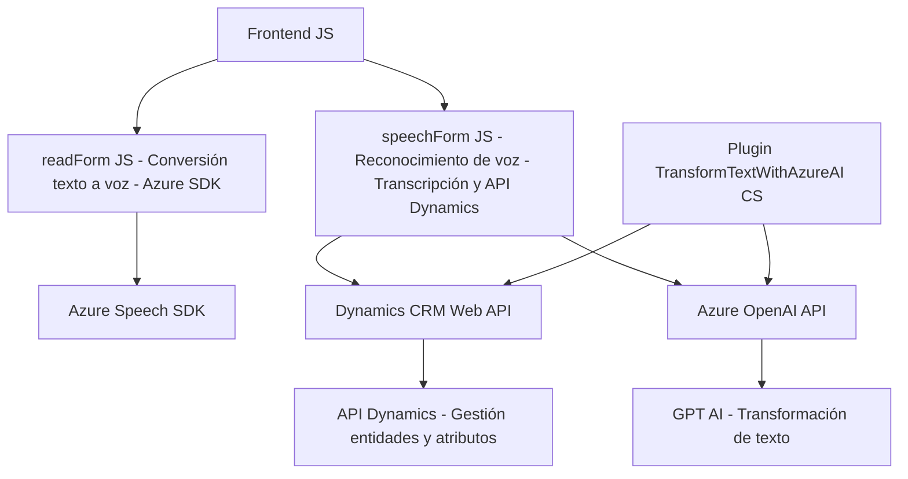

## Breve resumen técnico

El repositorio en cuestión incluye tres archivos diferenciados en funcionalidad:
1. **Frontend/JS/readForm.js**: Implementación para la conversión de datos visibles en un formulario dinámico a síntesis de voz, usando el Azure Speech SDK.
2. **Frontend/JS/speechForm.js**: Funcionalidades de reconocimiento de voz, transcripción e integración con Dynamics 365, apoyándose en APIs externas e inteligencia artificial.
3. **Plugins/TransformTextWithAzureAI.cs**: Plugin de Dynamics CRM que transforma texto a formato estructurado (JSON) utilizando Azure OpenAI.

## Descripción de arquitectura

1. **Tipo de solución**:
   - Esta solución está orientada hacia un sistema **híbrido**, que combina componentes de un **frontend** basado en JS con integración directa con APIs externas y una lógica definida como plugin para Dynamics CRM. El enfoque permite interacción avanzada con formularios y automatización de procesos empresariales mediante reconocimiento de voz e inteligencia artificial.

2. **Arquitectura**:
   - **Componentes independientes y acoplados**: Los archivos son dependientes unos de otros (especialmente en el frontend) pero acoplan comunicación externa con servicios como Azure.
   - **Patrones mixtos**:
     - El frontend utiliza una arquitectura **modular** con funciones independientes para procesamiento lógico.
     - En Dynamics CRM, el plugin sigue un patrón **hexagonal** (al integrar lógica externa mediante servicios como trámite de APIs REST).

## Tecnologías usadas

1. **Frontend**:
   - **Azure Speech SDK**: Para síntesis de voz y reconocimiento de voz.
   - **DOM API**: Carga dinámica de recursos externos en el navegador.
   - **Dynamics 365 Web API**: Operaciones sobre formulario y actualización de atributos.
   - **Promesas y callbacks** para flujos asíncronos.
2. **Plugin en Dynamics CRM**:
   - **Microsoft.Xrm.Sdk**: Extensión de CRM, manejo de entidades y ejecución de servicios del sistema.
   - **Azure OpenAI**: Transformación de texto siguiendo normas específicas.
   - **Newtonsoft.Json.Linq** y `.NET API`: Manipulación de JSON y solicitudes HTTP.

## Dependencias o componentes externos

1. **Servicios externos**:
   - **Azure Speech SDK**: Reconocimiento y síntesis de voz. URL de carga dinámica.
   - **Azure OpenAI**: Comunicación REST para transformar texto (GPT).
   - **Dynamics CRM Web API**: Para actualización de datos en formularios y entidades.
2. **Bibliotecas internas y externas**:
   - `.NET Framework`: Manejo de solicitudes HTTP.
   - **Newtonsoft.Json.Linq**: Procesamiento JSON en el backend.
   - **DOM API** en frontend (manipulación básica del DOM).

## Diagrama Mermaid

## Conclusión final

Esta solución muestra una arquitectura bien diferenciada que integra **frontend dinámico**, **API de terceros** (Azure Speech SDK y Azure OpenAI), y extensibilidad en un **plugin CRM**. Utiliza tecnologías modernas como JavaScript asíncrono, REST APIs y estructuras modularizadas en el frontend, emparejadas con código plugin en `.NET` que sigue el estándar para Dynamics CRM. La utilización de servicios externos como Azure garantiza potencia en reconocimiento de voz e inteligencia artificial para transformar datos empresariales.

Es ideal para aplicaciones corporativas donde la automatización de formularios y la interacción por voz son esenciales. Sin embargo, hay áreas de mejora, particularmente en la externalización de diversas configuraciones sensibles, como claves API, que actualmente parecen estar incluidas en el código fuente.