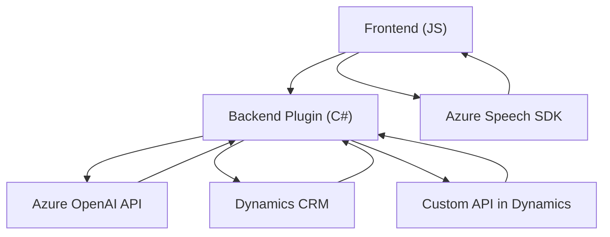

### Breve resumen técnico

El repositorio es una solución que integra procesamiento de datos con la ayuda de inteligencia artificial (Azure OpenAI) y software para manejo de voz (Azure Speech SDK). Su funcionalidad principal está diseñada para mejorar la interacción de formularios en aplicaciones basadas en Dynamics CRM y enriquecer la experiencia del usuario con capacidades de voz e inteligencia artificial (IA).

---

### Descripción de la arquitectura

1. **Tipo de solución:** La arquitectura general parece ser una aplicación orientada a la integración entre Dynamics CRM y servicios de IA y reconocimiento de voz. Por lo tanto, se puede categorizar como un sistema compuesto de **API** y **plugins** integrados a una solución CRM. También incorpora funcionalidades de **frontend** para interacción del usuario vía formularios dinámicos.

2. **Arquitectura:** Se puede clasificar como una arquitectura **de n capas** donde:
    - La capa **frontend** es responsable de la interacción con el usuario (gestión del formulario y síntesis de voz).
    - La capa **backend** con **plugins** gestiona la interacción directa con Dynamics CRM y maneja los datos transformados por Azure OpenAI.
    - Servicios **externos** como Azure Speech SDK y Azure OpenAI están integrados dentro de esta arquitectura.

---

### Tecnologías utilizadas:

1. **Lenguajes y entorno:**
   - **JavaScript:** Utilizado para la parte de frontend (interacción de formularios).
   - **C# (.NET Framework):** Utilizado para el plugin que extiende Dynamics CRM.

2. **Frameworks y librerías:**
   - **Azure Speech SDK:** Para el reconocimiento y síntesis de voz.
   - **Microsoft Dynamics CRM SDK:** Para la integración con el sistema CRM.
   - **Newtonsoft.Json:** Gestión de estructuras JSON en el plugin.
   
3. **APIs y servicios:**
   - **Azure OpenAI:** Procesamiento semántico y generación de texto en formato JSON.
   - **Microsoft Xrm.WebApi:** Para la consulta y manipulación de entidades de Dynamics CRM.

4. **Patrones usados en el diseño:**
   - **Event-driven programming:** Uso de callbacks y promesas en el frontend.
   - **Service Integration:** Comunicación con APIs externas (Azure Speech SDK y OpenAI).
   - **Modular design:** Clara división de responsabilidades entre las funciones.
   - **Plugin-oriented architecture:** Extensión de Dynamics CRM con la implementación de `IPlugin`.

---

### Posibles dependencias o componentes externos

- **SDKs y APIs:**
  - Azure Speech SDK (`window.SpeechSDK`)
  - Azure OpenAI API (GPT models for text transformation)
  - Microsoft Dynamics Xrm.WebApi SDK for CRM interaction

- **Backend Services:**
  - Azure resources (Azure OpenAI endpoint, Speech SDK resources, Cognitive Services configurations).
  - Custom APIs hosted on Dynamics 365 or Azure for additional processing.

---

### Diagrama Mermaid válido para GitHub

---

### Conclusión final

Esta solución combina tecnologías modernas como las redes neuronales (Azure OpenAI) y la síntesis/reconocimiento de voz (Azure Speech SDK), integrándolas en una implementación para Microsoft Dynamics CRM. La arquitectura de n capas está bien formada en términos de separación de responsabilidades entre frontend, backend y servicios externos. 

El diseño modular permite escalabilidad y fácil mantenimiento. Adicionalmente, el uso de patrones como la programación basada en eventos y la integración con servicios externos, asegura un sistema dinámico y susceptible a mejoras futuras, robusto para soluciones empresariales con una alta interactividad con el usuario.