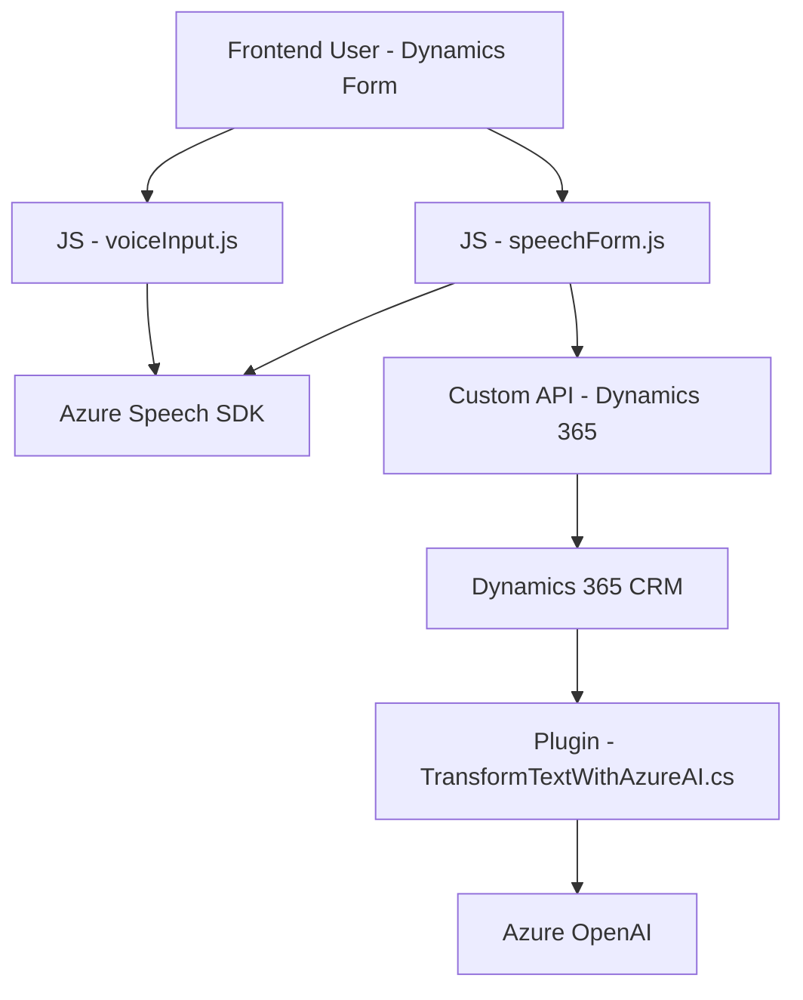

### Breve resumen técnico:
Este repositorio alberga una solución que integra la funcionalidad de reconocimiento y síntesis de voz, junto con transformación de texto mediante Inteligencia Artificial de Azure OpenAI, en el contexto de formularios de Microsoft Dynamics 365. Está compuesto por:
1. **Frontend JavaScript Code**: Maneja la interacción con el SDK de Microsoft Azure Speech para sintetizar voz a partir de texto visible.
2. **Dynamics 365 Plugins**: Utiliza el SDK de Dynamics CRM junto con Azure OpenAI para transformar el texto mediante reglas predefinidas.

### Descripción de la arquitectura:
La arquitectura tiene características de sistemas **SoA (orientada a servicios)**, donde micro-lógicas específicas se integran mediante la interacción con APIs externas y plugins. Combina elementos de arquitectura **n-capas**, diferenciando una capa de presentación (frontend) que interactúa con formularios, y una capa de negocio (plugin en Dynamics CRM), donde se procesa información mediante IA en el backend.
Adicionalmente, se puede percibir una aproximación al patrón **hexagonal**, al desacoplar las dependencias externas (Azure Speech SDK y Azure OpenAI) y un contexto estructurado de uso con Dynamics CRM.

### Tecnologías usadas:
#### Frontend:
- **JavaScript** como lenguaje de programación principal.
- **Azure Speech SDK**: Reconocimiento y síntesis de voz.
- **Dynamics 365 Context API (Xrm.WebApi.online)**: Operaciones sobre formularios dinámicos de CRM.

#### Backend:
- **Microsoft Dynamics CRM SDK**, específicamente `Microsoft.Xrm.Sdk`.
- **C#** como lenguaje de programación.
- **Azure OpenAI Service**: Transformación de textos mediante modelos GPT.
- **JSON Processing**: `System.Text.Json` y `Newtonsoft.Json` para manipulación de datos serializados.

### Dependencias o componentes externos:
1. **Azure Speech SDK**: Para realizar reconocimiento de voz y convertir texto en voz.
2. **Azure OpenAI Service**: Realiza transformaciones de texto con un modelo GPT específico.
3. **Dynamics 365 CRM**: API para formularios dinámicos y mapeo de datos.
4. **HTTP Client Libraries**: Basada en `System.Net.Http` para comunicación con API externa.
5. **JSON Libraries**: Uso extendido de `Newtonsoft.Json.Linq` y `System.Text.Json`.

---

### Diagrama **Mermaid** (100% compatible con GitHub Markdown):

### Conclusión final:
Este repositorio presenta una solución **integrada** que utiliza **Microsoft Azure Speech SDK** y **Azure OpenAI** para mejorar la interacción dinámica con formularios de **Microsoft Dynamics 365** mediante la síntesis de voz y transformación de texto. Su arquitectura orientada a servicios divide claramente roles entre presentación (frontend) y lógica de negocio (backend gestionado en Dynamics CRM). La implementación incluye buenos patrones de encapsulación alrededor de dependencias externas, como el SDK de Azure Speech y el servicio OpenAI. Esto hace que el desarrollo sea modular, escalable y adecuado para su propósito en el contexto de Dynamics CRM.