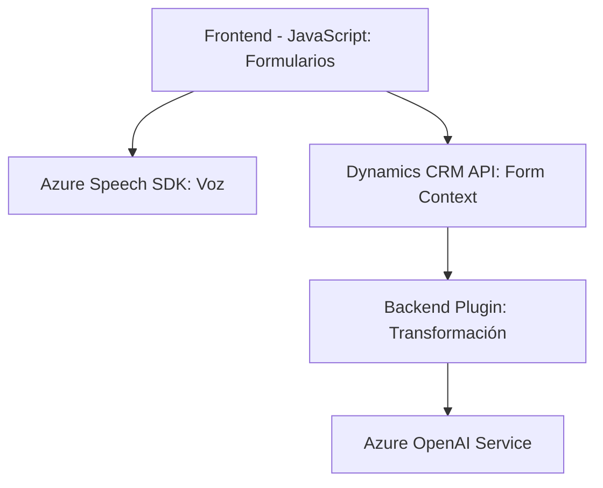

### Breve resumen técnico:
El repositorio incluye funcionalidades para reconocimiento de voz, síntesis de texto a voz y procesamiento de texto con servicios Azure. Los archivos están orientados a integrar capacidades de Microsoft Azure en un entorno Dynamics CRM para enriquecer la experiencia del usuario dentro de formularios y plugins personalizados.

---

### Descripción de arquitectura:
1. **Tipo de solución:** La solución es un sistema que integra frontend (scripts para formularios web) con backend (plugins para Dynamics CRM), utilizando servicios externos (Azure Speech SDK y OpenAI) para procesos de voz y texto.
2. **Patrones de arquitectura:**
   - **N-capas:** Los scripts JavaScript funcionan en el nivel de presentación para integración con formularios de Dynamics CRM. Los plugins operan como capa de lógica de negocio en el backend, procesando eventos del CRM.
   - **Microservicios:** Dependencias a APIs externas (Azure Speech y OpenAI), que procesan la voz y el texto.
   - **Modularidad:** Las funcionalidades están desacopladas entre frontend y backend con funciones específicas independientes.
   - **Evento/Callback:** Uso de callbacks para interacción asíncrona.

---

### Tecnologías usadas:
1. **Frontend:**
   - JavaScript.
   - Azure Speech SDK.
   - Dynamics CRM API.
2. **Backend (externo):**
   - Microsoft Azure Speech Service.
   - Azure OpenAI Service.
3. **Backend (interno):**
   - Dynamics CRM SDK (`IPlugin`).
   - C# para plugins personalizados.
   - HTTP APIs (para interacción con Azure).

---

### Dependencias o componentes externos:
- **Azure Speech SDK:** Para reconocimiento y síntesis de voz.
- **Azure OpenAI Service:** Para procesamiento de texto según reglas.
- **Dynamics CRM:** Contextos de formularios y eventos como `IPluginExecutionContext`.

---

### Diagrama **Mermaid**:

---

### Conclusión final:
La solución representa un sistema conectado y escalable que aprovecha servicios cloud (Azure Speech y Azure OpenAI) junto con un entorno CRM (Dynamics). La arquitectura combina las capacidades de frontend dinámico con procesamiento backend efectivo. Sin embargo, es importante considerar prácticas de seguridad y optimización, como el manejo seguro de claves API y la modularidad del código. 

