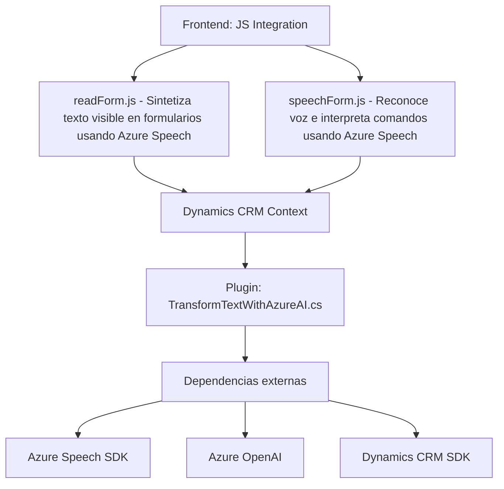

### Breve Resumen Técnico
El repositorio incluye tres archivos principales (`readForm.js`, `speechForm.js`, `TransformTextWithAzureAI.cs`) que trabajan como parte de una solución orientada a integrar funcionalidades de reconocimiento de voz, síntesis de texto y procesamiento de comandos en Dynamics CRM utilizando servicios de Azure (Speech SDK y OpenAI). Es una solución híbrida que combina frontend con capacidades dinámicas y extensiones backend.

---

### Descripción de Arquitectura
La arquitectura observada es modular y extensible con las siguientes características:
1. **Frontend basado en voz**: Archivos `readForm.js` y `speechForm.js` implementan capacidades relacionadas con extracción de datos del formulario, procesamiento de entrada y salida de voz, e integración dinámica con forms en Dynamics CRM.
2. **Extensión de Dynamics CRM (plugin)**: `TransformTextWithAzureAI.cs` implementa una arquitectura de plugin para enriquecer la funcionalidad backend de Dynamics 365 mediante procesamiento inteligente con Azure OpenAI.
3. **Patrones predominantes**:
   - **Plugin Architecture** en Dynamics CRM.
   - **Client API**: Uso de Azure Speech SDK y OpenAI API.
   - **Distribución n-capas** (interacción entre front y plugin backend).
   - **Modularidad**: Separación total de responsabilidades (procesamiento de voz, síntesis, backend de IA).

El esquema global tiene componentes frontend para UX mejorado con APIs conversacionales y un backend que modela arquitectura extensible basada en integración con Azure.

---

### Tecnologías Usadas
- **Frontend**:
  - **JavaScript** (`readForm.js`, `speechForm.js`): Base para el manejo de DOM, lógicas de eventos, SDK Azure.
  - **Azure Speech SDK**: Servicio externo para reconocimiento y síntesis de voz.
  - **Dynamics CRM Context API (`formContext`)**: Interacción directa con los formularios de CRM.
- **Backend/Plugins**:
  - **C#** (`TransformTextWithAzureAI.cs`): Extensión para Dynamics CRM.
  - **Azure OpenAI Service**: Procesamiento de texto usando GPT o modelos inteligentes.
  - Librerías relevantes:
    - **Newtonsoft.Json** (JSON parsing).
    - **System.Net.Http** (Comunicación REST).
  - **Microsoft Dynamics SDK** (Interfaces para integración como `IPluginExecutionContext`).
- **Promesas y asincronismo**: Flujo event-driven con callbacks y promesas para SDK.

---

### Diagrama Mermaid

---

### Conclusión Final
Este repositorio implementa una solución integrada para mejorar la experiencia en el flujo de trabajo de Dynamics CRM utilizando tecnologías avanzadas como Azure Speech SDK y OpenAI, combinando frontend dinámico con un plugin backend extensible. La arquitectura se puede clasificar como **n-capas**, con una segmentación clara entre frontend, contexto del CRM y un backend receptivo con funcionalidades de IA. La solución destaca por su modularidad y potencial para incorporar capacidades de inteligencia artificial en entornos de negocio tradicionales. Se podrían optimizar ciertos aspectos técnicos como el manejo centralizado de configuraciones para las claves y servicios externos.