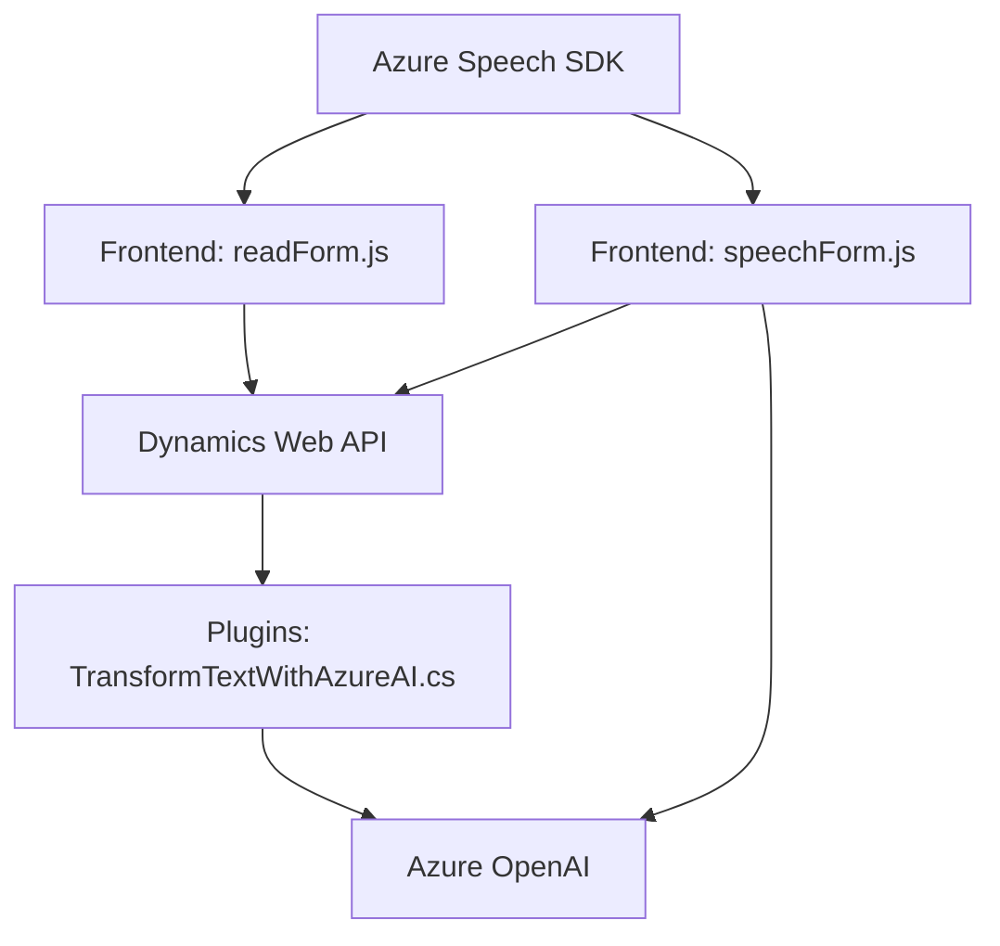

### Breve Resumen Técnico

El repositorio implementa tres componentes principales que facilitan la interacción con formularios de Dynamics 365, incluyendo lectura y entrada de datos por voz (utilizando **Azure Speech SDK**) y transformación avanzada de texto mediante **Azure OpenAI**. Cada archivo se enfoca en diferentes aspectos de la integración entre cliente (JavaScript) y servidor (.NET plugin) para extender funcionalidades en Dynamics.

---

### Descripción de Arquitectura

1. **Tipo de Solución:**  
   La solución integra varias capas de interacción:
   - **Frontend (JavaScript):** Manejo de lógica para entrada/salida de voz y conexión con formularios en Dynamics.
   - **API Plugin (C#):** Transformación avanzada de datos con Azure OpenAI en el servidor.

2. **Arquitectura:**  
   - **N-Capas (Frontend/Backend):** modelo distribuido, donde componentes de frontend operan de forma independiente, consumen SDKs y delegan operación avanzada al backend mediante plugins.  
   - **Integración API externa:** Dependencia de servicios de Azure (Speech SDK y OpenAI) para delegar tareas avanzadas.  

---

### Tecnologías Usadas

**Frontend (JavaScript):**
- **Azure Speech SDK:** Procesamiento de reconocimiento y síntesis de voz.
- **Dynamics API (formContext, Xrm.WebApi):** Manipulación directa de formularios y campos en Dynamics.

**Backend (Plugin en C#):**
- **Azure OpenAI:** Conversión y procesamiento de texto utilizando modelos GPT desde el servidor.
- **Microsoft.Xrm.Sdk:** Para integrar el plugin en Dynamics.
- **Newtonsoft.Json:** Manejo avanzado de datos JSON.

---

### Diagrama Mermaid

---

### Conclusión Final

La solución implementa una arquitectura híbrida distribuida basada en n-capas, en la que el cliente (JavaScript) utiliza SDKs de Azure y realiza tareas básicas de interacción con formularios, mientras que tareas complejas de transformación de datos son delegadas a un plugin .NET que interactúa con Azure OpenAI. Destaca el uso modular y la alta cohesión en funciones, con una integración sólida de APIs externas que amplían las capacidades del sistema en tiempo real.