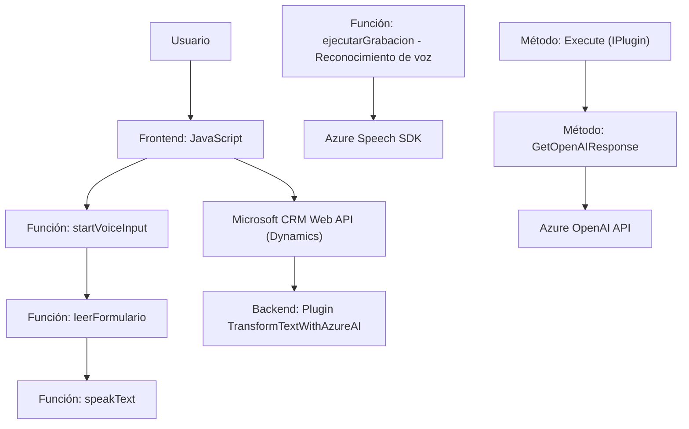

### Breve resumen técnico

El código y la arquitectura descritos nos presentan una solución que integra un **frontend** (archivos JavaScript) con un **backend complementario** (plugin en `C#`) para interactuar con un sistema CRM como Dynamics 365. La solución está orientada a la mejora de la experiencia de usuario con funcionalidades avanzadas como: la síntesis y reconocimiento de voz (usando Azure Speech SDK) y la transformación de textos en objetos estructurados JSON mediante la API de Azure OpenAI.

---

### Descripción de la arquitectura

#### **Arquitectura General**
La solución sigue una arquitectura **híbrida de integración de servicios**, donde:
- El frontend es responsable de la interacción directa con el usuario, la captura y manejo de datos (incluyendo soporte para comandos de voz).
- Un backend independiente, bajo forma de **plugins en Dynamics CRM**, extiende las funcionalidades del sistema mediante el uso de APIs externas (Azure OpenAI) para procesar los datos recibidos.

#### **Patrones Arquitectónicos Identificados**
1. **Patrón de capas n-tier**:
   - **Frontend**: Capa de presentación centrada en JavaScript que interactúa con APIs nativas de Dynamics y servicios web de Azure.
   - **Backend**: Capa lógica en forma de plugins, encargada de procesar los datos y ejecutar operaciones más complejas como transformaciones de texto con IA.

2. **Patrón hexagonal/modular en el frontend**:
   - Se identifican módulos encapsulados para tareas específicas (procesamiento de voz, integración con APIs personalizadas, etc.).
   - Las funciones están organizadas lo suficientemente bien para que se puedan conectar con otros servicios externos.

3. **Integración basada en servicios**:
   - Comunicación constante entre los módulos internos y servicios externos como Azure Speech SDK y API de Azure OpenAI.

4. **Plugin de acción predefinida**:
   - El backend sigue un enfoque de plugin definido por Microsoft Dynamics CRM.

---

### Tecnologías y frameworks usados

1. **Frontend (JavaScript)**:
   - JavaScript: Lógica en funciones modulares para manejar formularios y reconocimiento/síntesis de voz.
   - Azure Speech SDK: Maneja la captura y reproducción de voz mediante reconocimiento de comandos hablados.

2. **Backend (C# Plugin)**:
   - C#: Lenguaje base para el plugin de Dynamics CRM.
   - Microsoft Dynamics SDK (`IPlugin`, contexto de ejecución CRM).
   - Azure OpenAI API: API utilizada para transformaciones avanzadas de texto.
   - Librerías para el manejo de solicitudes HTTP (`System.Net.Http`) y procesamiento JSON (`System.Text.Json`).

3. **Dependencias externas identificadas**:
   - Azure Speech SDK (para voz en frontend).
   - Azure OpenAI API (para transformaciones en backend).
   - Dynamics CRM Web API (`Xrm.WebApi`).

---

### Diagrama Mermaid válido en GitHub Markdown

---

### Conclusión final

Este repositorio representa una solución híbrida centrada en la interacción del usuario con datos dinámicos dentro de formularios en un entorno CRM como Dynamics 365. Se destacan:
- **Frontend avanzado** con funciones modulares que aprovechan tecnologías como Azure Speech SDK para soporte de comandos de voz.
- **Backend (plugin)** que aplica lógica compleja mediante comunicación con Azure OpenAI API para transformar textos.
- La solución presenta una arquitectura basada tanto en capas como en integración de servicios, con módulos que interactúan con APIs externas.

Para optimizar y escalar esta solución:
1. **Seguridad**: Evitar la exposición directa de claves API en el código (usar herramientas como Azure Key Vault).
2. **Modularidad**: Separar las funciones en el frontend por archivo según dominios específicos (sistemas de voz, formularios, requests API).
3. **Observabilidad**: Implementar mecanismos de logging en el backend (plugin) para facilitar el monitoreo y diagnóstico de errores en la comunicación con Azure OpenAI.