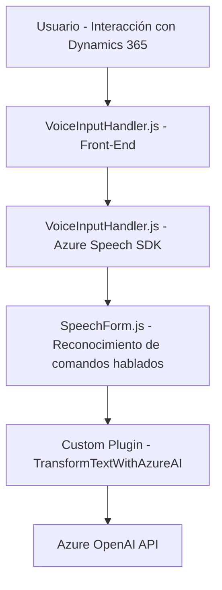

### Breve resumen técnico
El proyecto parece ser una solución orientada a ofrecer capacidades avanzadas de interacción con formularios de Microsoft Dynamics 365 utilizando reconocimiento de voz y generación de texto hablado. El código utiliza servicios externos como **Azure Speech SDK** y **Azure OpenAI**, integrados en módulos para procesar voz y sintetizar texto. Además, se observa la manipulación dinámica de formularios mediante plugins en Dynamics CRM.

---

### Descripción de arquitectura
La arquitectura general emplea un enfoque **n-capas**:
- **Front-End JavaScript:** Interactúa directamente con formularios en Dynamics 365 para capturar y procesar datos visibles, voz y comandos hablados a través de **Azure Speech SDK**. Actúa como una capa cliente en la interacción usuario-sistema.
- **Plugin Dynamics CRM:** Realiza transformaciones avanzadas en texto mediante Azure OpenAI como capa de negocio, integrándose como un microservicio externo de inteligencia artificial.
- **Integración con servicios externos:** Utiliza dos servicios estratégicos: 
  - Azure Speech SDK para reconocimiento y síntesis de voz.
  - Azure OpenAI para estructuración de datos mediante texto interpretado.

Además, sigue el patrón de integración de **eventos** (event-driven) en Dynamics 365, donde los plugins y métodos son disparados por acciones específicas del usuario.

La arquitectura puede considerarse una combinación de **n-capas** en Dynamics 365 y uso de **microservicios** externos para capacidades particulares de AI y síntesis de voz.

---

### Tecnologías usadas
1. **Azure Speech SDK**: Para reconocimiento de voz y síntesis de texto en audio.
2. **Azure OpenAI API**: Para interpretar y transformar texto basado en inteligencia artificial.
3. **Microsoft Dynamics CRM SDK**:
   - `IPlugin`, `IOrganizationServiceFactory`, `IPluginExecutionContext`, para interactuar con entidades y eventos CRM.
4. **JavaScript**: Implementación en el frontend del cliente Dynamics 365 (procesamiento DOM y lógica cliente).
5. **C# (.NET)**:
   - Plugin backend para Dynamics CRM basado en `System.Net.Http`, `Newtonsoft.Json`.
6. **HTTP Services**: Comunicación con API REST externas como OpenAI mediante solicitudes de cliente.

---

### Dependencias o componentes externos
1. **Dependencias externas:**
   - Azure Speech SDK JavaScript.
   - Azure OpenAI API (requiere `api-key` y endpoint).
   - HTTP Client Libraries (`System.Net.Http`) para interoperabilidad con API externas.
   - Newtonsoft.Json para serializar y deserializar respuesta JSON.
2. **Dependencias internas:**
   - Formulario Dynamics 365 (`executionContext`).
   - Webhooks y eventos dispuestos mediante plugins en Dynamics CRM.

---

### Diagrama **Mermaid** válido para GitHub

---

### Conclusión final
El proyecto implementa una solución híbrida combinando **n-capas** y microservicios para dotar a los formularios de Dynamics 365 de capacidades avanzadas de interacción mediante voz e inteligencia artificial. La tecnología utilizada es moderna y aprovecha servicios cloud como Azure Speech y OpenAI. La arquitectura es escalable, con integración estratégica entre el frontend, servicios externos y las funcionalidades backend proporcionadas por Dynamics CRM.