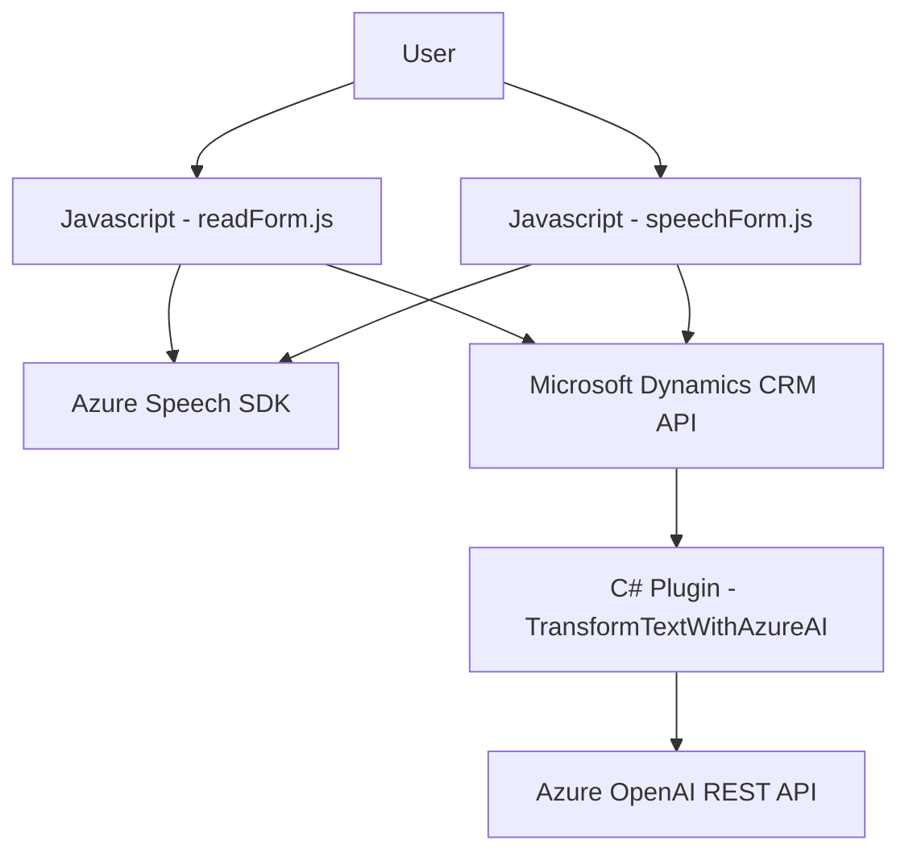

### Breve resumen técnico

La solución es un sistema orientado a CRM que consiste en una serie de componentes integrados a nivel frontend, backend y plugins. Está diseñado para mejorar la interacción y la gestión de datos entre usuarios y formularios dinámicos utilizando funcionalidades avanzadas de Azure Speech SDK y servicios de Azure OpenAI. Incluye:

1. **Frontend**: Scripts diseñados para interactuar con formularios CRM, realizar la síntesis de voz y reconocimiento de voz, además de actualizar dinámicamente los datos desde transcripciones.
2. **Backend**: Plugins de Dynamics CRM que usan Azure OpenAI para transformar y procesar texto según reglas predefinidas.
3. **Integraciones externas**: Uso de servicios de Microsoft Azure para síntesis y reconocimiento de voz (Speech SDK), así como para procesamiento de texto basado en AI (Azure OpenAI).

---

### Descripción de arquitectura

La arquitectura representa una solución **n-capas con servicios externos** integrada sobre una plataforma de CRM (Dynamics). Se emplean dos capas principales:
1. **Frontend**: Responsable de la interacción directa con el usuario mediante el navegador. Se maneja con JavaScript y está especializado en formularios dinámicos de CRM.
   - La capa incluye reconocimiento de voz y síntesis usando Azure SDK, además de un llamado ocasional a APIs personalizadas del CRM.
   
2. **Backend (Plugins)**: Proporciona operaciones de procesamiento en el servidor usando C# y el SDK de Dynamics CRM. Aquí se encapsula la lógica de negocio con integración directa de APIs REST para interactuar con Azure OpenAI.

El diseño refleja patrones como:
- **Integración de servicios cloud**: Uso del Speech SDK y Azure OpenAI para extender funcionalidades de la solución.
- **Modularidad**: Cada archivo y clase está bien segmentado por propósito y contexto de uso.
- **Callback y promesas**: Validación y procesos asincrónicos (e.g., carga del Speech SDK y llamadas a APIs).
- **Mapper pattern**: Para vincular las etiquetas en los formularios visuales con las claves internas del modelo en Dynamics.

---

### Tecnologías usadas
1. **Frontend**:
   - **JavaScript**: Uso de ES6 con funciones asíncronas y promesas (e.g., `callCustomApi`).
   - **Azure Speech SDK**: Para síntesis de voz y reconocimiento de voz.
   - **Microsoft Dynamics CRM API**: Interfaz para la manipulación de formularios CRM (e.g., `executionContext`, `Xrm.WebApi`).
2. **Backend**:
   - **C# (.NET Framework)**: Desarrollo de plugins siguiendo la arquitectura estándar de Dynamics CRM.
   - **Azure OpenAI**: Llamadas directas al API para transformar texto.
   - **Newtonsoft.Json / System.Text.Json**: Para convertir texto a y desde JSON.
3. **Servicios Externos**:
   - Azure Speech SDK (https://aka.ms/csspeech/jsbrowserpackageraw).
   - Azure OpenAI API para procesamiento de texto.
   - Dinámica de acceso a servicios XRM de Microsoft.

---

### Diagrama **Mermaid**

---

### Conclusión final

La solución presentada parece estar orientada al uso en configuraciones de CRM. Utiliza un enfoque modular con arquitectura **n-capas**, donde el frontend y el backend interactúan con servicios externos de Azure para obtener capacidades avanzadas en síntesis y reconocimiento de voz, además de procesamiento de texto mediante AI. La elección de tecnologías como Azure Speech SDK y OpenAI asegura escalabilidad y funcionalidad para una experiencia de usuario optimizada. Sin embargo, el sistema tiene un cierto acoplamiento con Microsoft Dynamics CRM y Azure, lo que podría limitar su flexibilidad en entornos sin estas tecnologías.