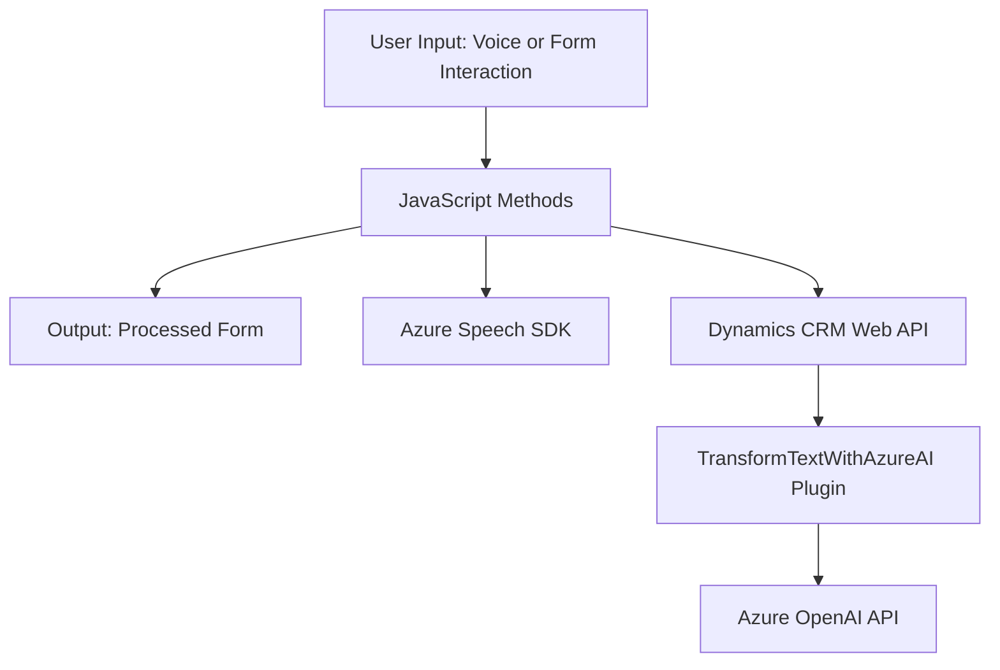

### Breve resumen técnico
El repositorio descrito implementa una solución orientada a la interacción entre interfaces formularias (frontend), procesamiento de voz (TTS y entrada de voz) y servicios de transformación avanzada de texto (Azure OpenAI integrado con Dynamics CRM). Los componentes trabajan juntos para proporcionar una interfaz accesible mediante voz y automatizar tareas en formularios CRM, como llenar, transformar y leer campos dinámicamente.

---

### Descripción de arquitectura
La arquitectura sigue un modelo híbrido, combinando aspectos de **n-capas** y **hexagonal**, apoyándose en:
1. **Frontend JS**:
   - Implementa lógica cliente para la interacción directa con el usuario, entrada de voz y lectura de datos del formulario.
   - Usa SDKs de Azure para operaciones en el navegador.
2. **Plugins para Dynamics CRM (.NET)**:
   - Implementan lógica extendida y personalizada para Dynamics CRM, siguiendo el patrón típico de **Plugins** soportados por la plataforma.
3. **Servicios externos**:
   - Azure Speech SDK: Interacción del navegador para reconocimiento y síntesis de voz.
   - Azure OpenAI API: Transformación de texto con IA.
   - Dynamics CRM Web API: Integración interna para manejo de formularios.

Esta infraestructura conecta módulos independientes, pero trabaja bajo patrones organizados para modularidad, flexibilidad y soporte en sistemas heterogéneos.

---

### Tecnologías, frameworks y patrones usados
1. **Frontend**:
   - **JavaScript** + SDKs externos (Azure Speech).
   - **Patrones**: Modularidad, Event-Driven, callback pattern.
   - **Framework**: Dinámico sobre Dynamics CRM (sin frameworks frontend explícitos).

2. **Backend CRM (.NET)**:
   - **Tecnologías**: Dynamics CRM SDK, Azure OpenAI, System.Net.Http.
   - **Framework**: .NET, manejando plugins con extensiones propias de Dynamics CRM.
   - **Patrones**: Service-Oriented Architecture (SOA), Interacción API basada en eventos, Modularidad.

3. **General**:
   - **Servicios externos**: Azure Speech y Azure OpenAI.
   - **Integración**: APIs externas dinámicas y dependencias incrustadas.

---

### Diagrama Mermaid

---

### Conclusión final
El repositorio combina tecnologías avanzadas para automatizar procesos empresariales (entrada y transformación de datos textuales), integrando soluciones de reconocimiento de voz, procesamiento natural por IA y Dynamics CRM. Sigue patrones orientados a modularidad y reusabilidad, con un enfoque híbrido entre **n-capas** para segmentación estructural y **hexagonal** que promueve independencia de servicios externos. La introducción dinámica de SDKs y APIs favorece la flexibilidad, pero implica consideraciones de seguridad y configuración, como el manejo de claves API en entornos seguros.