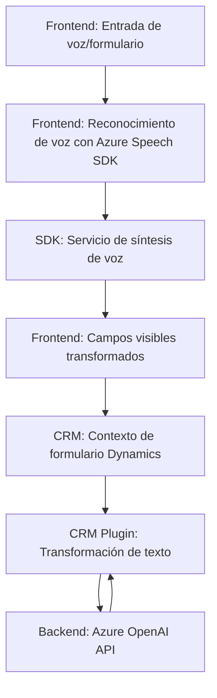

### Resumen Técnico
El repositorio contiene componentes que interactúan con formularios dinámicos y servicios externos (Azure Speech SDK y Azure OpenAI) para manejar la entrada de voz y transformar datos. Consiste en una solución de múltiples módulos, incluyendo un frontend en JavaScript para manejar interfaces y backend con un plugin en C# para transformar texto mediante Azure OpenAI dentro de Dynamics CRM.

---

### Descripción de la Arquitectura
La solución utiliza una **arquitectura de n capas** compuesta por:
1. **Frontend (JavaScript)**: Maneja la interacción con el usuario y el contexto del formulario en Dynamics CRM. Utiliza funciones modulares para descomponer tareas como reconocimiento de voz, entrada de datos y síntesis de texto a voz.
2. **Backend Plugin (C# en Dynamics CRM)**: Manipula el texto y lo transforma en un formato estructurado mediante Azure OpenAI, integrándose como un plugin de Dynamics.

Se emplea la separación de responsabilidades entre cada componente:
- **Frontend**: Procesamiento de datos del usuario y comunicación con el SDK de Azure Speech.
- **Plugin Backend**: Validación, transformación y retorno de datos a Dynamics CRM.

---

### Tecnologías Usadas
- **Frontend**:
  - JavaScript (ES6+, modularizado).
  - Azure Speech SDK (reconocimiento y síntesis de voz).
  - Integración con Dynamics CRM (Xrm.WebApi).

- **Backend Plugin**:
  - Microsoft Dynamics CRM SDK.
  - C# (framework .NET).
  - Newtonsoft.Json y System.Text.Json (manejo de JSON).
  - Azure OpenAI API (procesamiento de texto).

---

### Dependencias y Componentes Externos
1. **Azure Speech SDK**:
   - Usado en el frontend para reconocimiento y síntesis de voz.
   - Cargado dinámicamente utilizando métodos de lazy loading.

2. **Azure OpenAI API**:
   - Llamada desde el plugin backend para transformar texto usando inteligencia artificial.

3. **Xrm.WebApi**:
   - Integrado en el frontend para interactuar con los datos de formularios en Dynamics CRM.

4. **Microsoft Dynamics CRM SDK**:
   - Usado en el backend para acceder y actualizar datos en CRM.

5. **Librerías JSON**:
   - Newtonsoft.Json y System.Text.Json para serialización/deserialización en C#.

---

### Diagrama Mermaid

---

### Conclusión Final
Este repositorio representa una solución **basada en una arquitectura de n capas**, donde:
- El frontend se enfoca en interacción con el usuario y servicios externos para reconocimiento de voz y síntesis de texto.
- El backend, mediante un plugin en Dynamics CRM, convierte texto transcrito a voz en estructuras JSON utilizando un servicio avanzado de inteligencia artificial (Azure OpenAI).

La solución está bien diseñada para integrarse con Microsoft Dynamics CRM, demostrado por el uso del SDK correspondiente y la separación de responsabilidades entre los módulos. Además, la flexibilidad para cargar dinámicamente servicios externos, como el Azure Speech SDK, sugiere una arquitectura adaptativa que prioriza la eficiencia en la integración y operación.