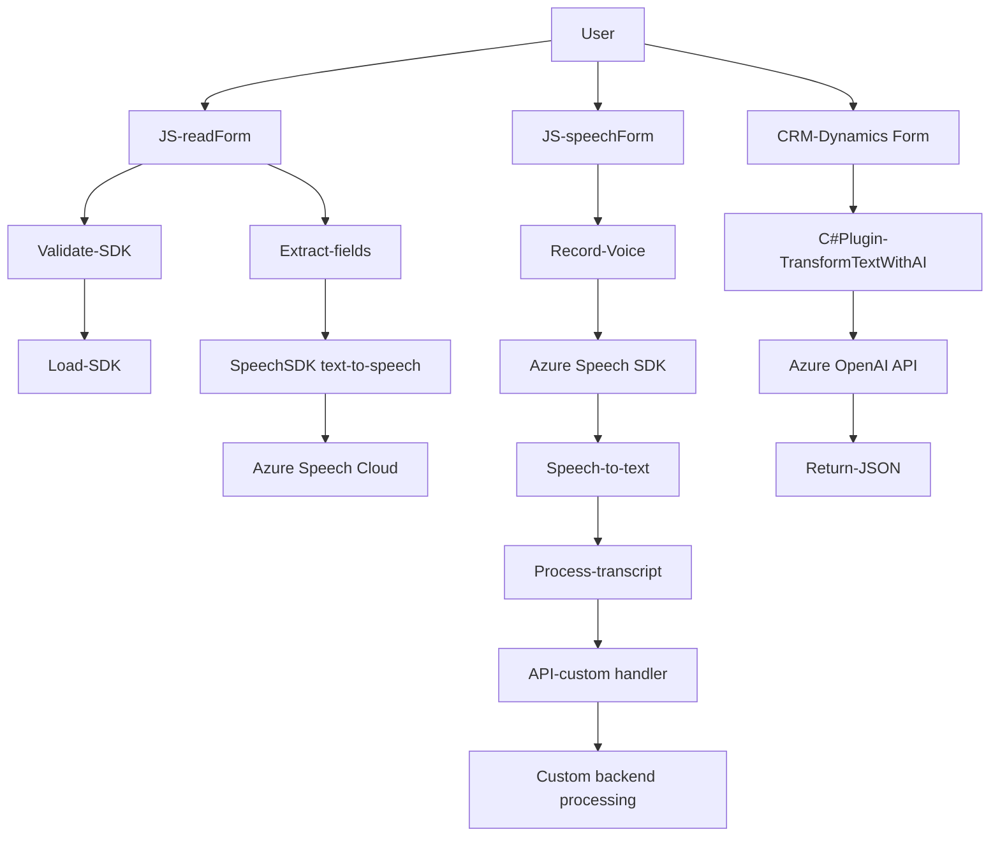

### Breve resumen técnico:
El repositorio presentado implementa una solución integrada que combina procesamiento de datos de formularios, reconocimiento de voz, y transformación de texto utilizando servicios de Microsoft Azure y patrones de integración comunes. La solución parece ser parte de un sistema CRM, posiblemente basado en Microsoft Dynamics, que integre características avanzadas como reconocimiento de voz (text-to-speech y speech-to-text) y transformación de datos mediante Inteligencia Artificial.

---

### Descripción de arquitectura:
La arquitectura está orientada a componentes que interactúan entre sí dentro de un sistema basado en Microsoft Dynamics CRM. Se emplean dos capas principales:
1. **Frontend**: Scripts desarrollados en JavaScript para mejorar la experiencia del usuario mediante captura de datos de formularios y síntesis/reconocimiento de voz. El frontend interactúa con el SDK de Azure Speech y los componentes de Dynamics para obtener y actualizar información de los formularios.
2. **Backend**: Un Plugin desarrollado en C# que actúa como un middleware dentro de Dynamics CRM, utilizando el servicio Azure OpenAI para transformar datos y generar respuestas estructuradas. Opera según reglas configurables y valida entradas/salidas.

Se trata de una arquitectura híbrida **orientada a servicios**, donde servicios externos (Azure SDK y APIs) se integran con componentes concretos (Plugins y scripts frontend) mediante llamadas HTTP/SDK asíncronas. Por tanto, tiene elementos de **arquitectura modular** para el procesamiento local y la integración con servicios externos, como los SDK de Azure y el sistema subyacente de Dynamics CRM.

La organización modular clara en funciones y clases permite una fácil extensibilidad, respetando principios como la **separación de preocupaciones** y **cohesión funcional**. Las interacciones entre componentes y servicios externos están gestionadas mediante API REST y SDKs.

---

### Tecnologías usadas:
1. **Frontend**:
   - Lenguaje: JavaScript.
   - SDK: Azure Speech SDK para text-to-speech y speech-to-text.
   - Contexto: Microsoft Dynamics CRM (integración vía objetos como `formContext`, `executionContext`, Xrm API).
   - Diseño: Funciones modulares y orientadas a eventos asíncronos/callback.

2. **Backend**:
   - Lenguaje: C#.
   - Framework: Microsoft Dynamics CRM SDK (Clases: `IPlugin`, `IOrganizationService`).
   - Librerías:
     - `System.Net.Http`: Para realizar solicitudes HTTP.
     - `Newtonsoft.Json.Linq`: Gestión avanzada de JSON.
     - `System.Text.Json`: Serialización de JSON.
   - Servicio: Integración directa con Azure OpenAI.

3. **Servicios Externos**:
   - Cloud SDKs/Services:
     - Azure Speech SDK: Para reconocimiento y síntesis de voz.
     - Azure OpenAI API: Para transformación de texto con IA.
   - API personalizada: Extendida en Dynamics para análisis avanzado.

4. **Patrones Técnicos**:
   - Modularidad.
   - Integración SDK-API.
   - Delegación Asíncrona/Callbacks.
   - Validación robusta de entradas y errores.
   - Arquitectura basada en plugins para el backend.

---

### Diagrama Mermaid válido para GitHub:

---

### Conclusión final:
Este repositorio implementa una solución avanzada orientada al procesamiento y generación de contenido en voz, texto, y datos estructurados mediante la integración de servicios de Microsoft Azure (Speech SDK y OpenAI API) y operaciones en Microsoft Dynamics CRM. La arquitectura presenta elementos modulares tanto en el frontend como en el backend. Mediante SDKs y APIs integrados, se logra una sinergia efectiva entre un sistema CRM local y un conjunto de servicios basados en la nube. 

La arquitectura híbrida y orientada a servicios garantiza facilidad en el mantenimiento, escalabilidad, y extensibilidad hacia futuras mejoras, tales como nuevas capacidades de IA o interacción con formularios y entidades adicionales en Dynamics.