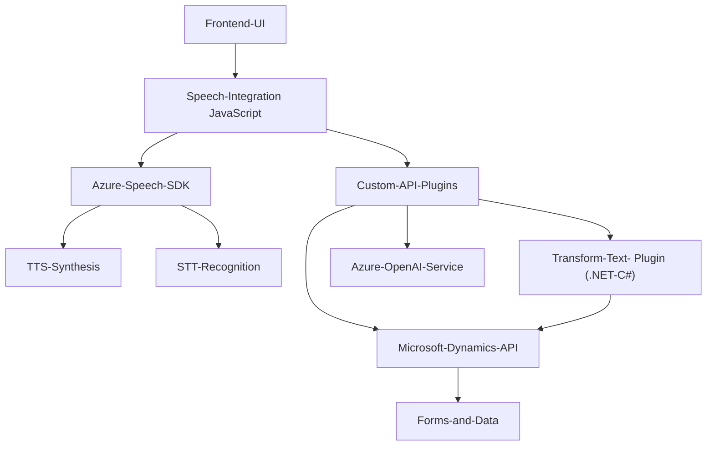

# Análisis técnico con base en los archivos proporcionados

## Breve resumen técnico
El repositorio indica una solución que implementa la interacción entre formularios web y servicios en la nube, específicamente para **síntesis de voz (TTS)**, reconocimiento de voz (STT), y transformación de texto utilizando **Inteligencia Artificial** de **Azure Speech SDK** y **Azure OpenAI Services**. La solución se integra con Microsoft Dynamics CRM para aportar funcionalidades avanzadas a través de plugins y frontend JavaScript.

---

## Descripción de arquitectura
### Tipo de solución
La solución consta de diferentes componentes que permiten interacción entre **frontend web**, **Azure Speech API** (síntesis/reconocimiento), y un **plugin para Dynamics CRM**. Este sistema es híbrido ya que:
1. **Frontend**: Representa la capa de interacción del usuario final (interfaz web).
2. **Integración Backend**:
   - A través de **Microsoft Dynamics API** para gestionar datos del CRM (formContext, attributes, controls).
   - Plugins en C# que extienden funcionalidades del CRM para tratar datos usando **Azure OpenAI** para transformación de texto.

### Arquitectura general
La arquitectura es un modelo **n-capas extendido** con un enfoque **en integración de APIs y servicios en la nube**.
1. La capa de presentación (frontend) maneja interacción basada en voz con formularios y servicios de transcripción y síntesis proveídos por Azure.
2. La capa de lógica específica incluye el código en **Plugins** y **JavaScript** para procesar datos del formulario y generar peticiones HTTP hacia APIs externas (Azure Speech y Azure OpenAI).
3. La capa de datos utiliza Microsoft Dynamics CRM para almacenar y manipular la información.
4. La conectividad con servicios externos (Azure Speech y Azure OpenAI) sigue un enfoque basado en *API Gateway Pattern*, ejecutando llamadas externas desde módulos dedicados.

Además, exhibe características de una **arquitectura orientada a servicios (SOA)** implementando funcionalidades modulares a través de SDKs de terceros y **Microsoft Dynamics Plugins**.

---

## Tecnologías y patrones arquitectónicos usados
1. **Frontend JavaScript**:
   - **Azure Speech SDK**: Para síntesis de voz (TTS) y reconocimiento (STT).
   - **Callbacks asíncronos** (JavaScript native callbacks) para manejo de operaciones asíncronas como carga de SDK o uso del speech-to-text de Azure.
   - **DOM Manipulation**: Para interacción con formularios dentro de Dynamics 365.
   - **Helper Functions**: Uso de funciones de normalización y gestión de datos estructurados (e.g., conversión de palabras a números).

2. **Backend Plugins (C#/Dynamics SDK)**:
   - **Microsoft Dynamics CRM SDK**: Uso de servicios y objetos como `IPlugin`, `IOrganizationService`, y gestión de contextos del plugin dentro de Dynamics.
   - **Azure OpenAI API**: Para transformar texto según normas predefinidas mediante solicitudes HTTP.
   - **Singleton Pattern**: Uso de métodos estáticos para conexiones con servicios externos como Azure.
   - **JSON Parsing**: Uso de `Newtonsoft.Json.Linq` y `System.Text.Json` para manejar objetos JSON.
   - **Service-Oriented Architecture**: Dependencias principales se centran en servicios como CRM SDK y APIs de terceros.

3. **API Integration Patterns**:
   - Uso de **RESTful API** para conectar con **Azure Speech SDK** y **Azure OpenAI API**.
   - Llamadas HTTP externas gestionadas dinámicamente mediante claves y región configuradas.

---

## Dependencias o componentes externos

### Internas:
- **Microsoft Dynamics CRM SDK**:
  - Contexto (formContext) de los formularios, atributos, y controles.
  - Plugins de Dynamics para extender funcionalidades.

### Externas:
1. **Azure Speech SDK**:
   - Síntesis de voz (Text-To-Speech, TTS).
   - Reconocimiento de voz (Speech-To-Text, STT).

2. **Azure OpenAI API**:
   - Transformación de texto empleando capacidades de IA (GPT).
   - Requiere manejo de credenciales (API key y región).

3. **Microsoft Dynamics 365 API**:
   - Para integración directa con datos y contexto de formularios.

4. **JavaScript Libraries**:
   - Native DOM manipulation.
   - On-demand script loading via `document.head.appendChild()`.
   - Asynchronous callbacks.

5. **C# Libraries**:
   - `Newtonsoft.Json.Linq` (JSON structures handling).
   - `System.Net.Http` (HTTP requests to Azure APIs).

---

## Diagrama Mermaid

---

## Conclusión final
La solución configura un entorno híbrido con interacción de **frontend, APIs externas**, y un **sistema CRM**. Está diseñada bajo una arquitectura **n-capas** que se apoya en integraciones orientadas a servicios (SOA) para proporcionar funcionalidades avanzadas como síntesis de voz, comandos por voz, y transformación de texto mediante IA. Utiliza un enfoque modular mediante plugins y servicios, lo cual facilita la escalabilidad y extensibilidad del sistema hacia nuevos casos de uso.

Para entornos de producción, sería fundamental revisar:
1. La seguridad de las credenciales (Azure Key).
2. La carga dinámica del SDK para garantizar la disponibilidad del servicio.
3. Optimizaciones en el manejo de diferentes respuestas de los servicios cloud.