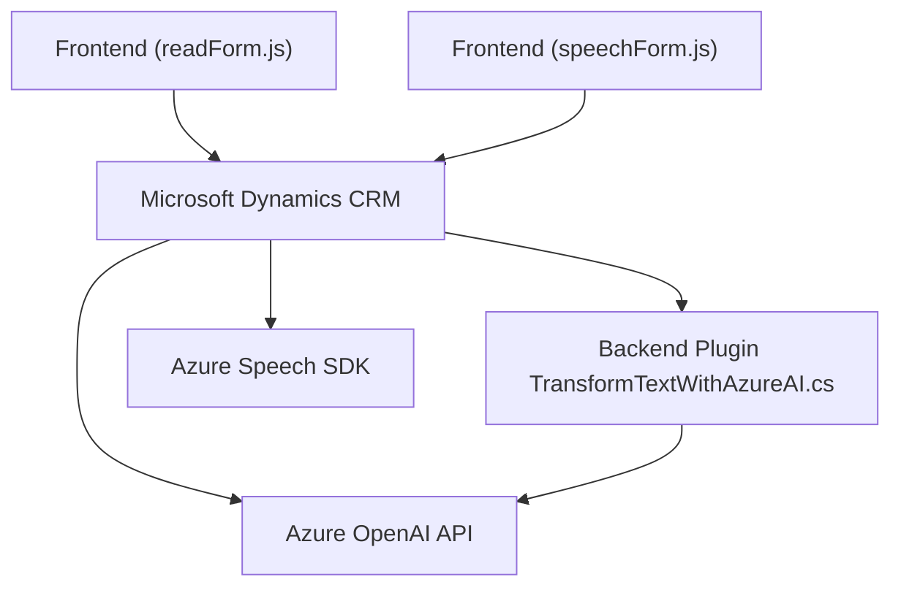

### Breve resumen técnico:
El repositorio parece implementar una solución integrada dentro de **Microsoft Dynamics CRM** que aprovecha capacidades de **Azure Cognitive Services (Speech SDK)** y **Azure OpenAI**. Se enfoca en facilitar dos funcionalidades principales: síntesis de texto a voz desde formularios (archivo `readForm.js`), y reconocimiento y procesamiento de voz para insertar datos en formularios dinámicos (archivo `speechForm.js`). Adicionalmente, el archivo de **plugin `TransformTextWithAzureAI.cs`** se encarga de transformar texto utilizando AI en el backend con Azure OpenAI.

---

### Descripción de arquitectura:
La arquitectura sigue el enfoque **Cliente-Servidor** con integración directa entre procesamiento cliente (JavaScript ejecutado en navegadores) y backend (plugin desarrollado en C#). Las capas están organizadas como sigue:
1. **Frontend (Presentation layer):** Implementada en JavaScript, está encargada de la interacción directa con el usuario, extracción de datos del formulario y manejo de eventos de voz.
2. **Backend (Logic layer):** Se encuentra en el archivo `TransformTextWithAzureAI.cs` y realiza operaciones de transformación de datos solicitadas desde Dynamics CRM.
3. **Servicios externos:** Interfaz directa con APIs como **Azure Speech SDK** y **Azure OpenAI**.

La solución se diseñó bajo una **arquitectura modular** para mejorar la separación de responsabilidades. Adopta patrones claros de client-side callbacks y servicios REST para comunicación con sistemas remotos.

---

### Tecnologías usadas:
1. **Microsoft Dynamics CRM:** Para la gestión de datos a través de formularios.
2. **JavaScript:** En el frontend, destinado a interactuar con CRM y servicios externos.
3. **Azure Cognitive Services Speech SDK:** En el frontend, facilitando el reconocimiento de voz y la síntesis de voz.
4. **Azure OpenAI API:** En el backend, para transformar texto en respuesta al plugin de Dynamics.
5. **C#:** Lenguaje utilizado para programar el plugin en el backend.
6. **Microsoft.Xrm.Sdk:** Librería de Dynamics para interactuar con las funcionalidades del CRM.
7. **Newtonsoft.Json** y **System.Text.Json:** Para manejar objetos JSON.
8. **System.Net.HttpClient:** Llamadas HTTP al servicio Azure OpenAI.

---

### Diagrama Mermaid válido para GitHub:

---

### Conclusión final:
Este repositorio es una solución **híbrida Cliente-Servidor** que interactúa entre el frontend de Microsoft Dynamics y la capa de backend mediante APIs externas como Azure Speech SDK y Azure OpenAI. El enfoque modular y la separación de responsabilidades en las diferentes capas proporcionan buena extensibilidad y escalabilidad. Sin embargo, existe un alto acoplamiento con la arquitectura de Dynamics CRM, lo que limita su uso en diferentes contextos fuera de este ecosistema.