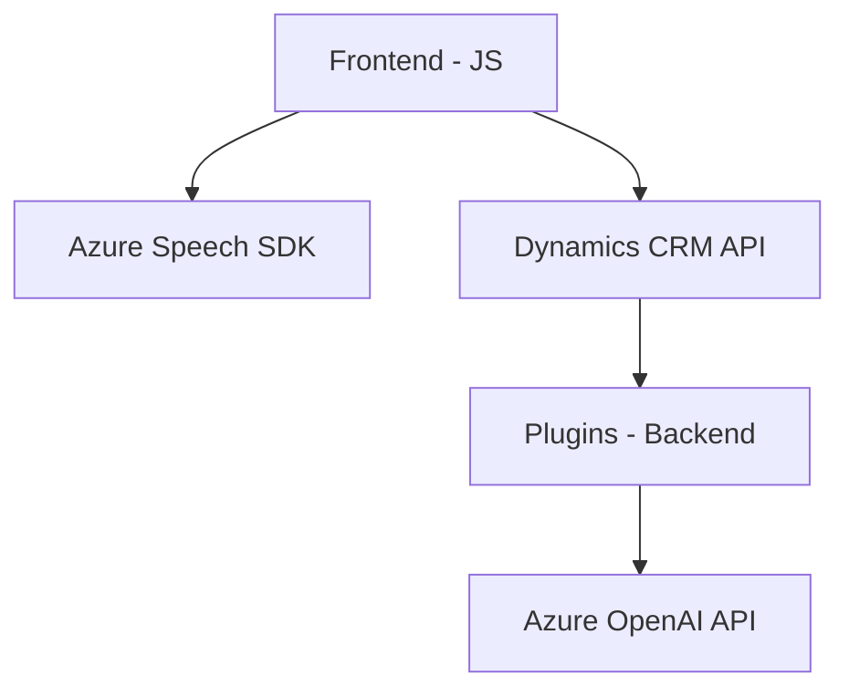

### Breve resumen técnico

Los archivos analizados pertenecen a un sistema integrado en una aplicación de CRM (probablemente Dynamics 365) donde el principal objetivo es habilitar funcionalidades avanzadas de voz: síntesis de voz, reconocimiento de voz y procesamiento de texto mediante servicios de Azure y OpenAI. Estas capacidades están divididas en funcionalidades frontend (interacción con formularios) y backend (procesamiento mediante plugins para Dynamics 365).

---

### Descripción de arquitectura

La solución parece ser un **sistema modular** distribuido entre capas:

- **Frontend**: Scripts que actúan sobre formularios en Dynamics 365, proporcionando funcionalidades como síntesis de voz y reconocimiento de voz. Estas funciones están diseñadas como módulos independientes con integración directa hacia servicios de Azure (Speech SDK/AI).
- **Backend**: Plugins en Dynamics CRM que actúan como puntos de integración entre el sistema y servicios externos (Azure OpenAI). Estos plugins procesan inputs personalizados (como texto para transformación) y devuelven datos estructurados en formato JSON.
- **Capas de integración externa**: Uso de servicios externos como Azure Speech SDK (frontend) y Azure OpenAI (backend) para funciones avanzadas.

La arquitectura mencionada se asemeja a un **n-capas distribuido**, donde:
1. El **Frontend** actúa como cliente implementado en JS para interacción directa con el usuario y la interfaz (formulario CRM).
2. El **Backend** utiliza plugins para Dynamics CRM como capa de procesamiento y lógica central del sistema.
3. Los servicios externos (Azure Speech API y Azure OpenAI) actúan como capas horizontales de integración.

Esta complejidad sugiere un posible enfoque de arquitectura orientada a servicios (SOA) con una fuerte dependencia de APIs externas.

---

### Tecnologías usadas

- **Frontend**:
  - JavaScript para lógica de negocio.
  - **Azure Speech SDK** para síntesis y reconocimiento de voz.
  - Dynamics CRM API (`Xrm.WebApi`) para manipulación de formularios.

- **Backend**:
  - Microsoft Dynamics CRM Plugin Framework (`IPlugin`).
  - C# para implementación de lógica de plugins.
  - **Newtonsoft.Json** para manipulación JSON.
  - **Azure OpenAI API** para procesamiento de texto en formato JSON.

### Patrones observados

1. **Delegate Pattern**: Uso de callbacks para manejar dependencias del SDK de Azure en el frontend.
2. **Plugin Pattern**: Implementación típica de Dynamics CRM para manejar eventos en el backend.
3. **Integración basada en APIs**: Consumo de puntos de servicio externos (Speech SDK y OpenAI) como parte de procesos críticos.

---

### Diagrama Mermaid válido para GitHub

---

### Conclusión final

Este sistema distribuye funcionalidades específicas entre frontend y backend para proporcionar capacidades avanzadas de reconocimiento, síntesis y procesamiento textual mediante servicios integrados de Azure Speech SDK y Azure OpenAI. Sus características son adecuadas para entornos empresariales como Microsoft Dynamics 365, apoyando la digitalización de procesos. La arquitectura modular y por capas asegura una separación clara de responsabilidades y facilita el escalamiento mediante la incorporación de nuevos servicios o funcionalidades basadas en APIs.