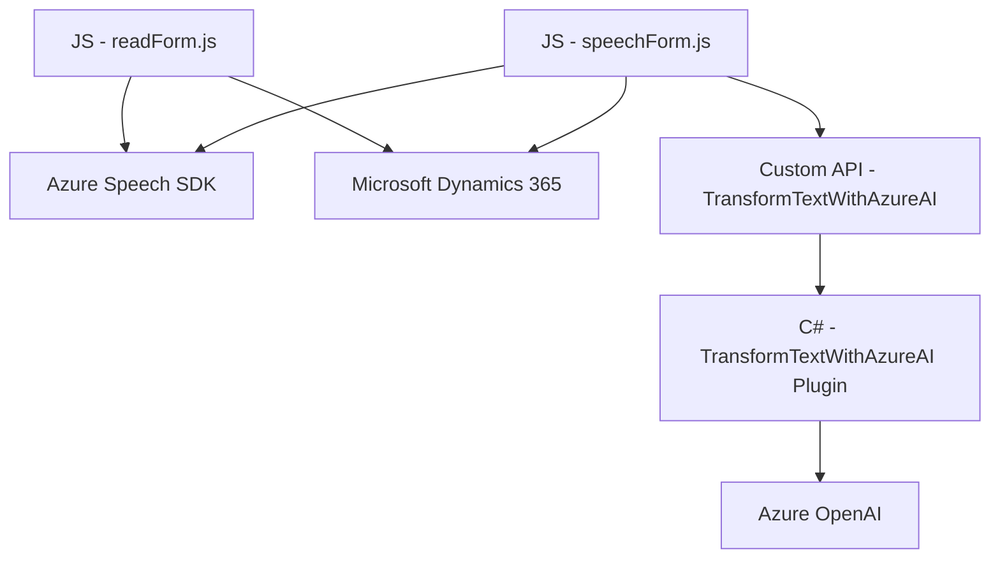

### Breve resumen técnico

El repositorio contiene archivos que implementan una solución basada en Microsoft Dynamics 365, con integración de reconocimiento de voz mediante el **Azure Speech SDK** y procesamiento de textos en lenguaje natural utilizando **Azure OpenAI**. Los archivos están organizados bajo un frontend (JavaScript) y una lógica de plugins (C#), lo que combina funcionalidad de cliente con procesamiento de negocio en el backend. 

La solución está diseñada para formularios interactivos dentro de Dynamics 365, permitiendo lectura, reconocimiento y procesamiento de datos de entrada de voz, con soporte para reglas personalizadas y capacidades de interacción con APIs externas.

---

### Descripción de la Arquitectura

La arquitectura combina elementos propios de Dynamics 365 y servicios externos, lo que sugiere una solución híbrida:

1. **Frontend:** Usando JavaScript para ejecutar y controlar el reconocimiento de voz, síntesis de voz y manipulación de formularios dentro del navegador. Este capa trabaja sobre los formularios personalizados de la plataforma Dynamics 365.
   
2. **Backend:** Implementado como un plugin para Dynamics CRM (escrito en C#), diseñado para conectarse al servicio **Azure OpenAI**. Se basa en un procesamiento externo de datos mediante APIs, devolviendo valores procesados en formato estructurado a la aplicación.

3. **Integración externa:** Se utiliza el Azure Speech SDK para funcionalidades de voz y Azure OpenAI para análisis de lenguaje natural mediante servicios en la nube. Ambos servicios están desacoplados y se comunican dinámicamente con la solución.

Globalmente, esta arquitectura tiene las siguientes características:
- **Event-Driven:** La entrada de datos por voz o texto gatilla eventos (como actualizaciones en los campos del formulario).
- **Microservicios:** Integración con servicios externos (SDK y APIs) para realizar partes específicas del procesamiento (reconocimiento y análisis).
- **N-capas:** Separación clara entre frontend de usuario, lógica de negocio en plugins y APIs externas para procesamiento avanzado.

---

### Tecnologías Usadas

1. **Frontend:**
   - **JavaScript (Vanilla JS):** Principal herramienta para control de formularios y funciones dinámicas.
   - **Azure Speech SDK:** Para síntesis de voz y reconocimiento de audio en tecnologías web mediante CDNs.
   - **Microsoft Dynamics 365 API:** Para acceder y modificar atributos de formularios de manera programática.

2. **Backend:**
   - **C# Plugins:** Para lógica de negocio personalizada en el contexto de Dynamics CRM.
   - **Microsoft.Xrm.Sdk:** Manipulación de datos en Dynamics CRM.
   - **Azure OpenAI API:** Integración con servicios de inteligencia artificial GPT-4 para procesamiento y transformación de texto.
   - **Newtonsoft.Json** y **System.Text.Json:** Manipulación de JSON.

3. **Servicios externos:**
   - **Azure Speech & OpenAI Services:** Reconocimiento y generación de voz, procesamiento de lenguaje natural.

---

### Diagrama Mermaid

---

### Conclusión final

La solución utiliza una arquitectura híbrida basada en **N-capas** que separa de manera clara el frontend, la lógica de negocio y la integración con servicios externos. Los archivos en el repositorio ofrecen funcionalidades avanzadas como síntesis de voz, reconocimiento de voz y análisis semántico de texto mediante AI, aplicadas específicamente al contexto de formularios personalizados de Dynamics 365.

El diseño modular del frontend promueve reutilización y mantenibilidad, mientras que la lógica del plugin en el backend refuerza la separación de responsabilidades. Además, la integración dinámica de servicios externos indica un enfoque flexible y adaptable. Aunque la solución no implementa patrones avanzados como arquitectura hexagonal o microservicios completos, su robustez y capacidad de expansión hacen que sea ideal para implementaciones en entornos corporativos.