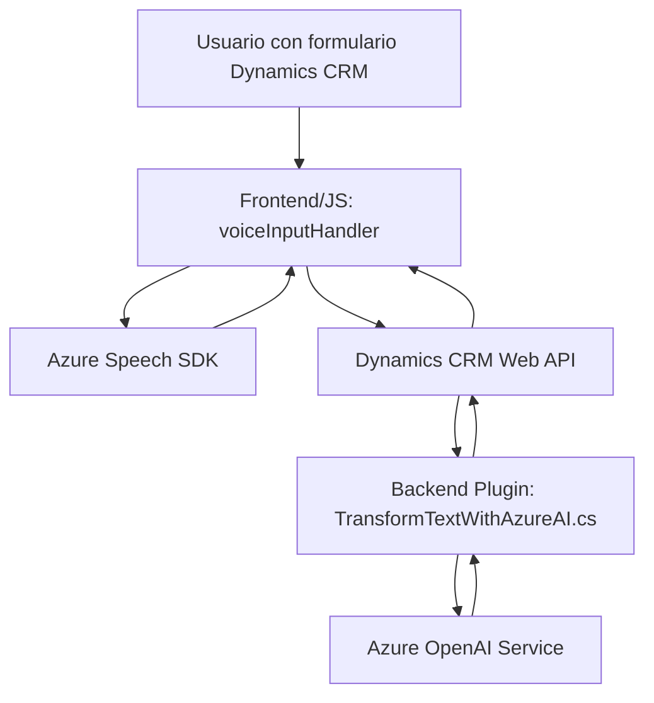

### Breve resumen técnico

El repositorio contiene una solución de software híbrido que interactúa con Microsoft Dynamics CRM como agregador del negocio, integrando funcionalidades avanzadas de reconocimiento de voz, procesamiento de datos por texto hablado y uso de servicios de inteligencia artificial de Azure. Está diseñado para habilitar experiencias enriquecidas en formularios del CRM, facilitando su gestión por medio de entrada y salida de voz.

---

### Descripción de arquitectura

1. **Tipo de solución:**  
   - Este proyecto parece ser un **middleware híbrido** basado en una combinación de un **Frontend (con JavaScript)** y un **plugin en Backend (C#)** que interactúa con la plataforma Dynamics CRM desde el lado del servidor. El frontend utiliza JavaScript para interactuar con la interfaz del usuario y servicios de Azure (Speech SDK), mientras que el backend implementa un microservicio para comunicación con Azure OpenAI.

2. **Arquitectura:**  
   - La arquitectura general puede categorizarse como **n-capas** con una integración limitada a servicios externos de Azure. Las capas son las siguientes:
     - **Capa cliente (Frontend):** Responsable de las interacciones con el usuario y presentación de datos (formulario dinámico).
     - **Capa de lógica del negocio (Backend plugin):** Ejecuta transformaciones de texto con Azure OpenAI y coordina la comunicación con Dynamics CRM.
     - **Capa de servicios externos:** Incluye las APIs de Azure Speech SDK y Azure OpenAI para procesamiento de voz, síntesis de texto y transformación mediante IA.

3. **Patrones observados:**
   - **Event-Driven Architecture:** El frontend emplea llamadas asíncronas y carga dinámica de scripts.
   - **Separation of Concerns:** Cada función tiene una responsabilidad bien definida, desde la carga del SDK hasta la interacción con la API personalizada de Dynamics CRM.
   - **Plugin Architecture:** El backend utiliza el patrón de plugin estándar de Dynamics CRM.
   - **DTO (Data Transfer Objects):** Para transfusión de datos procesados como JSON estructurado entre capas y servicios Azure.
   - **Dynamic Dependency:** El SDK de Azure se carga dinámicamente en el cliente.

---

### Tecnologías usadas

1. **Frontend:**
   - **Lenguaje:** JavaScript (modular y sin frameworks explícitos).
   - **Servicios:** Azure Speech SDK (`window.SpeechSDK`) para reconocimiento y síntesis de voz.
   - **Plataforma:** Dynamics CRM como contenedor de formularios.

2. **Backend:**
   - **Lenguaje:** C# para plugin de Dynamics CRM.
   - **Frameworks/SDKs:** Microsoft.Xrm.Sdk para integración directa a Dynamics CRM.
   - **Servicios:** Azure OpenAI para procesamiento avanzado de texto.

3. **Externos:**   
   - Azure Speech SDK para reconocimiento de voz.
   - Azure OpenAI para procesamiento y generación de texto.

---

### Dependencias o componentes externos

- **Azure Services:**
  - Speech SDK: Reconocimiento de voz y texto a voz.
  - OpenAI: Transformación basada en inteligencia artificial.
- **Dynamics CRM Web API:** Para gestión de datos en los formularios y entidades dinámicas.
- **HTTP Client:** Para llamadas API desde el backend hacia Azure.

---

### Diagrama Mermaid (estructura y flujo de interacción)

---

### Conclusión final

La solución está diseñada como un complemento robusto para una aplicación Dynamics CRM, con funcionalidades avanzadas de reconocimiento de voz, síntesis de voz y procesamiento de texto basado en IA. Su arquitectura modular y enfoque en eventos proporciona escalabilidad y adaptabilidad. Sin embargo, se pueden mejorar aspectos de seguridad y manejo de credenciales, además de agregar pruebas unitarias y auditorías de código para garantizar mayor calidad y confiabilidad en escenarios sensibles al error. El uso de servicios de Azure aporta un alto nivel de funcionalidad inteligente al sistema, pero también demanda una implementación robusta de manejo de dependencias y configuraciones externas.