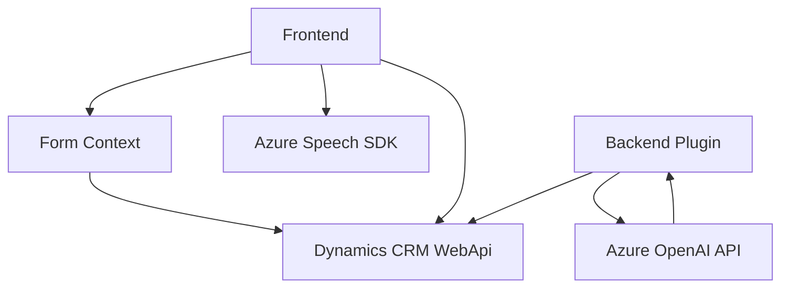

### Análisis y explicación detallada

#### 1. Tipo de solución
La solución combinada que se describe en los archivos es una **aplicación híbrida cliente-servidor**:
- El componente **frontend** incluye funcionalidades que interactúan con formularios y servicios de voz (Azure Speech SDK), procesando tanto entrada como salida de texto relacionado con formularios.
- El componente **backend/servidor** define un plugin compatible con Dynamics CRM, que se integra con el servicio **Azure OpenAI API** para transformar texto en un formato específico como JSON, añadiendo inteligencia artificial al análisis de datos.

Es un modelo modular, con lógica organizada para entrada de voz, procesamiento en cliente y transformación en servidor.

---

#### 2. Tecnologías, frameworks y patrones empleados
**Tecnologías usadas:**
- **Frontend:**
  - **JavaScript**: Para el procesamiento de datos en el cliente y control de formularios.
  - **Azure Speech SDK**: Para la síntesis de voz y reconocimiento de entrada.

- **Backend:**
  - **C#**: Desarrollo del plugin.
  - **Microsoft Dynamics CRM SDK**: Para la ejecución dentro del entorno de Dynamics CRM.
  - **Azure OpenAI API**: Integración de IA para la transformación avanzada de texto a estructura de datos.
  - **JSON Libraries (Newtonsoft.Json)**: Serialización y manipulación de datos en formato JSON.

---

**Patrones empleados:**
1. **Cliente-Servidor**: 
   - Interacción entre el frontend (formularios y cliente web) y backend para operaciones complejas.
   
2. **División de responsabilidades**:
   - En el frontend, las funciones están separadas: captura de entrada de voz, estructura de datos de formularios y síntesis de voz.
   - En el backend, se divide procesamiento de texto (`TransformTextWithAzureAI`) y la integración con OpenAI API.

3. **Carga dinámica**:
   - En el cliente, el Azure Speech SDK se carga dinámicamente utilizando el patrón de inicialización diferida en plataformas web modernas.

4. **Repository & Adapter**:
   - En el backend, el plugin sigue el patrón **Repository Adapter** para interactuar con Dynamics CRM.

---

#### 3. Tipo de arquitectura
- **Frontend** utiliza una arquitectura orientada a **n-capas**: Tiene capas de presentación y lógica de negocio en cliente, integrando servicios externos como Azure Speech SDK mediante APIs.
- **Backend** usa una arquitectura basada en **Plugins CRM** con patrones de **adapter** para la integración de OpenAI y **repository** para manipulación de datos internos.

El diseño general podría considerarse **integración multiservicio**, no necesariamente microservicios, pero con separación clara entre frontend y backend.

---

#### 4. Dependencias o componentes externos que podrían estar presentes
1. **Azure Speech SDK**:
   - Para habilitar entrada/salida de voz en cliente web.
2. **Azure OpenAI API**:
   - Para realizar transformaciones de texto relacionadas con IA. Este servicio requiere una suscripción activa.
3. **Dynamics CRM SDK**:
   - Necesario para que el plugin se registre en un entorno CRM. Incluye dependencia de clases como `IPlugin`, `IOrganizationService`, etc.
4. **Xrm.WebApi** (de Dynamics CRM, frontend):
   - Usado en el dominio cliente para interacciones directas con la API del CRM.
5. **JSON Libraries** (`Newtonsoft.Json`, `System.Text.Json`):
   - Para serializar datos y realizar operaciones sobre el JSON.

---

#### 5. Diagrama Mermaid para GitHub Markdown

---

### Conclusión Final
Esta solución está diseñada para ser modular e integrable con servicios modernos de Azure (Speech y OpenAI), junto con un entorno corporativo CRM basado en Dynamics 365. La arquitectura captura y procesa datos tanto en cliente como en servidor, aprovechando la potencia de inteligencia artificial en backend mientras que permite interacciones fluidas en el frontend mediante reconocimiento y síntesis de voz.

Los patrones identificados favorecen la escalabilidad y modularidad, pero el sistema depende de múltiples servicios de Azure, por lo que consideran estabilidad y optimización en las integraciones necesarias para su uso.