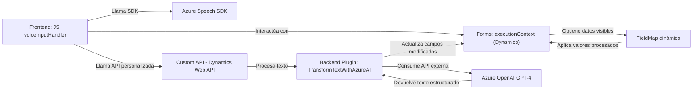

### Breve resumen técnico
Este repositorio forma parte de un sistema que implementa interacción por voz con formularios y utiliza inteligencia artificial para transformar texto. Combina un frontend que se integra con el **Azure Speech SDK** para reconocimiento de voz y síntesis de audio, además de un backend en Dynamics CRM que emplea un **plugin C#** para procesamiento avanzado de texto con **Azure OpenAI Service (GPT-4)**.

### Descripción de arquitectura
La arquitectura es híbrida y combina elementos de **n-capas** (frontend, backend, lógica de negocio) junto con **servicios externos** (SDK de Azure, APIs de Dynamics y Azure OpenAI). El sistema emplea una **event-driven architecture** en el frontend para iniciar procesos basados en acciones del usuario (voz), y un **plugin pattern** en Dynamics CRM para extender funcionalidades sin alterar el núcleo del sistema.

### Tecnologías usadas
#### Frontend:
- **JavaScript** con funciones modulares para manejar lógica de voz.
- **Azure Speech SDK** para reconocimiento y síntesis de voz.
- **Microsoft Dynamics 365** (`executionContext`, APIs de WebApi) para la integración con formularios y entidades.
- Función de callback para control asíncrono tras la carga del SDK.

#### Backend:
- **C# con Dynamics CRM SDK**: Implementa un plugin para manejar eventos y conectar con servicios externos.
- **Azure OpenAI Service (GPT-4)**: Provee procesamiento avanzado de texto según reglas configuradas por el cliente.
- **Newtonsoft.Json** y **System.Text.Json** para manejo de datos JSON.
- **HTTP client** para comunicación con el servicio Azure OpenAI.
- Expresiones regulares y manejo robusto de excepciones.

#### Patrones principales:
1. **Event-driven programming** (en frontend, basado en interacción por voz).
2. **Service-based architecture** (backend conectado a APIs externas).
3. **Plugin pattern** (lógica extendida de Dynamics CRM).
4. **SRP (Single Responsibility Principle)** en funciones y clases.

### Posibles dependencias externas
1. **Azure Speech SDK**: Para manejo de voz.
2. **Azure OpenAI Service**: Para procesamiento avanzado con GPT-4.
3. **Dynamics 365 APIs**: Integración con sistemas empresariales.
4. **Newtonsoft.Json** y **System.Text.Json**: Manejo robusto de estructuras JSON.
5. **HTTP APIs**: Comunicación con servicios externos (e.g., Azure OpenAI).

### Diagrama Mermaid

### Conclusión final
El diseño del sistema combina una arquitectura basada en eventos y servicios para cumplir su propósito: manejar interacción por voz con formularios y realizar transformaciones de texto con IA. La estructura y los patrones utilizados son consistentes con una solución orientada a empresas con integración de Dynamics CRM y Azure servicios. Aunque el sistema es robusto y modular, debe manejar de forma segura las credenciales y garantizar que los servicios externos no generen puntos únicos de fallo.