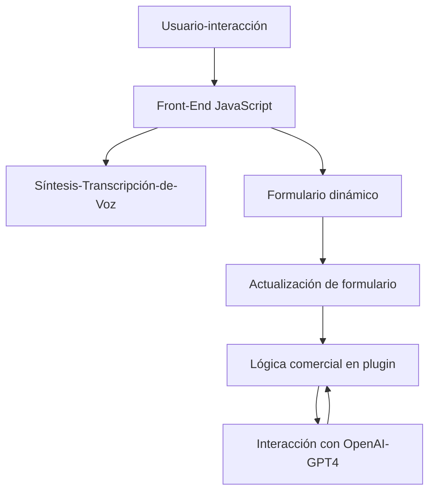

### Breve Resumen Técnico
El repositorio implementa funcionalidad para **integrar servicios de Azure** (Speech SDK y OpenAI GPT-4) con una aplicación basada en **Microsoft Dynamics CRM**. Los módulos permiten la lectura de datos de formulario, transcripción de voz, y procesamiento de texto para rellenar dinámicamente campos contextuales en CRM. Adicionalmente, incluyen lógica para interactuar con APIs externas y extender funcionalidades CRM mediante un plugin.

---

### Descripción de Arquitectura
La arquitectura global sigue el enfoque **modular** y combina componentes de **front-end (JavaScript y Azure SDK)** y **back-end (Dynamics CRM Plugins y Azure AI)**. 

#### Niveles Observables:
1. **Capa de UI-Front-End** (JavaScript): Funcionalidades para interacción directa del usuario como lectura del formulario en voz, transcripción de voz y actualización dinámica de formularios.
   - Comunicación directa con servicios de Azure Speech SDK.
   - Modularización de funcionalidades para reutilización en formularios.

2. **Capa de Extensiones CRM** (Plugin en .NET): Extensión de lógica que interactúa con datos en la base del CRM utilizando APIs y servicios externos.
   - Comunicación con Azure OpenAI para transformación de texto.
   - Actualización de campo dinámico en base a contexto CRM.

#### Patrón arquitectónico predominante:
- **Arquitectura N Capas:** Las funciones se separan en diferentes capas como presentación (front-end), integración (llamados a APIs externas), y lógica empresarial (plugin en Dynamics CRM).
- **Integración basada en SDKs y APIs:** Uso de SDKs y REST APIs para interactuar con servicios de voz (Speech SDK) e inteligencia artificial (OpenAI GPT-4).
- **Plugin Pattern:** Extensión basada en Microsoft Dynamics CRM Plugins que establece puntos de entrada para la integración con Azure AI.

---

### Tecnologías Usadas
1. **Front-end:**
   - **JavaScript**: Funcionalidad para interacción en el navegador con formularios.
   - **Azure Speech SDK**: Para síntesis y transcripción de voz.

2. **Back-end:**
   - **C#**: Implementación del plugin de Dynamics CRM.
   - **Dynamics CRM SDK**: Para manipular datos CRM directamente.
   - **Azure OpenAI (GPT-4)**: Para transformación de texto y reglas de IA.

3. **Servicios Externos:**
   - Servicio de Voz de Azure.
   - Azure OpenAI (GPT-4) endpoint.
   - API interna en Microsoft Dynamics CRM.

---

### Dependencias o Componentes Externos
1. **SDKs Externos:**
   - Azure Speech SDK (JavaScript).
   - Dynamics CRM SDK (C#).
2. **Servicios Cloud:**
   - Azure OpenAI GPT-4 para transformación de texto.
   - Servicios REST para interacción con CRM.
3. **Librerías del Proyecto:**
   - `Newtonsoft.Json`, `System.Net.Http` para manejo de JSON y solicitudes HTTP en los plugins.
   - Scripts dinámicos en front-end para cargar Azure Speech SDK.
   
---

### Diagrama Mermaid (100 % compatible con GitHub Markdown)

---

### Conclusión Final
El repositorio define una solución integral para aplicaciones dinámicas en el ecosistema de CRM con soporte avanzado para servicios de voz e inteligencia artificial. Su arquitectura modular basada en capas y el uso de SDKs y APIs externas lo hace escalable para integrar características adicionales. Sin embargo, se podría mejorar la estrategia de manejo de errores, especialmente en la interacción con servicios externos para garantizar mayor resiliencia en ambientes reales.