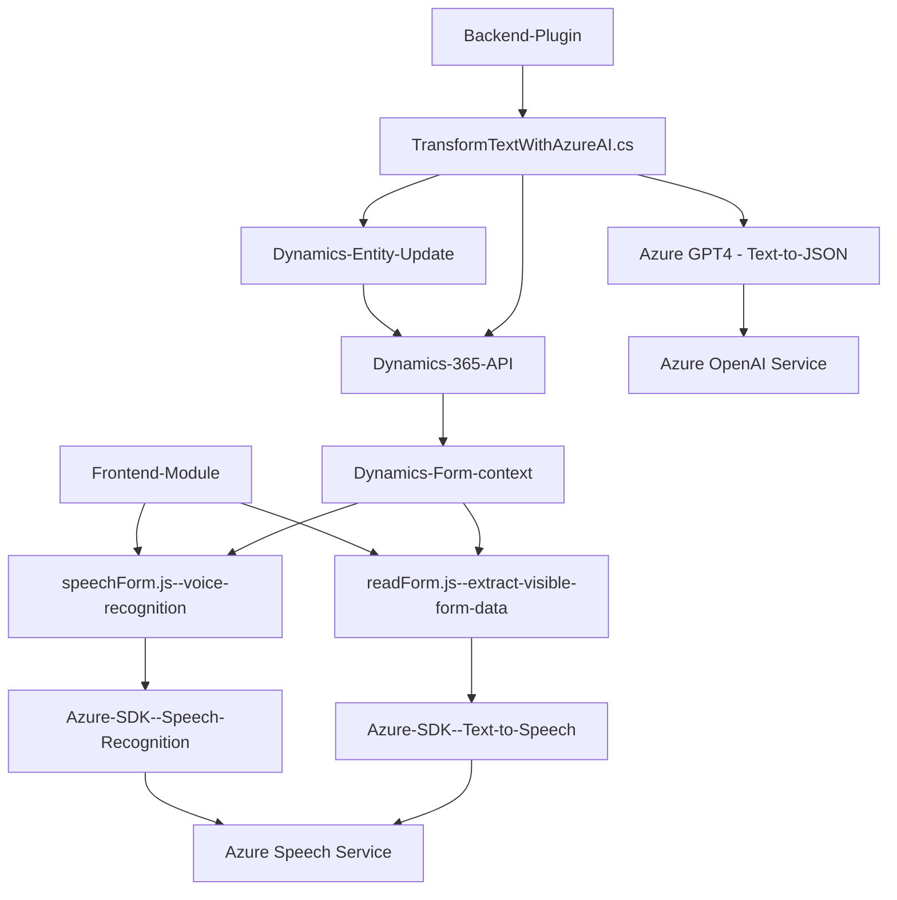

# Análisis y Arquitectura del Repositorio

## **Breve Resumen Técnico**
El repositorio contiene archivos enfocados en integrar funcionalidades de reconocimiento de voz y síntesis de texto en voz utilizando Azure Speech SDK y Azure OpenAI GPT-4. Está orientado hacia la accesibilidad y el procesamiento inteligente de datos dentro de un contexto Dynamics 365 CRM. Además, los archivos demuestran integración con servicios externos como Dynamics APIs y Azure Cloud para operaciones avanzadas.

---

## **Descripción de la arquitectura**
1. **Tipo de solución**: El repositorio parece ser una combinación que incluye:
   - **Frontend**: Archivos en JavaScript (`readForm.js`, `speechForm.js`) interactúan con formularios en Dynamics 365 y ejecutan funciones para síntesis y reconocimiento de voz, además de procesamiento de datos.
   - **Backend**: Un plugin en C# (`TransformTextWithAzureAI.cs`) que interactúa con Dynamics CRM para transformar texto en estructuras JSON utilizando Azure OpenAI (GPT-4).

2. **Arquitectura**:  
   La solución implementa una arquitectura **modular basada en capas**. Podemos observar:
   - **Capa de presentación (frontend)**: Archivos en JavaScript interactúan con el contexto de Dynamics 365 para formularios del usuario.
   - **Capa de lógica de negocio (backend)**: El plugin en C# es responsable de ejecutar reglas específicas y gestionar la comunicación con Azure OpenAI.
   - **Servicios externos**: Integración con Azure API como el Speech SDK y OpenAI GPT.

3. **Patrones utilizados**:
   - **Modularidad**: Cada función está bien definida para realizar tareas específicas.
   - **Carga dinámica de dependencias**: SDK de Azure es cargado de manera dinámica solo cuando es necesario (`ensureSpeechSDKLoaded()`).
   - **Patrón Plugin** en C#: Aprovecha la interfaz `IPlugin` para extender la funcionalidad de Dynamics CRM.
   - **Acceso a APIs externas**: Servicios en la nube como Azure SDK y OpenAI se utilizan para las operaciones principales.
   - **Event-driven architecture**: Lógica orientada al manejo de eventos relacionados con la carga de SDK, reconocimiento, y síntesis de voz.
   - **Procesamiento funcional**: Las funciones en el frontend están diseñadas para seguir un flujo de entrada, transformación y salida.

---

## **Tecnologías usadas**
- **Frontend**:
  - JavaScript para lógica de interfaz.
  - Azure Speech SDK para reconocimiento de voz y síntesis de texto en voz.
  - Dynamics 365 SDK para manejo de formularios.
  
- **Backend**:
  - C# para desarrollar plugins.
  - Azure OpenAI (GPT-4) para procesamiento de texto y generación de contenido estructurado.
  - Microsoft Dynamics CRM SDK (`Microsoft.Xrm.Sdk`) para integrar con la base de datos.
  - `Newtonsoft.Json` y `System.Text.Json` para manipulación JSON.
  - `System.Net.Http` para consumo de APIs de Azure.

- **Externo**:
  - *Azure Speech Service*: Para reconocimiento y síntesis de voz.
  - *Azure OpenAI (GPT-4)*: Procesamiento de texto con modelos AI.
  - *Dynamics 365 API*: Para manipulación de datos en formularios y entidades.

---

## **Diagrama Mermaid**

---

## **Conclusión Final**
Este repositorio refleja una solución compleja que integra accesibilidad y procesamiento inteligente basado en voz dentro de una aplicación Dynamics 365 CRM. Utiliza una **arquitectura modular basada en capas**, donde el **frontend** y el **backend** interactúan de manera eficiente con servicios externos como Azure Speech SDK y Azure OpenAI. Los patrones utilizados garantizan extensibilidad, modularidad y compatibilidad con servicios modernos en la nube. Es ideal para aplicaciones empresariales que necesiten utilizar tecnologías de voz y texto con procesamiento avanzado. Sin embargo, el repositorio podría beneficiarse de una revisión en términos de seguridad para el manejo de claves y configuración sensible.