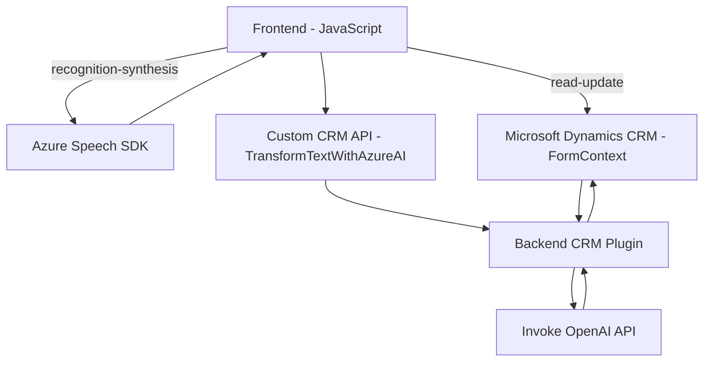

### Breve Resumen Técnico

El repositorio contiene múltiples componentes destinados a integrar funcionalidades de síntesis de voz y reconocimiento de voz con Microsoft Dynamics CRM utilizando Azure Speech SDK y Azure OpenAI. Los archivos están organizados para manejar la manipulación dinámica de formularios y procesar texto mediante inteligencia artificial.

---

### Descripción de Arquitectura

La solución implementa una **arquitectura n-capas** que combina elementos de integración con servicios externos. Está compuesta de distintas capas:
1. **Frontend:** Scripts diseñados para interactuar con formularios del entorno Dynamics CRM y llevar a cabo operaciones relacionadas con la voz (síntesis y reconocimiento).
2. **Backend/plugin:** Comprende el archivo `TransformTextWithAzureAI.cs`, que amplía las capacidades del CRM con el uso de un servicio de Azure OpenAI para transformar datos textuales.
3. **Servicios externos:** Integraciones con Azure Speech SDK para síntesis y reconocimiento de voz, además del servicio de Azure OpenAI para procesamiento textual.

La arquitectura parece orientada a funcionalidad **distribuida**, donde el backend actúa como enlace entre el frontend y servicios en la nube como Azure Speech SDK y Azure OpenAI. Al mismo tiempo, los componentes siguen principios de separación de responsabilidades en módulos.

---

### Tecnologías Usadas

1. **Frontend:**
   - Ecosistema web estándar (JavaScript para el procesamiento del DOM y lógica de negocios).
   - Azure Speech SDK integrado para síntesis y reconocimiento de voz.
   - Microsoft Dynamics CRM UI Framework (DX API, como `Xrm.WebApi.online`).

2. **Backend:**
   - Microsoft Dynamics CRM Plugin Framework (`IPlugin`).
   - Azure OpenAI Service para procesamiento textual vía API.

3. **General:**
   - Asincronía mediante Promises y funciones de callback.

---

### Dependencias o Componentes Externos

1. **Azure Speech SDK:** Usado en el frontend para la síntesis y el reconocimiento de voz. Requiere una clave de API y una región configurada (`azureKey` y `azureRegion`).
2. **Azure OpenAI Service:** Proporciona herramientas de procesamiento de lenguaje natural en backend para transformar texto.
3. **Microsoft Dynamics CRM:** Componentes nativos usados en ambos frontend (formularios dinámicos) y backend (plugins).
4. **DOM estándar y métodos del navegador:** Para manipulación del contenido visible de páginas/formularios.
5. **Librerías externas:** 
   - `Newtonsoft.Json` y `System.Text.Json` utilizadas en el backend para serialización y deserialización de datos JSON.
   - `System.Net.Http` para gestionar solicitudes HTTP hacia Azure OpenAI.
6. **Custom APIs**: Para extender la funcionalidad en el sistema CRM, como la API `trial_TransformTextWithAzureAI`.

---

### Diagrama Mermaid Válido para GitHub

---

### Conclusión Final

La solución presente en el repositorio puede considerarse un híbrido entre una **arquitectura n-capas** (frontend y backend conectados por una API) y una integración de **microservicios**. Aunque utiliza un plugin en el backend para extender las capacidades del CRM, la mayoría de la lógica del sistema parece estar en el frontend y abrirse a la comunicación directa con los servicios de Azure.

Principales ventajas:
- Uso de tecnologías modernas y servicios de nube específicos con SDK robustos (Azure Speech).
- Capacidad de reutilización mediante el diseño modular de cada archivo.

Aspectos a considerar:
- Algunas piezas del código carecen de una organización jerárquica avanzada (por ejemplo, implementar MVC, manipuladores de eventos más robustos).
- Múltiples dependencias externas pueden necesitar ajustes si hay cambios en las API de Azure Speech SDK o OpenAI, lo que exige mecanismos de manejo de errores robustos y pruebas constantes en los endpoints externos.

En resumen, este proyecto representa una integración sólida de funcionalidades orientadas a voz y texto con un enfoque modular y distribuido, pero podría beneficiarse de ajustes de implementación para lograr mayor escalabilidad y mantenibilidad.