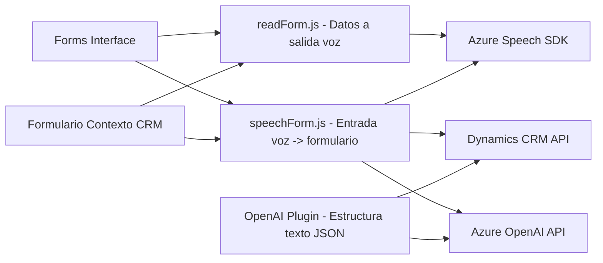

### Breve resumen técnico

El repositorio contiene tres archivos principales que implementan funcionalidades relacionadas con Microsoft Dynamics 365, Azure AI y Speech SDK. Estos archivos aportan capacidades de entrada/salida de voz y procesamiento de texto mediante herramientas de inteligencia artificial, aprovechando la interacción con formularios dinámicos de CRM. También incluye un plugin para automatización de transformación de texto mediante Azure OpenAI.

___

### Descripción de arquitectura

La solución está diseñada como una **arquitectura de integración modular de servicios**. Cada componente tiene responsabilidades específicas:

1. **Frontend (JS)**: Proveen interacción directa con el usuario en formularios de Dynamics 365.
   - `readForm.js` maneja la salida por voz usando datos visibles de formularios.
   - `speechForm.js` administra entrada por voz, conectividad con APIs externas y mapeo de campos.
   
2. **Plugin Backend (C#)**: Diseñado para ejecutar lógica de transformación avanzada (texto a JSON) directamente dentro del entorno Dynamics CRM mediante Azure OpenAI.

La arquitectura utiliza **Event-Driven principles** en el frontend (acciones basadas en eventos de voz/entrada) y sigue el patrón **Plugin-Centric Architecture** en el backend para Dynamics CRM. Aunque la solución puede ser expandida hacia microservicios, actualmente parece seguir un enfoque **n-capas**:
   - **Capa de presentación** (JS en el frontend).
   - **Capa de negocio** (C# como plugin).
   - **Capa de integración externa** (Azure SDK y OpenAI para AI).

___

### Tecnologías usadas

1. **Frontend**:
   - **Azure Speech SDK**: Para entrada/salida de texto hablado.
   - **Dynamics CRM JS API** (`Xrm.WebApi`): Gestión de datos y formularios.

2. **Plugin Backend**:
   - **Microsoft Dynamics SDK**: Extensión del comportamiento estándar del CRM.
   - **Azure OpenAI API**: Para transformación de texto basado en GPT-4.
   - **C#/.NET**: Lenguaje de desarrollo del plugin.

3. **Patrones aplicados**:
   - Event-Driven Processing.
   - Modular y funcional.
   - Integración de APIs externas (Azure Speech y OpenAI).
   - Helper Method para abstracción interactiva con servicios.

___

### Diagrama Mermaid

___

### Conclusión final

La solución es una integración avanzada que combina tecnologías de Microsoft Dynamics, Azure Speech SDK, y Azure OpenAI. Presenta un diseño modular con funcionalidad clara de entrada/salida de voz y transformación de datos en formularios CRM. Mientras el frontend utiliza JavaScript para interactuar con la interfaz del usuario, el backend (plugin) se ocupa de lógica avanzada de AI mediante API REST. Por su dependencia de servicios externos como Azure y OpenAI, la arquitectura ofrece una gran flexibilidad y posibilidades de expansión, pero está fuertemente acoplada con el ecosistema de Microsoft.