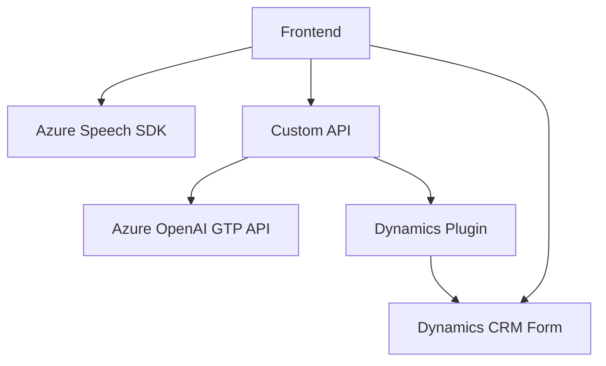

### Breve resumen técnico:
El repositorio presenta una solución que implementa funcionalidades relacionadas con el manejo y procesamiento de datos en formularios, con una interacción basada en voz y conversión a texto mediante Azure Speech SDK, luego transformados por Azure OpenAI API. Se compone principalmente de dos módulos de frontend (JavaScript) y un plugin backend (C# ASP.NET-based), configurado como parte de un sistema Dynamics CRM. El objetivo es facilitar la interacción del usuario con formularios, haciendo uso de reconocimiento y síntesis de voz.

---

### Descripción de arquitectura:
La arquitectura es una combinación de **cliente-servidor distribuido** y **integración con servicios externos** (Azure Speech SDK y OpenAI GPT). Cada módulo lleva funciones específicas:

1. **Frontend Javascript**:
   - Interactúa con los formularios visibles en el cliente.
   - Procesa entrada/salida con Azure Speech SDK.
   - Realiza llamadas AJAX a una **Custom API** definida en el backend.

2. **Backend Plugin**:
   - Implementa funciones como plugins en Dynamics CRM.
   - Ejecuta transformaciones de texto en JSON usando Azure OpenAI GPT.

Esta separación de responsabilidades y comunicación mediante APIs lo hace más cercano a una **arquitectura de microservicios**, donde las funcionalidades clave están desacopladas y se conectan por medio de servicios.

---

### Tecnologías, frameworks y patrones usados:
**Frontend**:
- **Azure Speech SDK**: Para reconocimiento y síntesis de voz.
- **AJAX**: Para la interacción con APIs internas (e.g., Dynamics CRM) y externas (Azure OpenAI).

**Backend Plugin**:
- **Dynamics CRM SDK (.NET)**: Para interfaces estándar como `IPlugin`.
- **Azure OpenAI API**: Para transformación de texto.
- **Newtonsoft.Json**: Para manejo de datos JSON.
- **HTTP Client**: Para las peticiones a Azure OpenAI.

**Patrones identificados**:
- **Programación orientada a eventos**: Se observa en las funciones de frontend que manejan la interacción de usuarios y APIs al cargar SDK o procesar texto.
- **Interfaces/Plugins**: Se usan mecanismos propios de Dynamics CRM (`IPlugin`, `IServiceProvider`).
- **Integración externa (API Gateway)**: Flujo de datos hacia y desde servicios externos como Azure OpenAI y Speech SDK, una característica común en sistemas desacoplados.
- **Modularidad**: Código estructurado según funcionalidades en ámbitos bien definidos (frontend/backend).

---

### Dependencias o componentes externos posibles:
1. **Azure Speech SDK**: Para síntesis y reconocimiento de voz.
2. **Azure OpenAI API (GPT-4)**: Generación de texto a partir de datos.
3. **Dynamics CRM Platform**:
   - **Xrm.WebApi**: Para comunicación interna con datos del sistema.
   - **IPlugin interfaces**: Ejecutadas dentro del contexto CRM.
4. **Libraries**:
   - Newtonsoft.Json: Para serialización y manejo de datos JSON en backend.
   - System.Net.Http: Integración HTTP en .NET.
   - System.Text.Json: JSON handling en .NET context.

---

### Diagrama Mermaid válido para GitHub Markdown:
El siguiente diagrama muestra las relaciones de módulos en el sistema:

---

### Conclusión final:
El análisis identifica que el repositorio implementa una solución técnica basada en una arquitectura híbrida de cliente-servidor distribuido. Con un claro desacoplamiento modular, cada componente realiza una función bien definida. Las tecnologías clave son Azure Speech SDK, Dynamics CRM, y Azure OpenAI. El código sigue principios de modularidad y programación basada en eventos. La integración con servicios externos indica una estrategia de API-driven development.