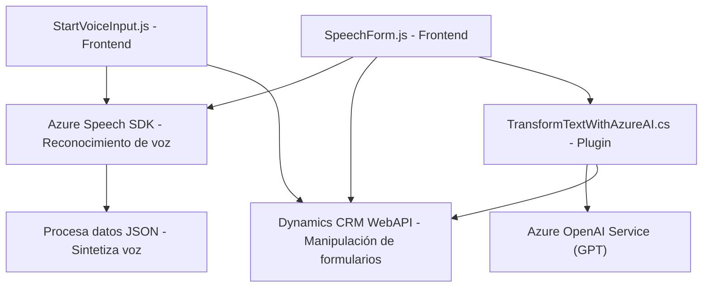

### Breve resumen técnico:
El repositorio consiste en tres componentes principales que trabajan en conjunto para integrar servicios de Azure (Speech SDK y OpenAI) con formularios en Dynamics CRM. Cada archivo tiene una función específica: lectura y síntesis de voz en formularios (JavaScript), reconocimiento de voz y procesamiento IA en formularios (JavaScript), y un plugin para transformar texto mediante Azure OpenAI en Dynamics CRM (.NET).

---

### Descripción de la arquitectura:
La aplicación utiliza una arquitectura modular basada en tres capas principales:
1. **Frontend** (JavaScript): Permite interacción directa del usuario con formularios en Dynamics CRM, usando Azure Speech SDK.
2. **Backend** (Plugin .NET): Procesa texto y aplica lógica avanzada de transformación mediante integraciones con Azure OpenAI Service.
3. **External Services**: Dependen de integraciones con Azure Speech SDK para reconocer y sintetizar voz, y Azure OpenAI Service para procesamiento IA.

La arquitectura principal puede considerarse **n-capas**, donde cada capa cumple un propósito diferenciado:
- Capa de presentación (formularios en Dynamics).
- Lógica de negocio (procesamiento y transformaciones).
- Capa de datos y servicios (interacciones con WebAPI, Azure Speech, y OpenAI).

---

### Tecnologías usadas:
1. **Azure Speech SDK**:
   - Reconocimiento de voz y síntesis de texto.
   - Integración dinámica con formularios web.

2. **Azure OpenAI**:
   - Uso de GPT para transformar contenido textual.

3. **Dynamics 365 WebAPI**:
   - Manipulación y actualización de formularios construidos sobre Dynamics.

4. **Microsoft Dynamics CRM Plugin Framework (.NET)**:
   - Plugin para extender funcionalidades nativas de Dynamics.

5. **JavaScript (Browser)**:
   - Control de formularios del frontend.
   - Carga dinámica del SDK de Azure Speech.

6. **.NET Framework**:
   - Plugin para interacción con Dynamics CRM y servicios externos.

7. **JSON Manipulation**:
   - Uso intensivo de `Newtonsoft.Json` y `System.Text.Json` en el plugin.

---

### Diagrama Mermaid válido para GitHub:

---

### Conclusión final:
Este repositorio implementa un sistema de reconocimiento de voz, procesamiento de formularios y transformación de texto en un entorno Microsoft Dynamics CRM. Utiliza una arquitectura modular de n-capas que integra servicios externos como Azure Speech SDK y Azure OpenAI. Los principales patrones incluyen la delegación de responsabilidades entre módulos, separación de concernimientos a nivel de funciones, uso de servicios web y carga dinámica de recursos. La solución está bien diseñada para sus objetivos, aunque su éxito depende de configuraciones específicas dentro del entorno de Dynamics y los servicios API de Azure.