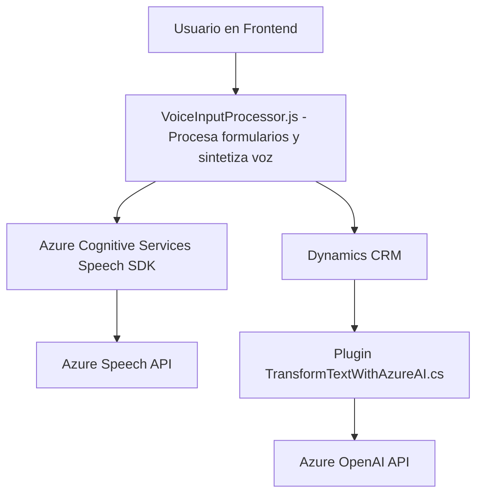

# Breve resumen técnico
El repositorio contiene varios archivos (JavaScript y C#) orientados a la integración de **procesamiento de voz** y **transformaciones de texto avanzadas** con servicios de **Microsoft Azure**. La solución parece ser una combinación de frontend con capacidades avanzadas y plugins personalizados para **Dynamics CRM**, que involucran el uso de APIs de inteligencia artificial y servicios externos como Azure Cognitive Services y Azure OpenAI.

---

# Descripción de arquitectura
La solución se basa en una arquitectura **modular** que mezcla frontend con lógica de integración API y plugins de procesamiento en Microsoft Dynamics CRM. Los archivos tienen una clara separación de responsabilidades:
- **Frontend**: Procesa formularios y usa entrada de voz para sintetizar o reconocer comandos que interactúan con APIs externas y el contexto del CRM.
- **Plugins personalizados**: Procesan texto de manera avanzada utilizando Azure OpenAI; retornan datos estructurados y se integran dentro del flujo de trabajo de Dynamics CRM.

La arquitectura es **n capas**, con las siguientes divisiones:
1. **Capa de presentación**: Maneja la interacción del usuario, el procesamiento de formularios y las solicitudes de voz a través de SDKs en el frontend.
2. **Capa de lógica (plugins)**: Ejecuta transformaciones avanzadas de texto y conecta servicios externos como Azure Cognitive Services y Azure OpenAI.
3. **Capa de acceso a datos (Dynamics CRM)**: Define el almacenamiento y procesamiento de información estructurada en el contexto del formulario y bases de datos asociadas.

La solución utiliza patrones como **Delegación**, **Integración API**, y **Plugin-based Architecture**, garantizando modularidad y extensibilidad.

---

# Tecnologías usadas
1. **Lenguajes**: JavaScript (frontend) y C# (backend/plugin).
2. **Frameworks**: Microsoft Dynamics CRM (backoffice y extensiones).
3. **Servicios externos**:
   - **Azure Cognitive Services Speech SDK**: Para síntesis y reconocimiento de voz.
   - **Azure OpenAI**: Para procesamiento avanzado de texto con entrada y salida JSON.
4. **Librerías externas**:
   - `Newtonsoft.Json.Linq` y `System.Text.Json` para manejo de JSON en C#.
   - `System.Net.Http` para solicitudes HTTP hacia APIs externas.

---

# Diagrama Mermaid

---

# Conclusión final
La solución está diseñada para mejorar la experiencia de usuario mediante el uso de tecnologías de voz y inteligencia artificial en un contexto CRM. Utiliza una arquitectura modular basada en capas con interacción directa entre frontend, backend (plugins) y servicios externos. Esto la hace ideal para aplicaciones empresariales escalables y adaptables. Aunque las dependencias de SDK externos garantizan potentes capacidades, se debe asegurar un manejo seguro de las claves y endpoints de Azure.