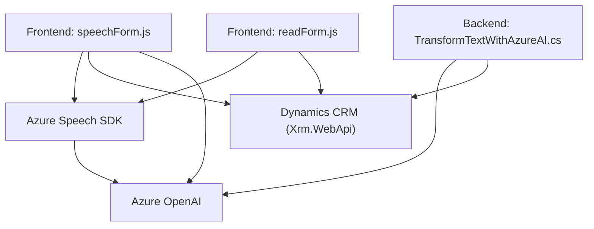

### Resumen técnico
El repositorio contiene tres componentes clave que permiten integrar funcionalidades avanzadas de texto a voz, reconocimiento de voz, y procesamiento de texto usando Azure AI en un entorno Dynamics 365. Se trata de una solución orientada al manejo de datos de formularios, integración vocal, y análisis de datos mediante servicios externos de Microsoft Azure.

---

### Descripción de arquitectura
La solución tiene una **arquitectura híbrida cliente-servidor basada en servicios externos**. Utiliza una implementación modular con lógica definida en diversas capas:

1. **Frontend (JavaScript):**  
   - Procesa formularios desde Dynamics 365 en el navegador.
   - Realiza dos acciones principales:
     - Sintetización de texto a voz usando Azure Speech SDK.
     - Reconocimiento de voz para actualizar campos y transcribir comandos.

2. **Backend (C#):**  
   - Implementa un plugin extensible en Dynamics CRM.
   - Consume APIs de Azure OpenAI para procesamiento de texto basado en IA.

3. **Dependencia externa:**  
   - Azure Speech SDK y Azure OpenAI son utilizados para sintetización de voz, reconocimiento, y procesamiento avanzado.

### Tecnologías usadas
**Frontend (JavaScript):**  
- **Azure Speech SDK:** Proporciona la funcionalidad de texto a voz y reconocimiento de voz.
- **Dynamics 365 client libraries:** Gestión de formularios y datos mediante API interna (Xrm.WebApi).

**Backend (C# Plugin):**  
- **Dynamics CRM SDK:** Acceso a servicios y gestión de datos organizacionales.
- **Azure OpenAI Services (GPT-4):** Procesamiento JSON con reglas específicas.
- **HTTP Client:** Envío de solicitudes REST hacia Azure OpenAI.
- **Newtonsoft.Json:** Manipulación y serialización JSON.

### Patrones utilizados
- **Capa de servicio externa:** Usan APIs de Azure para delegar tareas intensivas como IA y procesamiento de voz.
- **Modularidad:** Cada componente maneja una lógica específica (frontend para la interacción, backend para procesamiento).
- **Carga dinámica de código:** Dynamic import de librerías en JavaScript para optimizar recursos.
- **Plugin architecture:** En el backend, se sigue el patrón de plugins común en Dynamics CRM para integrar funcionalidades.

### Diagrama Mermaid

---

### Conclusión final
Esta solución integra funcionalidades avanzadas de reconocimiento de voz y procesamiento de texto mediante una **arquitectura cliente-servidor** con un fuerte enfoque en servicios externos (Azure Speech SDK y Azure OpenAI). Está diseñada para extender las capacidades de Dynamics 365, facilitando una interacción inteligente con formularios mediante reconocimiento vocal e IA. En términos de patrones arquitectónicos, utiliza un enfoque orientado a servicios y plug-ins, haciéndola escalable y fácil de adaptar.