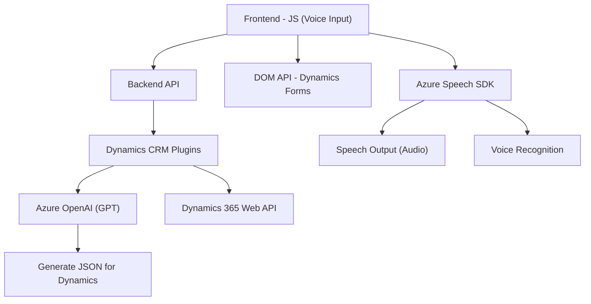

### Resumen técnico
El repositorio parece ser una solución híbrida que integra frontend en JavaScript con funcionalidades de reconocimiento de voz y síntesis mediante el **Azure Speech SDK**, además de plugins personalizados para Microsoft Dynamics 365 que aprovechan **Azure OpenAI**. Está diseñado para interacción vocal y transformación de datos con formularios dentro de Dynamics 365.

---

### Descripción de arquitectura
1. **Tipo de solución:**  
   - API y plugin del lado de Dynamics (código en **C#** y llamado a servicios externos).  
   - Frontend modular en **JavaScript** que interactúa con navegadores y servicios de Microsoft como Azure Speech.  
   - Interoperabilidad entre Frontend (forzado por client-side events o form data) y Dynamics 365 Web API para sincronizar datos.

2. **Tipo de arquitectura:**  
   - **Modular y N capas:** Suficiente separación entre funciones (Frontend) y plugins (Backend) que intercambian datos mediante Dynamics 365 APIs.  
   - **Patrones de integración:** External Service Integration y Repositories.

3. **Componentes del sistema:**  
   - **Frontend:** Proporciona interacción dinámica (JS) para el reconocimiento/síntesis de voz y la modificación de workflows en formularios.  
   - **Backend:** Plugins en **C#** procesan datos con Azure OpenAI y se integran dentro del contexto CRM (triggered y eventos automáticos).  
   - **Dependencias externas:** Microsoft Azure (Speech SDK, OpenAI), Dynamics 365 Web API, HTTP/JSON para comunicación asincrónica.

---

### Tecnologías usadas
- **Frontend JS:**
  - **Azure Speech SDK:** Reconocimiento/síntesis de voz.
  - **Vanilla JavaScript**, posible vínculo con DOM para formularios y eventos dinámicos.

- **Backend plugins con C#:**
  - **Azure OpenAI API:** Conversión de texto a JSON estructurado.
  - **Dynamics SDK (CRM plugins):** Implementación de plugins mediante `IPlugin`.

- **Comunicación:**
  - Invocación asincrónica de APIs externas (Azure Speech/OpenAI) mediante HTTP POST.
  - Manejo de datos estructurados en JSON (`Newtonsoft.Json` para el backend y `SpeechSDK` en frontend).

### Diagrama Mermaid (100% compatible)

---

### Conclusión final
La solución se desarrolla en torno a integrar servicios avanzados de procesamiento de IA (voz y texto) con Microsoft Dynamics 365 a través de plugins y frontend interactivo. Utiliza patrones de servicio externo, separación de capas, modularización y programación asincrónica para garantizar la facilidad de ampliación y escalabilidad. Está optimizada para soluciones empresariales como la automatización vocal/formularios en un entorno Dynamics 365. El diagrama ilustra cómo se comunica cada componente con otros módulos y servicios externos clave.