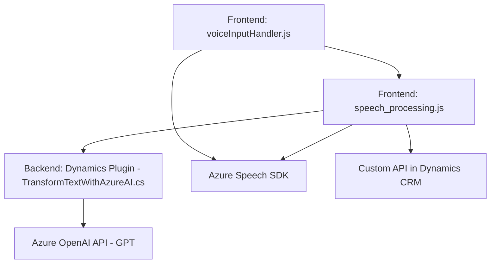

### Breve resumen técnico:
El repositorio contiene una solución mixta que integra capacidades de voz y texto mediante el **Azure Speech SDK** y **Azure OpenAI**, además de extender funcionalidad en **Dynamics 365 CRM**. Los archivos encontrados están organizados para interactuar con formularios, realizar transcripciones de voz, sintetizar texto en voz, y transformar texto con inteligencia artificial.

---

### Descripción de arquitectura:
1. **Arquitectura de solución:**  
   - La solución opera como un ecosistema híbrido, interconectado con servicios externos (Azure Speech SDK y Azure OpenAI API) y componentes internos de **Dynamics 365 CRM**.  
   - Incluye:
     - **Frontend:** Scripts que manejan voz (input/output) y dinámicas de formulario en Dynamics 365.
     - **Plugin en backend:** Desarrollado con C#, ejecuta lógica en Dynamics CRM para llamar a Azure OpenAI y transformar datos.
   - Típicamente se asocia con una **arquitectura de n capas**, donde la presentación (JS frontend), capa de lógica de negocio (plugin con C#), y la capa de integración (servicios externos) trabajan en conjunto.

2. **Tipo de arquitectura:**
   - Predominantemente **n capas**: Separación de funcionalidades por capas (interfaz de usuario, lógica de aplicación, servicios externos).
   - Elementos de **arquitectura hexagonal**: Interacción por puertos y adaptadores, al permitir la integración dinámica con APIs externas como Azure Speech y OpenAI.
   - Adopta **event-driven design** para controlar flujos a partir de interacciones. 

---

### Tecnologías usadas:
1. **Frontend:**
   - **JavaScript:** Scripts para el manejo de formularios y Azure Speech SDK.
   - **Azure Speech SDK:** Reconocimiento y síntesis de voz.
   - **Dynamics CRM JavaScript API:** Manipulación de formularios y atributos.

2. **Backend (Dynamics plugin):**
   - **C#:** Desarrollo del plugin.
   - **Azure OpenAI API:** Procesamiento y transformación de texto mediante GPT.
   - **ASP.NET Framework:** Base para integración en Dynamics CRM.
   - **Newtonsoft.Json.Linq:** Manipulación de JSON.

3. **Dependencias principales:**
   - `https://aka.ms/csspeech/jsbrowserpackageraw` (Azure Speech SDK).
   - `https://openai-netcore.openai.azure.com/` (Azure OpenAI endpoint).

4. **Patrones empleados:**
   - **Callback Pattern:** Uso evidente en `ensureSpeechSDKLoaded`.
   - **Single Responsibility Principle:** Separación clara de responsabilidades.
   - **Event-Driven Design:** Flujo basado en eventos, como el reconocimiento o síntesis de voz.

---

### Diagrama Mermaid válido para GitHub Markdown:

---

### Conclusión final:
Este repositorio representa una solución de integración profunda entre Dynamics CRM y servicios de Azure como Speech SDK y OpenAI. La arquitectura es clara y modular, con una separación de capas (n capas) y un enfoque en eventos y funciones especializadas. Los scripts frontend abordan la interacción de usuario con transcripciones y síntesis de texto/voz, mientras que el backend expande capacidades de Dynamics a través de plugins para procesamiento avanzado. Es un diseño escalable orientado a extender capacidades de inteligencia artificial en entornos de negocio.