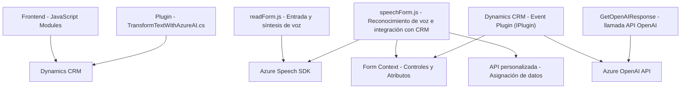

### Breve resumen técnico:
El repositorio es una solución basada en integraciones de servicios externos (Azure Speech SDK y Azure OpenAI API) y diseñada para entornos Microsoft Dynamics CRM (Plugins en `C#` y extensiones de formularios frontend en JavaScript). Permite manejar entrada y síntesis de voz, transformar texto usando modelos GPT, y asignar dinámicamente datos procesados en formularios de Dynamics CRM.

---

### Descripción de arquitectura:
1. **Tipo de solución:** Extensión frontend (JavaScript) complementada con un plugin backend (C#) que interactúan con Microsoft Dynamics CRM y servicios de Azure. Configurada para manejar entradas de voz, síntesis de texto, y transformación avanzada mediante IA.
2. **Arquitectura principal:**
   - **Frontend:** Segregación funcional basada en módulos JS.
   - **Backend (Plugin):** Componente basado en eventos, según la arquitectura estándar Plugin Pattern de Dynamics CRM.
3. **Arquitectura conceptual:** Combina elementos de arquitectura por capas (Presentation Layer y Business Logic Layer en JS + Backend Layer en Plugin) y arquitectura orientada a servicios (uso de APIs externas como Speech SDK y OpenAI).

---

### Tecnologías usadas:
1. **Frontend (JavaScript):**
   - Azure Speech SDK: Para captura y síntesis de voz en aplicaciones web.
   - DOM API: Manipulación de atributos y controles del formulario.
   - Promises y callbacks: Para manejar la carga del Speech SDK y procesos asincrónicos.
   - API personalizada de Dynamics CRM: Integración con servicios de Microsoft CRM a través de `Xrm.WebApi`.

2. **Backend (C# Plugin):**
   - Dynamics CRM SDK: Extensibilidad mediante plugins.
   - Azure OpenAI API: Procesamiento de texto avanzado con modelos GPT.
   - .NET Framework: Lenguaje extensible dentro del ecosistema Microsoft.
   - Dependency Injection/Service Provider: Contextualiza la ejecución del plugin en el CRM.

---

### Dependencias o componentes externos:
1. **Azure Speech SDK:** Para funciones de entrada y síntesis de voz.
2. **Azure OpenAI API:** Procesamiento avanzado de texto y generación de JSON estructurados.
3. **Dynamics CRM:** Como plataforma principal de datos, formularios y lógica empresarial.
4. **Xrm.WebApi.online.execute:** Método de Dynamics CRM para ejecutar APIs externas.
5. **Frameworks y bibliotecas comunes:**
   - Namespace `System` (C#): Proveido por .NET Framework.
   - Newtonsoft.Json para el manejo de JSON. 
6. **Transcripción de voz e IA:** Basada en servicios cloud (Azure).

---

### Diagrama Mermaid:

---

### Conclusión final:
La solución combina una extensión de frontend en JavaScript para Microsoft Dynamics CRM con manipulación de formularios, reconocimiento de voz, síntesis de voz y llamadas a APIs. En el backend usa un plugin en C# para integrar transformaciones avanzadas de texto mediante Azure OpenAI API. La arquitectura emplea una combinación de patrones como **Facade**, **Plugin Pattern**, y **Service-Oriented Architecture**. Es ideal para entornos que requieren procesamiento avanzado de datos y comunicación multifacética entre cliente, servidor y servicios externos. Sin embargo, sería conveniente implementar mejores prácticas de seguridad al manejar configuraciones sensibles (como claves de API).