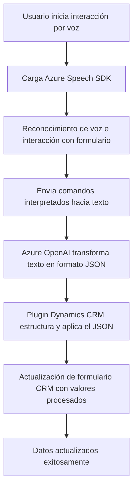

# Análisis Técnico

---

## Breve resumen técnico

El repositorio implementa soluciones que integran **Azure Speech SDK**, **Azure OpenAI** y **Dynamics 365**. Las funcionalidades se dividen en:

1. **Frontend (JavaScript):** Gestión de entrada y salida de voz como interfaz de usuario, trabajando con formularios de Dynamics 365.
2. **Plugin (C#):** Procesamiento avanzado de texto mediante Azure OpenAI, transformando datos de entrada en respuestas estructuradas JSON.
3. **Dependencias Externas:** Azure servicios (Speech SDK y OpenAI) y APIs de Dynamics 365.

---

## Descripción de arquitectura

### Tipo de solución
La solución implementa una combinación de:
- **Interfaz de usuario basada en voz** (frontend) para interactuar con formularios (entrada/salida de datos).
- **Backend basado en Plugins** desarrollado en C#, implementado en Dynamics CRM para procesamiento de texto avanzando.

### Arquitectura global
1. **Frontend con componentes independientes:**
   - Código modular en JavaScript con integración directa de SDKs.
   - Implementación de patrones como responsabilidades únicas y asincronía.

2. **Plugin en Dynamics CRM:**
   - Arquitectura de plugins orientada a eventos, ejecutándose dentro del contexto de Dynamics y delegando lógica avanzada a servicios REST (Azure OpenAI).

3. **Dependencias externas:** 
   - Azure Speech SDK.
   - Azure OpenAI.
   - Dynamics 365 Web API.

### Descripción completa
La arquitectura puede considerarse basada en **n capas**, donde:
- Frontend (vocal y visual) actúa como capa de interacción directa con el usuario.
- Backend (plugin Azure + APIs) opera como capa de negocio delegando operaciones complejas a servicios cloud externos.

---

## Tecnologías y patrones usados

### **Tecnologías**
- **Frontend:** HTML, JavaScript (integración SDK de Azure Speech y formularios Dynamics).
- **Plugin Backend:** C#, Dynamics 365 SDK, Azure OpenAI API.
- **APIs:** RESTful services (Azure y Dynamics).

### **Patrones**
- **N Capas:** Separación funcional en frontend, API (servicios externos) y DB (formularios y CRM Dynamics).
- **Event-Driven:** Ejecución basada en eventos en reconocimiento de voz y plugins.
- **Modularidad:** Código estructurado en funciones y métodos independientes con responsabilidad única.
- **Service-Oriented Architecture:** Delegación de procesamiento complejo a servicios Azure (OpenAI, Speech SDK).

---

## Dependencias, componentes externos y riesgos

### **Dependencias principales**
1. **Azure Speech SDK:** Incorporación en frontend dinámico para síntesis/reconocimiento de voz.
2. **Azure OpenAI:** API REST para procesamiento avanzado de texto.
3. **Dynamics 365 Web API:** Integración directa para manipulación de datos de formularios CRM.

### **Riesgos**
- **Exposición de claves:** Claves de servicios de Azure podrían ser comprometidas si no se manejan correctamente.
- **Latencia:** Dependencia de servicios cloud como Azure podría afectar tiempos de respuesta si hay problemas con la red o disponibilidad.
- **Validación de entradas:** Necesidad de robustez para evitar datos corruptos enviados a APIs externas.

---

## Diagrama Mermaid

---

## Conclusión final

La solución es una combinación de **frontend dinámico** para una experiencia enriquecida mediante comandos de voz y un **plugin backend en Dynamics CRM** para lógica empresarial avanzada. La arquitectura emplea servicios especializados de Azure (Speech SDK y OpenAI) y fomenta códigos modulares y reutilizables siguiendo principios de separación de capas y asincronía.

### Recomendaciones
1. **Seguridad:** Almacenar claves de Azure en recursos seguros como Azure Key Vault.
2. **Optimización:** Utilizar mecanismos de cache o batch processing para mejorar tiempos de respuestas en APIs.
3. **Escalabilidad:** Incorporar pruebas de carga en el reconocimiento de voz y generación de texto estructurado.

