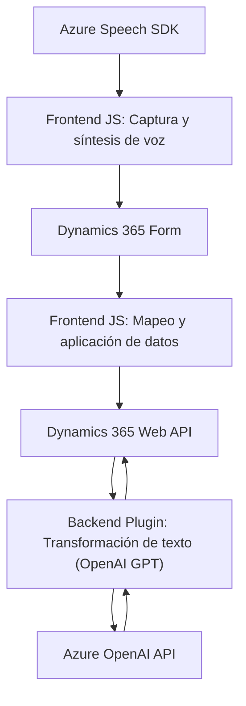

### Breve resumen técnico
El repositorio muestra una solución híbrida que integra funcionalidades de entrada de voz, procesamiento de texto mediante IA y transformación de datos en el contexto de Dynamics 365. Se utilizan tanto tecnologías frontend como complementos backend (plugins) en Dynamics CRM para garantizar una experiencia fluida al usuario con servicios avanzados de Azure.

---

### Descripción de arquitectura
La solución combina varias capas de funcionalidad:
1. **Frontend:**
   - Creación de módulos basados en JavaScript para la captura de entrada de voz, síntesis de texto a voz y transcripción mediante Azure Speech SDK. Los datos hablados son procesados y mapeados a un formulario en Dynamics 365.

2. **Backend:**
   - Plugins compilados en .NET (C#) para transformar textos a JSON estructurado utilizando el servicio Azure OpenAI GPT. El procesamiento incluye comunicación directa con Dynamics CRM y Azure API.

3. **Patrones observados:**
   - **Arquitectura n-capas:** Utilización de frontend para entrada de datos, procesamiento en la capa de aplicación con servicios de terceros (Azure), y conexión con el backend de Dynamics CRM.
   - **SOA:** Integración modular de servicios externos como Azure Speech y OpenAI.
   - **Plugin pattern:** Extendibilidad específica en Dynamics CRM mediante plugins.

Esta arquitectura puede clasificarse como **n-capas distribuida**, con integración de servicios externos en el frontend y backend para optimizar operaciones de Dynamics 365.

---

### Tecnologías usadas
- **Frontend:**
  - JavaScript.
  - Azure Speech SDK: Para entrada de voz y síntesis de texto a voz.
  - Dynamics 365 Web API: Manipulación y consulta de formularios.
- **Backend:**
  - C# (.NET) plugins para Dynamics CRM.
  - Azure OpenAI Service: Uso de GPT-4 para transformación de texto.
  - Serialización/deserialización JSON mediante `System.Text.Json` y `Newtonsoft.Json`.
- **Servicios externos:**
  - Azure (Speech SDK y OpenAI).
  - Dynamics CRM APIs.

---

### Dependencias o componentes externos presentes
1. **Azure Speech SDK:** Entrada de voz, síntesis de texto y transcripción.
2. **Dynamics 365 Web API:** Manipulación y sincronización de datos en formularios.
3. **Azure OpenAI Service:** Procesamiento de texto con GPT y generación de JSON.
4. **Cadastro de entidades:** Mapeo de campos en Dynamics CRM.
5. **JSON libraries** (`Newtonsoft.Json`, `System.Text.Json`, etc.): Manejo de estructuras JSON.

---

### Diagrama Mermaid válido para GitHub

---

### Conclusión final
El repositorio representa una integración sofisticada de servicios en la nube y dinámicas locales en Dynamics CRM. Combina entrada de voz, procesamiento con IA (GPT en Azure), y manipulación de datos hacia formularios en Dynamics 365. La arquitectura distribuida con APIs y plugins asegura modularidad, escalabilidad y facilidad para la implementación de nuevas funcionalidades.

Esta solución destaca en tecnologías modernas de Microsoft (Azure y Dynamics), lo que la convierte en un producto altamente adaptable para CRM inteligente.