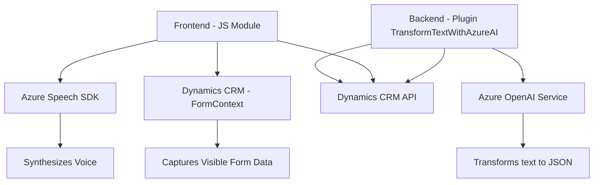

### Breve resumen técnico:
El repositorio analizado corresponde a una solución tecnológica y modular para Dynamics CRM. Su propósito principal es integrar capacidades avanzadas de **voz** y **texto mediante IA** en entornos de formularios, para facilitar la interacción con los datos de un CRM. Utiliza tecnologías de Microsoft Azure (Azure Speech SDK y Azure OpenAI) y se apoya en la API de Dynamics 365 para almacenar y procesar la información. 

### Descripción de la arquitectura:
La solución presenta una arquitectura **n-capas** orientada a la modularidad e integración de servicios externos. Se divide en tres módulos principales:
1. **Frontend (JS)**: Gestiona la captura de datos desde el formulario y la interacción basada en voz (lectura y entrada).
2. **Backend Plugin (C#)**: Implementa lógica empresarial avanzada como transformación de texto y comunicación con Azure OpenAI para manipular datos complejos.
3. **Integración de servicios externos**: Se conecta al Azure Speech SDK y Azure OpenAI desde tanto el frontend como el plugin para realizar tareas relacionadas con síntesis de voz y generación de formatos JSON.

La solución utiliza el **plugin pattern** y adopta principios de programación asíncrona para operaciones externas, eliminando bloqueos y promoviendo la modularidad.

### Tecnologías usadas:
1. **Frontend**:
   - **JavaScript** con funciones modulares.
   - SDK de **Azure Speech** para síntesis y reconocimiento de voz.
   - API de Dynamics CRM (`Xrm.WebApi.online`) para acceder y actualizar datos en formularios.

2. **Backend Plugin**:
   - **C# .NET Framework**, adherido al modelo de plugins nativo de Dynamics CRM (`IPlugin`).
   - Servicios RESTful con **HttpClient** integrado en código para interactuar con Azure OpenAI.

3. **Servicios Externos**:
   - **Azure Speech SDK**: Para entrada y salida basada en voz.
   - **Azure OpenAI Endpoint**: Para transformaciones avanzadas de texto (usando reglas definidas).

### Dependencias o componentes externos:
1. **Azure Speech SDK**: Procesamiento y síntesis de voz desde el frontend.
2. **Azure OpenAI Service**: Procesamiento de textos y generación de estructuras JSON en el backend.
3. **Dynamics CRM API**:
   - `Xrm.WebApi.online`: Utilizado para manipular datos en tiempo real.
   - Plugins de Dynamics (`IPlugin`) para lógica empresarial en el backend.

### Diagrama Mermaid:

### Conclusión final:
La solución representa una arquitectura modular basada en capas que combina eficientemente capacidades frontend (interacción por voz) y backend (lógica empresarial avanzada). El uso de servicios escalables como **Azure Speech SDK** y **Azure OpenAI** permite manejar datos mediante **IA** y potenciar la experiencia del usuario. Su diseño asíncrono y su integración con servicios externos garantizan la fluidez en operaciones críticas, haciéndola óptima para entornos dependientes de dinamismo como **Dynamics CRM**.