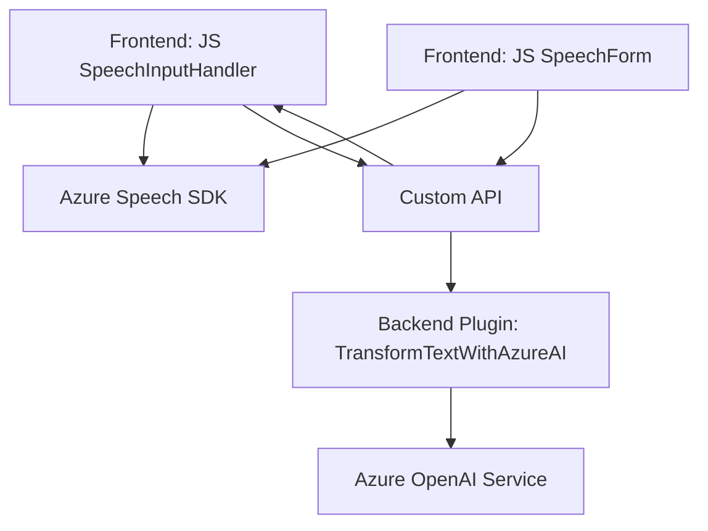

### Breve Resumen Técnico
El repositorio contiene archivos para la integración de formularios y APIs en aplicaciones que interactúan con servicios en la nube como Azure Speech SDK y Azure OpenAI Service, además de APIs propias de Dynamics 365. Utiliza una arquitectura especializada para integrar entrada-salida de voz en la gestión de formularios y para procesar texto con inteligencia artificial, proporcionando una solución mixta basada en tecnología frontend y servicios de backend.

---

### Descripción de Arquitectura
Con base en el análisis de los archivos proporcionados, esta solución implementa una **arquitectura de servicios distribuidos** orientada al uso de servicios en la nube. Resalta por una división clara entre funcionalidades frontend y lógica backend, lo que podría clasificarse como una arquitectura **microservicios** por integrar servicios externos (Azure Speech SDK, Azure OpenAI Service) junto con APIs internas (Dynamics 365 APIs).

1. **Frontend**:
   - Se utiliza JavaScript para integrar formularios y captura de voz vía servicio Azure Speech SDK.
   - Las funciones están organizadas según el principio de modularidad, cada una representando una responsabilidad específica (extraer datos, sintetizar texto en voz, procesamiento de API de transcripción).
   
2. **Backend**:
   - Un plugin desarrollado en .NET para ser ejecutado en Dynamics CRM, empleando la interfaz `IPlugin`.
   - El plugin realiza llamadas a Azure OpenAI Service mediante una integración RESTful para transformaciones de texto, usando modelos GPT-4.

### Tecnologías Usadas
1. **Frontend**:
   - **JavaScript (ES6)**: Para la manipulación del DOM, lógica funcional y eventos asincrónicos.
   - **Azure Speech SDK**: Para procesamiento y síntesis de voz.
   - **Dynamics 365 (Javascript)**: Para gestionar formularios y datos en la plataforma CRM.

2. **Backend**:
   - **C# (.NET Framework)** con la integración de plugins para Dynamics CRM.
   - **Azure OpenAI Service**: Para inteligencia artificial y procesamiento de lenguaje natural.
   - **Newtonsoft.Json**: Procesamiento JSON en C#.
   - **HTTP Client (System.Net.Http)**: Para llamar servicios RESTful al API de Azure OpenAI.

3. **Cloud Interaction**:
   - **Azure Services**:
     - Speech SDK.
     - OpenAI Service.
   - **Dynamics 365 Online APIs**: Para solicitudes relacionadas con formularios y entidades.

### Dependencias o Componentes Externos
1. **Azure Speech SDK**: Para la captura de voz y síntesis de audio.
2. **Azure OpenAI Service**: Modelo de IA para transformar texto a datos JSON estructurados.
3. **Dynamics 365 APIs**:
   - `Xrm.WebApi.online.execute`: Invocación de APIs personalizadas.
   - `Xrm.WebApi.retrieveMultipleRecords`: Recuperación de registros relacionados.
4. **Newtonsoft.Json.Linq** y **System.Text.Json**: Procesamiento avanzado de JSON.
5. **System.Net.Http**: Para solicitudes HTTP RESTful hacia el servicio OpenAI.

---

### Diagrama Mermaid
A continuación, se presenta un diagrama Merlin compatible con Markdown en GitHub, representando la integración entre frontend, plugins y servicios externos:

---

### Conclusión Final
La solución está diseñada para aplicaciones que necesiten interactuar con formularios y servicios de voz, empleando procesamiento de lenguaje natural. Combina un **frontend modular**, con servicios en la nube y APIs específicas de Dynamics 365 para la gestión de datos y operaciones más complejas. La arquitectura se asemeja a un esquema de **microservicios** debido a su integración con múltiples servicios y un plugin backend que actúa como conectivo modular.

