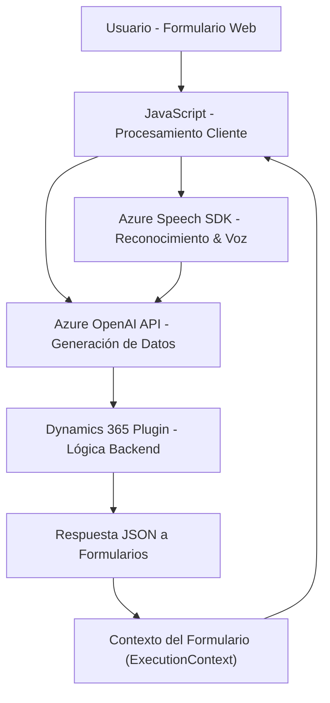

### Breve resumen técnico
El repositorio analizado corresponde a una solución integrada en el ecosistema de **Dynamics 365 CRM**, que utiliza tecnologias como **Azure Speech SDK** y **Azure OpenAI**. La funcionalidad principal se centra en el manejo de datos de formularios mediante reconocimiento de voz, síntesis de texto a audio y generación de datos estructurados (JSON) utilizando inteligencia artificial.

---

### Descripción de arquitectura

- **Tipo de solución:** 
  La solución combina funcionalidades de **frontend** (JavaScript en navegador para interacción con formularios) y **backend/plugins** (C# para lógica procesada en Dynamics CRM). Funciona como una extensión de las capacidades de Dynamics 365 al integrar servicios externos como **Azure Speech SDK** y **Azure OpenAI**.

- **Arquitectura predominante:**
   1. **Cliente/Navegador:** Funcionalidades JavaScript organizadas en módulos, usando patrones de modularidad y separación de responsabilidades.
   2. **Backend:** Plugins para Dynamics 365 que implementan patrones de arquitectura clásicos como **Plugin Pattern** y **Service Locator**.
   3. **Dependencias externas:** Integración con APIs gestionadas (Azure Speech SDK y Azure AI) en ambos entornos.

   En conjunto, la arquitectura es característicamente de **n capas**, diferenciando claramente la capa de presentación (JavaScript) de la lógica de negocio (Plugins en C#) y las integraciones externas (servicios gestionados en Azure).

---

### Tecnologías y patrones utilizados

1. **Tecnologías identificadas:**
   - **Frontend:** ECMAScript/JavaScript para la manipulación del DOM y SDK del navegador.
   - **Backend:** C# para creación del plugin Dynamics integrado.
   - **Servicios externos:** Azure Speech SDK, Azure OpenAI.
   - **Frameworks:** APIs integradas de Dynamics CRM (Xrm, WebApi).

2. **Patrones arquitectónicos:**
   - **Modularidad en JavaScript:** Cada función encapsula una responsabilidad específica.
   - **Plugin Pattern:** En el archivo `TransformTextWithAzureAI.cs`, se extiende CRM mediante la interfaz `IPlugin`.
   - **Callback y Promesas:** Para manejo de asincronismo en JavaScript.
   - **Service Locator:** Uso de `IServiceProvider` en el plugin.
   - **API Integration Pattern:** Llamadas HTTP para consumir servicios de Azure.

---

### Dependencias y componentes externos

La solución tiene las siguientes dependencias externas:
1. **Azure Speech SDK:** Cargado dinámicamente en el navegador mediante URL (`https://aka.ms/csspeech/jsbrowserpackageraw`) para soporte de reconocimiento de voz y síntesis de texto a voz.
2. **Azure OpenAI API:** Consumida desde el plugin (`TransformTextWithAzureAI.cs`) utilizando peticiones HTTP.
3. **Dynamics 365 APIs:** Uso extensivo de interfaces nativas del CRM, como `IPluginExecutionContext` y `Xrm.WebApi`.
4. **Newtonsoft.Json y System.Text.Json:** Para manipulación de datos JSON en C#.
   
Opciones de configuración adicionales incluyen claves y regiones definidos por el usuario, probablemente como variables de entorno o parámetros explícitos en el código.

---

### Diagrama **Mermaid** compatible con GitHub Markdown

---

### Conclusión final

La solución examinada es una integración avanzada de tecnologías para extender las capacidades de **Dynamics CRM** en la recolección, procesamiento y síntesis de datos usando la interacción por voz e inteligencia artificial. La arquitectura se basa en **n capas** con separación lógica de cliente (JavaScript) y servidor (C# plugins) aprovechando servicios gestionados de **Azure**, lo que permite implementar funciones sofisticadas sin incrementar significativamente la carga local en el cliente o servidor.  

Es una solución idónea para modernizar la experiencia del usuario, facilitando la entrada de datos en entornos empresariales donde formularios enriquecidos y tecnologías de AI juegan un papel crítico en la optimización de procesos.