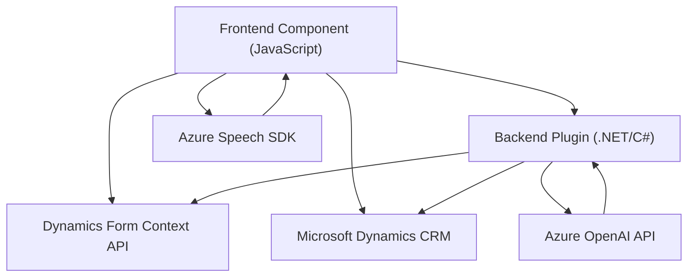

### Breve Resumen Técnico
El repositorio contiene una solución orientada a mejorar la accesibilidad mediante síntesis de voz y transcripción entre voz y texto integradas con Microsoft Dynamics CRM/Dynamics 365. Aprovecha los servicios de Azure Speech SDK y Azure OpenAI para facilitar la interacción de usuarios, así como el manejo dinámico de formularios. 

Está repartido en tres componentes principales:
1. **Frontend (JavaScript)** para sintetizar voz y realizar transcripciones.
2. **Backend Plugin (.NET/C#)** para transformar texto mediante reglas específicas usando Azure OpenAI.
3. **Integración con APIs de CRM y servicios de Azure**.

---

### Descripción de Arquitectura
La solución sigue una arquitectura **en capas**:
1. **Capa de Presentación (Frontend)**: Lógica en JavaScript para síntesis de voz y reconocimiento de voz que interactúa con los formularios de Dynamics CRM/Dynamics 365.
2. **Capa de Aplicación**: Plugins en C# que extienden funcionalidades de Dynamics al integrar servicios externos como Azure OpenAI.
3. **Capa de Servicios Externos**: Uso de Azure Speech SDK para síntesis/transcripción de voz y Azure OpenAI para transformación de texto.

Patrones observados:
- **Encadenamiento de responsabilidades** en el frontend: funciones distribuidas para la captura y procesamiento de datos.
- **Plugin Pattern** en la capa de backend: extendiendo Dynamics CRM funcionalmente mediante plugins.
- **Service-Oriented Architecture (SOA)**: integración de servicios externos (Azure Speech SDK y OpenAI) con Dynamics CRM.
  
En general, la solución tiene características de **arquitectura híbrida**, combinando una capa local en forma de plugins y aplicaciones web con servicios distribuidos (Azure).

---

### Tecnologías Usadas
1. **Frontend:**
   - JavaScript (para interacción DOM y lógica de procesamiento de la voz).
   - Azure Speech SDK (síntesis y transcripción de voz).
   - Dynamics Form Context API (para manipulación de formularios).

2. **Backend:**
   - .NET / C# (implementación del plugin).
   - Dynamics CRM SDK (ampliación del sistema CRM para acceder a datos y formularios).
   - Azure OpenAI API (transformación avanzada de texto a JSON).

3. **Dependencias:**
   - `Newtonsoft.Json`, `System.Net.Http`, `System.Text.Json` (en la lógica del plugin).
   - CDN (para carga dinámica de Azure Speech SDK en el frontend).

---

### Diagrama Mermaid

---

### Conclusión Final
El repositorio implementa una **multi-capa de integración basada en servicios** para mejorar la accesibilidad y la interacción en formularios de Dynamics CRM. La solución combina herramientas modernas como el Azure Speech SDK para voz y el Azure OpenAI para procesar texto estructurado en JSON. Además, usa un **modelo extensible de plugins** en Dynamics CRM para una personalización precisa. 

Sin embargo, la seguridad del manejo de claves para servicios de Azure puede ser mejorada. También se podría evaluar optimizar algunos fragmentos de JavaScript para modularizar el código en un formato más reusable, como **módulos ES6**.