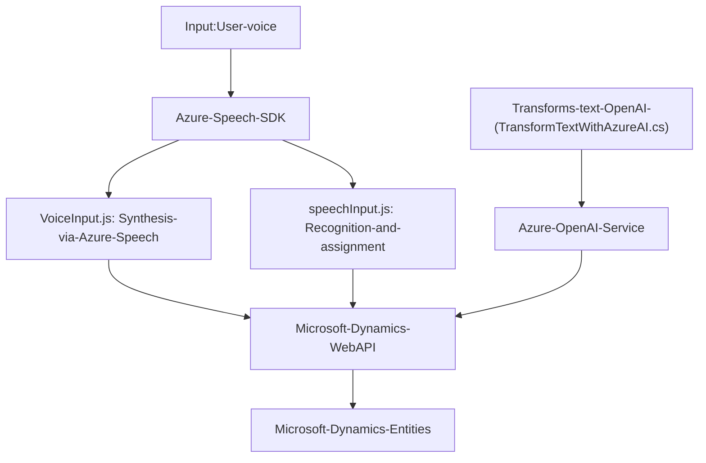

### Resumen técnico:
El repositorio proporcionado sugiere una solución que implementa una integración entre tecnologías de Microsoft Dynamics CRM y servicios de Azure (como Azure Speech SDK y Azure OpenAI). Se observa que está orientado a la mejora de formularios mediante funcionalidades de reconocimiento de voz, síntesis de voz y para procesar texto e integrarlo con entornos de CRM.

---

### Descripción de arquitectura:
1. **Tipo de solución**:  
   - La solución implementa una combinación de API y funcionalidad de frontend para reconocer voz y sintetizar salida, junto con un plugin para Dynamics CRM que actúa como un componente de backend.  

2. **Tipo de arquitectura**:  
   - **N capas**: La solución presenta una separación entre los diferentes componentes, donde las funcionalidades de frontend resultan independientes del backend de Dynamics CRM (que trabaja como plugin). Dentro del backend se observa la implementación de patrones de cliente-API y servicios independientes.  
   - **Microservicios (integración externa)**: El uso de Azure Speech SDK y Azure OpenAI promueve una arquitectura basada en microservicios o integración de servicios desacoplados.  

3. **Patrones utilizados**:  
   - **Modularidad**: Separación lógica de la funcionalidad en diferentes archivos y sistemas (voz, transformación de texto, integración CRM).  
   - **Evento y Callback**: Las funciones en JavaScript aseguran que las dependencias como Azure Speech SDK se carguen dinámicamente y se ejecuten bajo demanda mediante callbacks.  
   - **Service-Oriented Architecture (SOA)**: Gran enfoque hacia el uso de servicios externos como Azure Speech SDK y OpenAI Service para realizar tareas específicas.  
   - **Facade**: Métodos como `GetOpenAIResponse` están diseñados para encapsular llamadas al servicio Azure OpenAI desde Dynamics CRM, simplificando la interacción entre el cliente y el servicio.

---

### Tecnologías usadas:
- **Frontend/JavaScript**:
  - **Azure Speech SDK**: Permite reconocimiento de voz y síntesis de texto.
  - **Microsoft Dynamics Web API (Xrm.WebApi)**: Para manipulación de datos de formularios y campos de entidad en Dynamics CRM.
  - **JavaScript**: Programación de la lógica para capturar datos del formulario, realizar síntesis de texto y reconocimiento de voz, y asignar datos procesados al formulario.

- **Backend/C# Plugin**:
  - **Azure OpenAI Service**: Utilizado para transformar texto en un formato JSON estructurado con reglas específicas.
  - **Microsoft Dynamics CRM SDK (`IPlugin`)**: Extiende funcionalidades del CRM mediante un plugin que está diseñado para trabajar con texto transformado por AI y aplicarlo.

- **Patrones arquitectónicos**:
  - Modularización.
  - Event & Callback-driven programming.
  - Service-Oriented Architecture.
  - Plugin design.
  - Facade for API integration.

---

### Diagrama Mermaid:

---

### Conclusión final:
Este repositorio implementa una solución híbrida que combina tecnologías de frontend (JavaScript) con plugins de backend escritos en C#. La solución aprovecha el potencial del reconocimiento de voz y síntesis de texto proporcionado por Azure Speech y se integra con Dynamics CRM utilizando una arquitectura basada en capas y servicios externos. Aunque el código muestra un enfoque organizado hacia la modularidad y eventos, existen áreas de mejora, como la gestión de claves de API y un manejo más robusto de excepciones en el plugin.