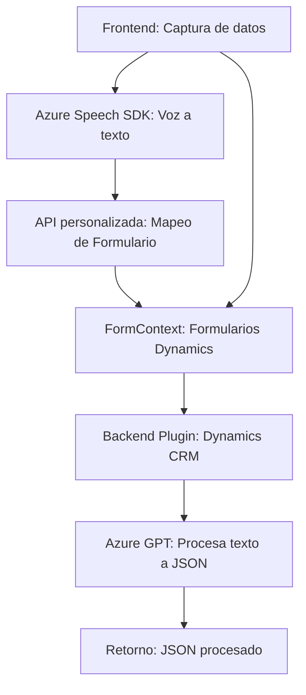

### Breve resumen técnico:
El repositorio describe una solución híbrida enfocada en la interacción entre un **frontend** y un **backend** orientado a aplicaciones empresariales en el ecosistema Microsoft Dynamics CRM. Los módulos frontend manejan entrada de datos y voz, mientras que los plugins backend transforman texto y datos mediante la **Azure Speech SDK** y **Azure OpenAI (GPT)**.

---

### Descripción de arquitectura:
La arquitectura general de la solución fusiona **n capas** y elementos de **SOA (Service-Oriented Architecture)**:
1. **Frontend:** Procesa datos hablados, interactúa con el formulario, y conecta APIs externas (Azure Speech SDK e incluso APIs personalizadas).
2. **Backend:** Incluye plugins de Dynamics CRM que coordinan ejecución basada en eventos y transforman texto en JSON con Azure OpenAI, permitiendo transacciones sin interrupción.
3. **Patrones predominantes:**
   - **Event-Driven Programming:** En el frontend y los plugins CRM, manejando eventos de activación.
   - **Cliente-Servidor:** Relación entre el frontend y APIs externas como Azure.
   - **Plugin Pattern:** En el backend para extensión modular del CRM.

---

### Tecnologías usadas:
1. **Frontend:**
   - **JavaScript:** Con múltiples funciones modulares y asincronía.
   - **Azure Speech SDK:** Captura, síntesis de voz y transcripción.
2. **Backend:**
   - **C#:** Para implementar plugins compatibles con Dynamics CRM.
   - **Azure OpenAI (GPT):** Para transformar datos y devolver resultados en formatos JSON.
   - **Newtonsoft.Json:** Procesamiento JSON avanzado.

---

### Dependencias o componentes externos:
1. **Azure Speech SDK:** Para integración directa con captura de voz y síntesis.
2. **Azure OpenAI:** Para procesar texto y transformarlo en objetos estructurados JSON.
3. **XRM SDK:** Para interactuar con Dynamics CRM en el backend.
4. **Servicios HTTP:** Para comunicación con APIs externas.

---

### Diagrama Mermaid:

---

### Conclusión final:
La solución es una arquitectura híbrida con fuerte integración a servicios de Azure, especialmente **Speech SDK** y **OpenAI GPT**, que está diseñada para aplicaciones empresariales. Ofrece funcionalidades dinámicas de captura de voz en frontend con procesamiento backend orientado a transformación de datos en CRM. Ideal para escenarios de operación en tiempo real en aplicaciones de interfaz con clientes.