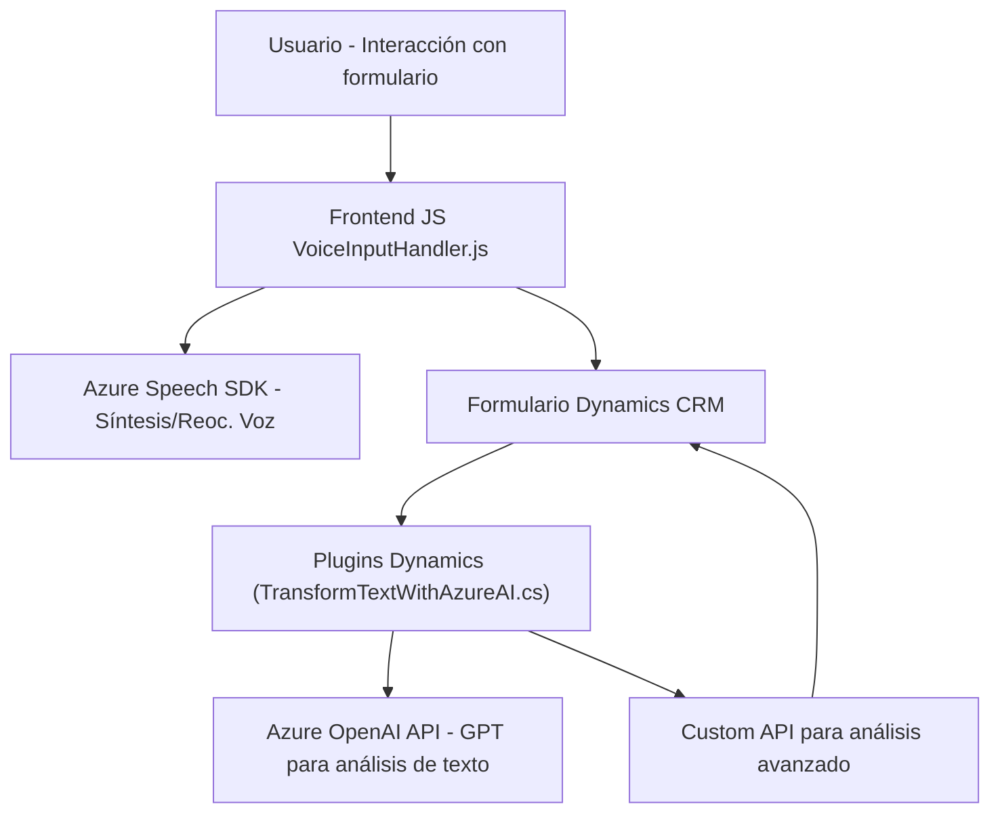

### Breve resumen técnico
Los archivos descritos integran una solución que utiliza entrada de voz, procesamiento de formularios y transformación de texto utilizando servicios externos (Azure Speech SDK y Azure OpenAI). La finalidad principal es automatizar tareas como reconocimiento de voz, síntesis de voz y análisis de entrada textual en un entorno de Microsoft Dynamics CRM.

---

### Descripción de arquitectura
La solución adopta una arquitectura híbrida basada en:
1. **Integración de servicios externos**: Azure Speech SDK y Azure OpenAI son los principales encargados de datos de voz y su procesamiento.
2. **Modularidad**: El código está dividido en capas funcionales (frontend, plugins de CRM y servicios externos).
3. **Patrones de integración**: Componentes del frontend interactúan con APIs personalizadas y plugins de Dynamics CRM, empleando una lógica de negocio claramente separada.

El diseño general tiene características de una arquitectura **n-capas**, ya que incluye:
- Capa de presentación: Archivos del **frontend** para interacción con usuarios.
- Capa de lógica de negocio: Plugins para procesamiento avanzado del formulario y lógica de validación/mapeo.
- Capa de servicios externos: Integración con Azure Speech SDK y Azure OpenAI para funcionalidades específicas.

El plugin utiliza un **patrón de plugin** y actúa como middleware para extender las capacidades del entorno Dynamics CRM con transformaciones de texto.

---

### Tecnologías usadas
#### **Frontend**
- **Framework:** Pure JavaScript (no se indica uso de frameworks frontend como React/Angular).
- **Servicios:** Azure Speech SDK, APIs personalizadas para procesamiento de texto.

#### **Backend (Plugins de CRM)**
- **Plataforma:** Microsoft Dynamics CRM.
- **Framework:** .NET Framework/Core para el desarrollo de plugins.
- **APIs/Servicios:** Azure OpenAI API para procesamiento de texto con GPT, Dynamics CRM SDK.

#### **Patrones**
- Modularidad y encapsulación de lógica.
- Patrón Plugin en Dynamics CRM.
- Integración vía servicios externos (REST APIs).
- Carga dinámica de scripts en el frontend.

---

### Dependencias o componentes externos
1. **Azure Speech SDK**: Reconocimiento y síntesis de voz.
2. **Azure OpenAI API**: Transformación de texto mediante GPT-4 modelos alojados en Azure.
3. **Microsoft Dynamics CRM SDK**: Interacción con formularios y datos del entorno de CRM.
4. **APIs personalizadas**: Procesamiento y transformación adicional del texto.

---

### Diagrama Mermaid válido para GitHub Markdown

---

### Conclusión final
La solución analizada es una integración robusta de procesamiento de voz y texto que interactúa con formularios dinámicos en un entorno de Dynamics CRM. Combina múltiples servicios de Azure (Speech SDK y OpenAI) y APIs personalizadas en un enfoque modular y escalable. La arquitectura es una mezcla de **n-capas** y **plugins**, donde cada componente tiene una funcionalidad específica, optimizando el rendimiento y escalabilidad en escenarios empresariales.