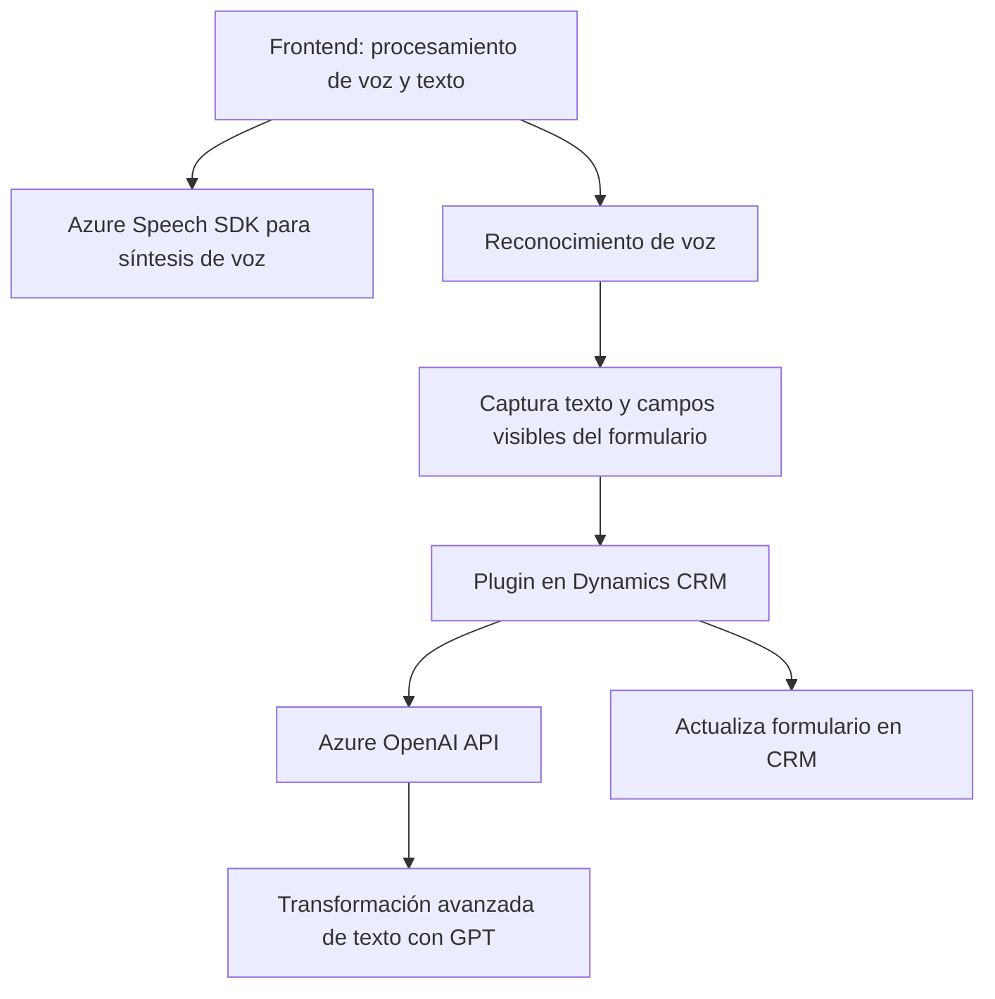
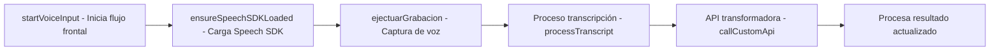
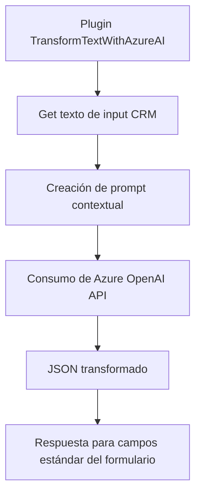

### Breve resumen técnico:
Los archivos proporcionados corresponden a una solución de software que integra funcionalidades avanzadas de procesamiento y generación de texto con tecnologías de Azure (Speech SDK y OpenAI). La solución parece estar diseñada para trabajar dentro de la infraestructura de Microsoft Dynamics CRM, extendiendo su funcionalidad con capacidades de accesibilidad (sintetización de texto en voz) y procesamiento de texto (reconocimiento y transformación de voz/texto).

---

### Descripción de arquitectura:
La arquitectura del sistema muestra una combinación de **n-capas** y **integación de servicios externos**:
1. **Frontend (JavaScript):** Maneja la lógica de interacción del usuario (captura de entrada de voz, síntesis de texto, actualización dinámica de formularios).  
2. **Backend (Plugins en C#):** Aporta extensiones personalizadas para la lógica CRM mediante la arquitectura de plugins. Además, delega a Azure OpenAI tareas como la transformación de texto.  
3. **Servicios externos:** Comunicación con **Azure Speech SDK** y **Azure OpenAI API** para generación de voz y procesamiento de texto transformado basado en IA.  

La solución se encuentra parcialmente integrada con **Microsoft Dynamics CRM**, lo que permite trabajar directamente con formularios y datos de usuario en tiempo real.

---

### Tecnologías usadas:
1. **Frontend:**
   - JavaScript (vanilla) en combinación con librerías internas de Dynamics (`executionContext`, `formContext`).
   - Azure Speech SDK integrado dinámicamente para funciones de síntesis y reconocimiento de voz.

2. **Backend:**
   - C# con el framework oficial de Dynamics CRM (`Microsoft.Xrm.Sdk`) para la implementación de plugins.
   - Integración directa con Azure OpenAI API mediante HTTP requests (`System.Net.Http`) para el procesamiento de texto basado en inteligencia artificial.

3. **Técnicas y patrones:**  
   - Modularidad: Métodos bien definidos (recolección de datos, síntesis de voz, procesamiento de la API).  
   - Integración API: Uso de servicios externos para delegar la lógica intensiva (Azure Speech y OpenAI).  
   - Asincronía: Procesamiento de eventos mediante callbacks y promesas (Azure SDK).  
   - SRP (Principio de Responsabilidad Única): Cada método se enfoca en una única tarea.  
   - Patrones específicos de Dynamics CRM: Extensiones basadas en `IPlugin` para eventos relacionados con entidades y campos del modelo CRM.

---

### Diagrama Mermaid

#### Estructura general:

#### Flujo funcional del frontend:

#### Flujo funcional del backend:

---

### Conclusión final:
Esta solución combina frontend, backend y servicios en la nube para proporcionar una experiencia accesible en la plataforma Dynamics CRM. Utiliza la síntesis de voz (para inclusión y accesibilidad) y el reconocimiento/transcripción de entradas de voz, junto con el procesamiento de texto basado en inteligencia artificial para simplificar la interacción del usuario con formularios dinámicos. La arquitectura está diseñada eficientemente con patentes de modularidad y enfoque en la delegación de tareas intensivas a servicios externos (Azure Speech y OpenAI).

Para mejorar la solución:
1. Mitigar riesgos de seguridad en el plugin backend (manejo de claves API).
2. Enriquecer el manejo de errores tanto en el frontend como el backend.
3. Proveer soporte de pruebas unitarias y de integración para formas más robustas en entornos empresariales.