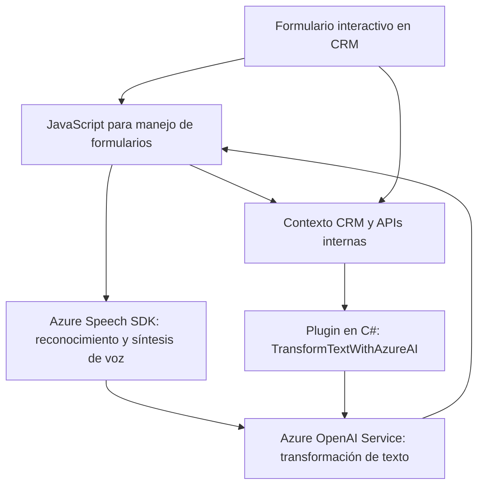

### Breve resumen técnico
El repositorio presenta archivos para la implementación de un sistema que permite la interacción entre formularios de Microsoft Dynamics CRM y servicios avanzados de procesamiento de voz e inteligencia artificial proporcionados por Azure (Speech SDK y OpenAI). Está orientado al uso dentro de un entorno empresarial para dinamizar y automatizar procesos relacionados con el manejo de formularios y transformación de datos.

---

### Descripción de arquitectura
La arquitectura combina:
- **Monolito CRM extendido**: Extiende Microsoft Dynamics CRM mediante plugins y JavaScript, manteniendo un modelo de ejecución encapsulado dentro del sistema CRM.
- **N-capas con integración externa**: Divide la lógica en capas de presentación (frontend interactivo para los formularios), capa lógica (procesamiento de datos mediante JavaScript y plugins), y una capa externa (servicios de Azure Speech y OpenAI).
- **Integración de microservicios externos**: Tanto el Azure Speech SDK como el servicio de Azure OpenAI actúan como microservicios que se invocan dinámicamente para proporcionar procesamiento avanzado.

---

### Tecnologías usadas
- **Frontend**:
  - **JavaScript**: Carga dinámica del Azure Speech SDK, además de procesamiento y visualización de datos.
  - Contexto de Microsoft CRM (`executionContext`, `formContext`).
- **Backend**:
  - **C#** para la extensión de Dynamics CRM mediante el desarrollo de plugins (`TransformTextWithAzureAI.cs`).
- **Servicios externos**:
  - **Azure Speech SDK** para reconocimiento y síntesis de voz vía API.
  - **Azure OpenAI** para la transformación avanzada de texto (usando modelos GPT).
- **Frameworks y librerías adicionales**:
  - `Newtonsoft.Json.Linq` y `System.Text.Json` para manejo de datos JSON.
  - `System.Text.RegularExpressions` para validación y manipulación de cadenas.
  
---

### Dependencias o componentes externos
- **Azure Speech SDK**: Para reconocimiento de voz y síntesis de audio.
- **Azure OpenAI Service**: Para procesamiento avanzado de texto con IA.
- **Microsoft Dynamics CRM SDK**:
  - `IPlugin`, `Xrm.WebApi` para ejecutar lógica de negocio y manipular datos.
- **Web API personalizada en Dynamics CRM**.
- Posible uso de endpoints para búsquedas de entidades relacionadas dentro de Dynamics CRM.

---

### Diagrama Mermaid compatible con GitHub

---

### Conclusión final
El repositorio contiene una solución para un entorno empresarial CRM, extendido mediante JavaScript en frontend y plugins en backend (C#), con fuerte dependencia de capacidades avanzadas en la nube como reconocimiento de voz (Speech SDK) y procesamiento de lenguaje natural (OpenAI). Esta solución está optimizada para automatizar tareas repetitivas, procesar información no estructurada, y elevar la interacción del cliente dentro de Dynamics CRM.

Recomendaciones adicionales:
1. **Seguridad**: Asesorarse sobre políticas de autenticación y uso seguro de claves API para Azure.
2. **Escalabilidad**: El uso de servicios externos con llamadas dinámicas debe considerar la latencia y la gestión de errores.
3. **Monitorización**: Implementar herramientas para seguir el rendimiento del SDK y el plugin dentro del flujo empresarial.