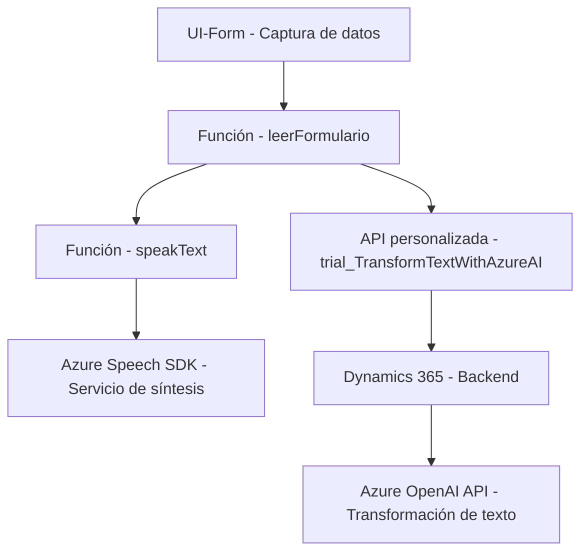

### Breve resumen técnico
Este repositorio presenta una solución que combina un sistema frontend en JavaScript para interacción directa con usuarios, integración con servicios cognitivos de Azure (Azure Speech SDK y Azure OpenAI) y un plugin basado en Microsoft Dynamics 365 para procesamiento y transformación avanzada de datos. La solución destaca por su capacidad de capturar información desde formularios, transformar datos mediante IA y sintetizar voz.

---

### Descripción de arquitectura
La arquitectura adoptada en este repositorio utiliza una combinación de **n capas** y **arquitectura hexagonal/orientada a servicios**. El diseño general implica:
1. **Frontend**: Implementado en JavaScript, que gestiona la interacción con el usuario, captura de datos, integración con Azure Speech SDK y comunicación con APIs de procesamiento.
2. **Backend en Dynamics 365**: Utiliza un plugin para ejecutar lógicas específicas en el sistema Dynamics CRM, como el consumo de servicios de Azure OpenAI para transformación de texto.
3. **Exposición por APIs externas**: El sistema interactúa con servicios externos, como Azure Speech, Dynamics SDK y Azure OpenAI API, para proporcionar funcionalidades avanzadas.

El backend se basa en los principios de extensibilidad (Plugins de Dynamics 365 con interfaces como `IPlugin`) y desacopla las dependencias mediante APIs externas, siguiendo patrones de **Integrated Systems Architecture**. Este diseño facilita la comunicación entre múltiples plataformas, manteniendo los componentes modulares.

---

### Tecnologías y frameworks usados
1. **Azure Speech SDK**: Para captura y síntesis de voz.
2. **Azure OpenAI Services**: Para transformación y enriquecimiento de texto.
3. **Microsoft Dynamics 365 SDK**: Interacción con APIs del CRM, manejo de plugins y acceso a datos relacionados.
4. **JavaScript**: Para el cliente frontend que interactúa con los servicios mencionados.
5. **HTTP Communication**: Consumir APIs externas mediante solicitudes HTTP con `window.SpeechSDK` (JS) y `HttpClient` (.NET plugin).
6. **Newtonsoft.Json** y **System.Text.Json**: Para el manejo de JSON en C#.
7. **Dynamic Plugin Architecture**: Extendiendo funcionalidades de Microsoft Dynamics CRM.
8. **Helper Functions**: Modularidad y separación de responsabilidades dentro de los archivos JavaScript.
9. **Loading on Demand**: Carga dinámica de dependencias (Azure Speech SDK).

---

### Diagrama Mermaid

---

### Conclusión final
La solución presentada en el repositorio está orientada a desarrollar un sistema que permita la interacción entre el usuario y los servicios cognitivos de Microsoft Azure mediante un frontend en JavaScript y un respaldo en Microsoft Dynamics 365. 

Se trata de una arquitectura n capas, con elementos modulares y basada en la comunicación entre servicios externos. Destaca el uso de Azure Speech SDK para la síntesis de voz, Azure OpenAI para la transformación de texto mediante IA y Dynamics 365 Plugins para integrar estas funcionalidades en un sistema CRM extendido. 

Este enfoque es ideal para herramientas avanzadas de interacción con formularios y gestión de datos, especialmente en contextos empresariales que requieren inteligencia artificial y servicios de voz.