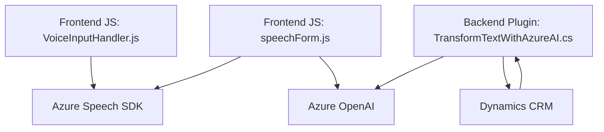

### Breve resumen técnico
El repositorio contiene componentes orientados a la manipulación de formularios y procesamiento de voz/texto, integrando tecnologías de reconocimiento de voz y procesamiento de texto a través de servicios basados en Azure Speech SDK y OpenAI. Los archivos están enfocados en extraer datos de formularios, transcribir voz a texto, sintetizar texto en voz, y transformar texto con inteligencia artificial. La aplicación parece un híbrido entre una **web frontend avanzada** y plugins que interactúan con Microsoft Dynamics CRM.

### Descripción de arquitectura
La solución parece estar formada por varios módulos distribuidos que actúan de manera separada:
1. **Frontend modular**: Principalmente en JavaScript, enfocado al reconocimiento y síntesis de voz mediante Azure Speech SDK, y manipulación de formularios DOM.
2. **Backend con SDKs y APIs**: A través de un plugin dinámico en C#, se delegan tareas complejas como transformación de texto al servicio Azure OpenAI.
3. **Uso API Gateway**: Tanto en el frontend (callCustomApi) como el plugin (HttpClient), se abstraen las llamadas externas a servicios mediante funciones específicas.

La arquitectura global se asemeja a **n capas** con integración a servicios SaaS como Azure Speech SDK y Azure OpenAI. No parece ser un sistema completamente basado en **microservicios**, pero utiliza la programación por componentes y módulos en cada capa.

### Tecnologías, frameworks y patrones usados
- **Frontend**:
  - **JavaScript**
  - **Azure Speech SDK**: API de reconocimiento y síntesis de voz.
  - **Azure OpenAI API**: Transformación de texto (integración con modelos AI).
- **Backend**:
  - **C#**
  - **Microsoft Dynamics CRM SDK**: SDK de manejo de datos en el CRM (XRM Framework).
- **Patrones**:
  - Event-Driven Architecture: Reconocimiento de voz se basa en eventos.
  - Service Integration: Integración con APIs en Azure y servicios externos.
  - Modularización: Implemente funciones separadas para lógica específica.

### Dependencias o componentes externos posiblemente presentes
1. **Azure Speech SDK**: Integración para síntesis y reconocimiento de voz.
2. **Azure OpenAI API**: Servicio de IA para la transformación de texto.
3. **Xrm SDK (Dynamics 365)**: Extensiones y manipulaciones que interactúan con el CRM vía plugins.
4. **Newtonsoft.Json.Linq**: Framework de gestión y transformación de JSON en C#.
5. **Plugins de Dynamics CRM**: Dependencia del entorno de plugins para interacciones específicas del CRM.
6. **HTTP Client**: Comunicación para consumir servicios externos como APIs.

### Diagrama Mermaid válido para GitHub

### Conclusión final
La solución combina tecnologías de frontend y backend para interactuar con avanzados servicios de reconocimiento de voz y análisis textual, haciéndolo apto para casos de uso como automatización en CRMs, accesibilidad y procesamiento de datos estructurados. Su arquitectura modular basada en **n capas** y la integración con servicios como **Azure Speech SDK** y **Azure OpenAI** permiten un diseño eficiente y escalable dentro de entornos corporativos como Dynamics 365. Sin embargo, la falta de organización explícita en términos de patrones de diseño puede complicar la gestión y escalabilidad a largo plazo.