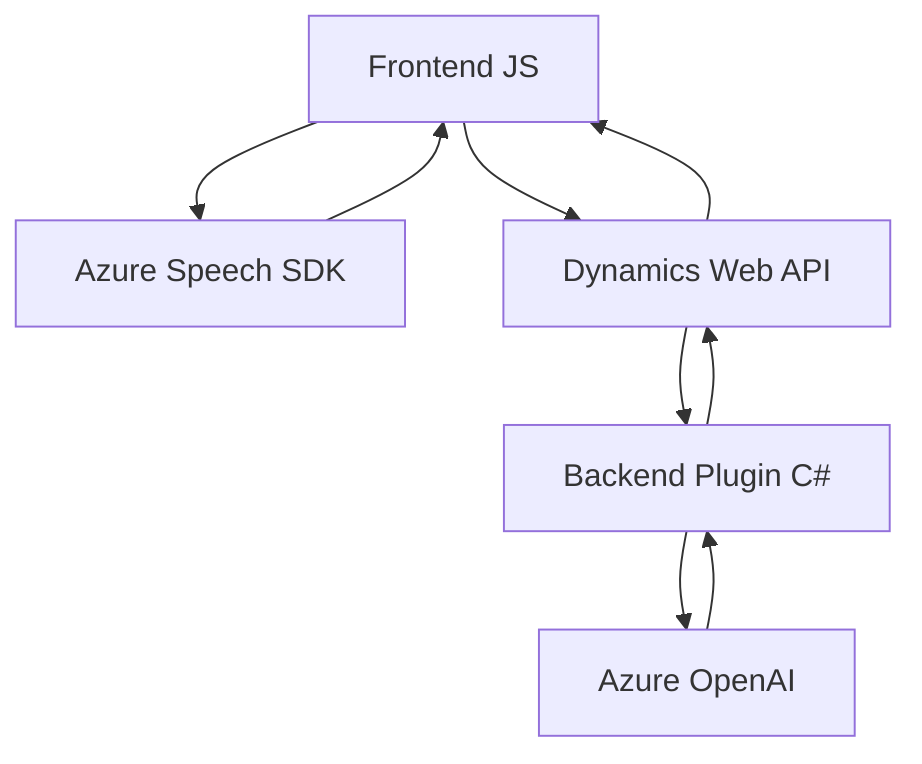

### Breve Resumen Técnico
El repositorio alberga una solución que combina frontend (JavaScript) y backend (C# plugin), con funciones específicas para la integración de entrada por voz y procesamiento de texto mediante Azure Speech SDK y Azure OpenAI. Está diseñado para interactuar con Microsoft Dynamics CRM, permitiendo una integración profunda entre formularios dinámicos y servicios en la nube.

### Descripción de Arquitectura
La solución evidencia una arquitectura **mixta**:
1. **Frontend (JavaScript)**: Orientada a eventos y operaciones asincrónicas para capturar voz, procesar datos y enviar solicitudes HTTP.
2. **Backend (C# Plugin)**: Arquitectura de extensibilidad, basada en un modelo de **Plugin de Dynamics CRM**. Este módulo actúa como un orquestador que delega el procesamiento al servicio Azure OpenAI.

La solución refleja un sistema multicapa o **n-capas**:
1. **Presentación**: Captura la entrada de usuarios desde un navegador con JavaScript.
2. **Lógica Aplicativa**: Procesa los datos en el frontend y backend con integración a Dynamics CRM y APIs.
3. **Capa Externa**: Interactúa con Azure Speech SDK y Azure OpenAI en la nube.

### Tecnologías Usadas
1. **Frontend**:
   - ES6 JavaScript.
   - Azure Speech SDK (cliente web para entrada de voz y síntesis de voz).
   - HTML DOM API para carga y manipulación dinámica de scripts.

2. **Backend**:
   - C# .NET Framework (Microsoft.Xrm SDK).
   - Microsoft Dynamics CRM: Contextos de ejecución, atributos y operaciones de datos.
   - Azure OpenAI: Para análisis y transformación avanzada de texto.
   - Newtonsoft.Json para manipulación de datos JSON.
   - System.Net.Http para consumo de servicios REST.

3. **Dependencias comunes**:
   - Azure Speech SDK (`https://aka.ms/csspeech/jsbrowserpackageraw`).
   - Microsoft Dynamics Web API (`Xrm.WebApi.online.execute`).
   - Azure OpenAI, que realiza el procesamiento del texto recibido en el plugin.

### Diagrama Mermaid

### Conclusión Final
La solución presenta una arquitectura robusta y modular diseñada para interactuar entre un frontend dinámico, un backend basado en plugins, y servicios en la nube como Azure Speech SDK y Azure OpenAI. Esto demuestra una orientación a soluciones empresariales complejas y específicas, donde el objetivo principal es automatizar la captura de datos por voz y simplificar decisiones usando inteligencia artificial.