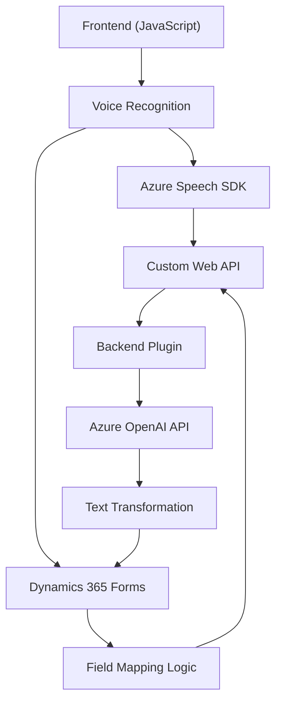

### Breve Resumen Técnico

El repositorio contiene múltiples archivos orientados a la integración de funcionalidades de reconocimiento y síntesis de voz con servicios de terceros (Azure Speech SDK y Azure OpenAI), así como para el manejo dinámico de formularios en Dynamics 365. Los principales objetivos son:
- Facilitar interacción por voz con formularios.
- Transformar texto mediante IA en datos estructurados aplicables en un sistema empresarial.
- Enviar y recibir datos entre Dynamics 365, Azure Speech SDK y APIs relacionadas.

---

### Descripción de Arquitectura

El sistema sigue una arquitectura de integración distribuida, donde los principales componentes incluyen:
1. **Frontend Autónomo**:
   - Archivos JavaScript que implementan funcionalidad de voz con SDK de Azure y manipulación dinámica de DOM/formularios.
   - Lógica asincrónica y modular para interactuar con APIs y manejar eventos (ejecución de comandos, reconocimiento, entrada/salida de voz).

2. **Backend con Plugins**:
   - Uso de plugins en Dynamics 365, especialmente para integrar servicios de Azure OpenAI.
   - Responsabilidad del backend de gestión centralizada de datos y lógica empresarial.

3. **Componentes Externos**:
   - Azure Speech SDK para funcionalidades de voz (reconocimiento/síntesis).
   - Azure OpenAI API para procesamiento avanzado de texto estructurado.

El diseño utiliza **patrones de integración entre servicios distribuidos**, manteniendo capas desacopladas:
- La arquitectura es principalmente **n-capas** (frontend, lógica de negocio en plugins, servicios externos).
- Puede derivar hacia una **arquitectura hexagonal** en el backend gracias a extensibilidad controlada mediante interfaces y dependencias inyectables.

---

### Tecnologías Usadas
1. **Frontend**:
   - JavaScript y APIs nativas del navegador (DOM, "window").
   - Azure Speech SDK: Interacción con servicios de síntesis y reconocimiento de voz.

2. **Backend**:
   - Dynamics 365 SDK (`IPlugin`), usado para comportamiento personalizado.
   - Azure OpenAI API: Procesamiento con GPT para transformación de texto.
   - Frameworks .NET (`System.Net.Http`, `Newtonsoft.Json`) para comunicación HTTP y serialización de datos.

3. **Integración y Patrones**:
   - **Callback Pattern**: En la carga del Azure SDK (asincronía).
   - **Promesas y Asincronía**: Manejo programático de eventos y flujos mediante `async/await`.
   - **Plugin Pattern**: Implementación en Dynamics CRM.
   - **Factory Pattern**: Creación dinámica de servicios (`IOrganizationServiceFactory`).

---

### Dependencias o Componentes Externos
1. **Azure Speech SDK**: Para síntesis y reconocimiento de voz.
2. **Dynamics 365 Web API**: Integración directa con formularios y flujo de datos empresarial.
3. **Azure OpenAI API**: Procesamiento avanzado de texto.
4. **Librerías JavaScript** integradas en el navegador: Principalmente para manejo DOM y eventos.
5. **Librerías .NET estándar** para ejecución de plugins (HttpClient, JSON).

---

### Diagrama Mermaid Válido para GitHub

---

### **Conclusión Final**

El repositorio presenta una solución híbrida que combina tecnologías frontend, backend y servicios cloud. Este diseño se orienta hacia la mejora de la interacción en sistemas empresariales (Dynamics 365) mediante capacidades avanzadas integradas como síntesis/reconocimiento de voz y transformación de datos con IA.

1. **Arquitectura**: La combinación de capas (frontend, backend, integración externa) forma una **n-capas distribuida** que puede derivar hacia **arquitectura hexagonal** en el backend gracias al uso de interfaces y plugins.
2. **Tecnologías**: El uso de Azure Speech SDK y Azure OpenAI permite integrar voz e inteligencia artificial a nivel empresarial.
3. **Patrones**: Predominio de patrones de asincronía, plugins y factorías que favorecen la modularidad y extensibilidad.

Este diseño es ideal para sistemas empresariales que requieren interacción avanzada, integraciones con IA y una experiencia basada en eventos. Aunque cumple su propósito, futuras mejoras podrían incluir un manejo más robusto de credenciales y autenticación mediante variables de entorno o identidad administrada para Azure.